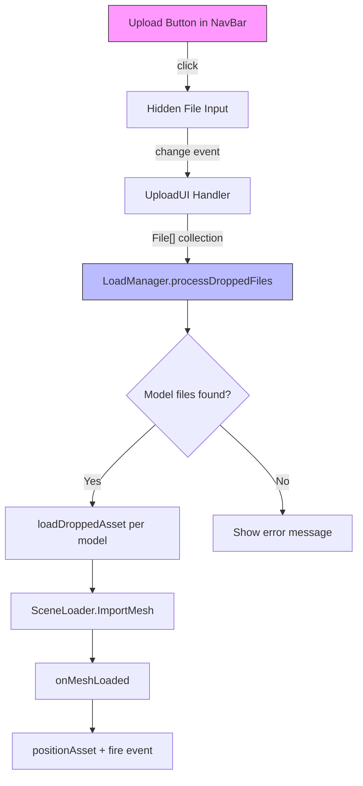

# Design Document

## Overview

This feature adds an "Upload" button to the main navigation menu bar (`NavBar`) that provides an alternative file/folder upload mechanism using the standard HTML `<input type="file">` API. This addresses the problem where browser extensions (security/privacy) block drag-and-drop events, preventing users from loading 3D assets into the scene.

The upload button reuses the existing `LoadManager.processDroppedFiles()` pipeline so that uploaded files are handled identically to drag-and-dropped files — same format validation, dependency resolution, asset positioning, and event firing.

## Architecture



**Key architectural decision**: Rather than creating a new loading pipeline, the upload button feeds files directly into the existing `processDroppedFiles` method. This guarantees behavioral parity with drag-and-drop and minimizes new code.

**Folder upload**: A separate hidden `<input>` element with the `webkitdirectory` attribute handles folder selection. The browser flattens the folder into a `FileList`, which is then processed identically to multiple dropped files.

## Components and Interfaces

### NavBarML.ts (Markup)

Add the upload button HTML to the `navHTML` template string, positioned after the download button for logical grouping (download ↔ upload):

```html
<button id="uploadAsset" title="upload file to scene">
  <span class="material-icons-outlined">upload_file</span>
</button>
```

The button uses the Material Icons `upload_file` icon and follows the same `<button>` + `<span>` pattern as all other NavBar buttons.

### UploadUI.ts (Logic)

New file: `src/gui/UploadUI.ts`

Responsibilities:
- Create two hidden `<input type="file">` elements (one for files, one for folders)
- Wire the NavBar upload button click to show a choice (file vs folder) or directly trigger file input
- On file selection, collect the `FileList` into a `File[]` and delegate to `LoadManager.processDroppedFiles()`

```typescript
export class UploadUI {
    private _fileInput: HTMLInputElement;
    private _folderInput: HTMLInputElement;
    private _vishva: any;

    constructor(vishva: any) { ... }

    public handleUploadClick(): void { ... }
    private _onFilesSelected(files: FileList): void { ... }
    private _onFolderSelected(files: FileList): void { ... }
}
```

**Design decision — file vs folder selection**: Since HTML file inputs cannot simultaneously support both file and folder selection in a single element, the upload button will show a small dropdown menu (similar to the existing curated assets menu pattern) with two options: "Upload File(s)" and "Upload Folder". This keeps the interaction simple and discoverable.

### LoadManager.ts (Existing — no changes needed)

The existing `processDroppedFiles(files: File[])` method already:
1. Filters files by supported extensions
2. Shows error if no model files found
3. Creates a `fileMap` of blob URLs for dependency resolution
4. Calls `loadDroppedAsset()` for each model file

This method accepts a `File[]` which is exactly what the file input's `FileList` provides (after conversion). No modifications to `LoadManager` are required.

### VishvaGUI.ts (Wiring)

The `_createNavMenu()` method will instantiate `UploadUI` and wire the button click handler, following the same pattern as other NavBar buttons.

## Data Models

No new persistent data models are introduced. The feature operates entirely on transient browser `File` objects and delegates to existing data flows.

**Transient data flow:**

| Stage | Data Type | Description |
|-------|-----------|-------------|
| File picker result | `FileList` | Browser-native file list from `<input>` |
| Conversion | `File[]` | Array conversion for `processDroppedFiles` |
| File map | `Map<string, string>` | filename → blob URL mapping (existing) |
| Loading | BabylonJS meshes | Loaded via `SceneLoader.ImportMesh` (existing) |

## Correctness Properties

*A property is a characteristic or behavior that should hold true across all valid executions of a system — essentially, a formal statement about what the system should do. Properties serve as the bridge between human-readable specifications and machine-verifiable correctness guarantees.*

### Property 1: File format classification is a complete partition

*For any* collection of files with arbitrary names, the system SHALL classify each file as either a model file (extension in {gltf, glb, obj, babylon, stl}, case-insensitive) or a dependency file, with no file left unclassified and no file in both categories.

**Validates: Requirements 2.2, 2.3, 3.2, 3.4**

### Property 2: Supported format identification is correct and complete

*For any* filename, it is identified as a supported model file if and only if its lowercase extension is exactly one of: gltf, glb, obj, babylon, stl. No other extensions are accepted, and all of these are accepted.

**Validates: Requirements 2.2, 2.3**

## Error Handling

| Scenario | Handling | User Feedback |
|----------|----------|---------------|
| No supported model files in selection | `processDroppedFiles` shows alert | Alert listing supported formats |
| File loading fails (corrupt/invalid) | `loadDroppedAsset` error callback | Alert with file name and error message |
| User cancels file picker | `change` event fires with empty `FileList` | No action taken, silent return |
| Browser doesn't support `webkitdirectory` | Folder option hidden or gracefully degraded | Only file upload available |

Error handling reuses the existing patterns in `LoadManager`:
- `alert()` for user-facing errors (consistent with existing drag-and-drop behavior)
- `console.error()` for developer diagnostics

## Testing Strategy

### Unit Tests (Example-based)

| Test | Validates |
|------|-----------|
| Upload button exists in NavBar DOM with correct icon and tooltip | Req 1.1, 1.3 |
| Clicking upload button triggers file input click | Req 2.1 |
| Empty FileList triggers no loading | Req 2.4 |
| Upload calls same `processDroppedFiles` as drag-and-drop | Req 4.1 |
| Folder input has `webkitdirectory` attribute | Req 3.1 |

### Property-Based Tests (fast-check + vitest)

| Property | Iterations | Validates |
|----------|-----------|-----------|
| File format classification partition | 100+ | Req 2.2, 2.3, 3.2, 3.4 |
| Supported format identification | 100+ | Req 2.2, 2.3 |

**Configuration:**
- Library: `fast-check` (already in devDependencies)
- Runner: `vitest` (already configured)
- Minimum iterations: 100 per property
- Tag format: `Feature: menu-bar-upload-button, Property {N}: {description}`

### Integration Tests

Integration-level verification (manual or future automated):
- Model with texture dependencies loads correctly via upload (Req 3.3)
- Loaded asset positioned in front of avatar (Req 4.2)
- World-items-changed event fires after upload (Req 4.3)
- Console logging occurs during upload processing (Req 5.1)
- Error alert shown on load failure (Req 5.2)
