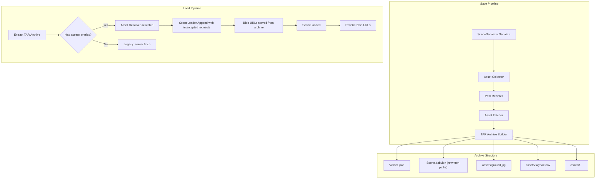

# Design Document: Standalone World Archive

## Overview

This feature transforms the Vishva world save/load pipeline so that archives are fully self-contained. Currently, the serialized `Scene.babylon` file references assets via server-relative paths (e.g., `bin/assets/internal/textures/ground.jpg`). When an archive is loaded offline or on a different server, these references break.

The solution introduces three new components into the save pipeline and one into the load pipeline:

1. **Asset Collector** — Scans the serialized scene JSON to discover all external asset URLs (textures, meshes, sounds, particle textures, environment maps)
2. **Path Rewriter** — Rewrites those URLs to archive-relative paths (`assets/<filename>`) and handles deduplication/disambiguation
3. **Asset Fetcher** — Downloads each discovered asset and stores the binary data for inclusion in the TAR archive
4. **Asset Resolver** — On load, intercepts BabylonJS file requests and serves matching assets from the extracted archive via Blob URLs

The existing TAR/gzip archive format is extended: in addition to `Vishva.json` and `Scene.babylon` at the root, asset files are stored under an `assets/` prefix. Legacy archives (without `assets/`) continue to work via the existing server-fetch behavior.

## Architecture



### Design Decisions

1. **Flat `assets/` directory with disambiguation** — Rather than preserving the original directory hierarchy (which would complicate TAR header handling and path matching), all assets are stored flat under `assets/` with a filename derived from the original path. Collisions are resolved with numeric suffixes. This keeps the archive simple and the resolver logic straightforward.

2. **Intercept via `Tools.LoadFile` override** — BabylonJS routes all file loads through `Tools.LoadFile`. The project already overrides this for drag-and-drop support. The Asset Resolver uses the same pattern: when the scene is loaded from an archive with bundled assets, the override checks if the requested filename matches an entry in the extracted `assets/` map and serves a Blob URL if so.

3. **Blob URLs with cleanup** — Assets are served as Blob URLs during load. After `SceneLoader.Append` completes and the scene is fully loaded, all Blob URLs are revoked to free memory. Textures and other resources will have already copied the data into GPU memory or internal buffers by that point.

4. **Data URI decoding at save time** — If `Texture.ForceSerializeBuffers` were true, textures would be embedded as base64 data URIs in the scene JSON. Even with it set to false, some textures (e.g., from GLB imports) may already have buffer data that serializes as data URIs. The Asset Collector detects these, decodes them to binary, stores them as files in `assets/`, and the Path Rewriter replaces the data URI with the archive-relative path.

5. **Graceful degradation on fetch failure** — If an asset cannot be fetched during save (e.g., 404, CORS), the save continues with a warning. The asset reference remains in the scene JSON but won't be available offline. This avoids blocking the entire save for a single missing texture.

## Components and Interfaces

### AssetCollector

**Location:** `src/managers/AssetCollector.ts`

**Responsibility:** Scans a serialized scene JSON object and produces a list of all external asset references.

```typescript
export interface AssetEntry {
    /** Original URL/path as it appears in the scene JSON */
    originalUrl: string;
    /** Absolute URL that can be fetched */
    fetchUrl: string;
    /** Target filename in the assets/ folder (after deduplication) */
    archiveFilename: string;
    /** If this was a data URI, the decoded binary data */
    decodedData?: Uint8Array;
}

export class AssetCollector {
    /**
     * Scan the serialized scene object and collect all asset references.
     * @param sceneObj The serialized scene JSON object
     * @param baseUrl The base URL for resolving relative paths
     * @returns Deduplicated list of asset entries
     */
    collect(sceneObj: object, baseUrl: string): AssetEntry[];
}
```

**Scanning targets:**
- `textures[].name` — texture file paths
- `reflectionTextures[].name` — environment/cube texture paths  
- `materials[].diffuseTexture.name`, `.bumpTexture.name`, `.specularTexture.name`, etc.
- `particleSystems[].textureName` — particle texture paths
- Mesh file references (if any external `.babylon` files are referenced)
- Sound file URLs (though currently sounds are stripped during save)

### PathRewriter

**Location:** `src/managers/PathRewriter.ts`

**Responsibility:** Rewrites all asset URLs in the serialized scene JSON from their original paths to `assets/<archiveFilename>`.

```typescript
export class PathRewriter {
    /**
     * Rewrite all asset references in the scene object.
     * @param sceneObj The serialized scene JSON object (mutated in place)
     * @param assetEntries The collected asset entries with their archive filenames
     */
    rewrite(sceneObj: object, assetEntries: AssetEntry[]): void;
}
```

**Strategy:** Builds a map from `originalUrl → archiveFilename`, then performs a deep traversal of the scene JSON replacing any string value that matches an original URL with `assets/<archiveFilename>`.

### AssetFetcher

**Location:** Integrated into `SaveManager.ts`

**Responsibility:** Fetches binary data for each asset entry that doesn't already have `decodedData` (i.e., wasn't a data URI).

```typescript
/**
 * Fetch all assets and return their binary data.
 * @param entries Asset entries to fetch
 * @param onProgress Callback for progress reporting
 * @returns Map from archiveFilename to binary data
 */
async fetchAssets(
    entries: AssetEntry[],
    onProgress?: (fetched: number, total: number) => void
): Promise<Map<string, Uint8Array>>;
```

### AssetResolver

**Location:** `src/managers/AssetResolver.ts`

**Responsibility:** During scene load, intercepts file requests and serves assets from the extracted archive.

```typescript
export class AssetResolver {
    private blobUrls: string[] = [];
    private assetMap: Map<string, Uint8Array>;

    /**
     * Activate the resolver with extracted archive assets.
     * Overrides Tools.LoadFile to intercept matching requests.
     */
    activate(assets: Map<string, Uint8Array>): void;

    /**
     * Deactivate the resolver and revoke all Blob URLs.
     * Restores original Tools.LoadFile behavior.
     */
    deactivate(): void;
}
```

**Interception logic:**
1. When a file request comes in, extract the filename from the URL
2. Check if `assets/<filename>` exists in the asset map
3. If yes: create a Blob URL from the binary data, track it, and redirect the load to the Blob URL
4. If no: pass through to the original `Tools.LoadFile`

### Integration with SaveManager

The save pipeline in `_getWorldZipBlob()` is extended:

```
1. SceneSerializer.Serialize(scene) → sceneObj
2. AssetCollector.collect(sceneObj, baseUrl) → assetEntries
3. PathRewriter.rewrite(sceneObj, assetEntries) → sceneObj (mutated)
4. fetchAssets(assetEntries) → assetDataMap
5. _createTarArchive([Vishva.json, Scene.babylon, ...assets/]) → tarBuffer
6. _compressWithGzip(tarBuffer) → gzipBlob
```

### Integration with LoadManager

The load pipeline in `loadZipWorld()` and `_loadWorldFromIndexedDB()` is extended:

```
1. _extractTarArchive(tarData) → files map
2. Check if any file key starts with "assets/" → hasAssets
3. If hasAssets:
   a. Collect asset entries from files map
   b. AssetResolver.activate(assetMap)
   c. SceneLoader.Append(...)
   d. On scene loaded callback: AssetResolver.deactivate()
4. If !hasAssets:
   a. Existing behavior (server fetch)
```

## Data Models

### Archive File Structure

```
archive.tar.gz
├── Vishva.json          # VishvaSerialized metadata
├── Scene.babylon        # Serialized scene with rewritten asset paths
└── assets/              # Bundled asset files
    ├── ground.jpg
    ├── skybox.env
    ├── Birch.jpg
    ├── model.babylon
    └── ...
```

### AssetEntry Interface

```typescript
interface AssetEntry {
    originalUrl: string;      // e.g., "bin/assets/internal/textures/ground.jpg"
    fetchUrl: string;         // e.g., "http://localhost:8080/bin/assets/internal/textures/ground.jpg"
    archiveFilename: string;  // e.g., "ground.jpg" (or "ground_1.jpg" if collision)
    decodedData?: Uint8Array; // Present only for data URI sources
}
```

### Filename Flattening Rules

1. Extract the basename from the original URL path (last segment after `/`)
2. If the basename already exists in the collected set, append `_N` before the extension (e.g., `texture_1.png`)
3. Strip query strings and fragments from the URL before extracting the basename

### Scene JSON Asset Reference Locations

The following fields in the serialized BabylonJS scene JSON contain asset file paths that need rewriting:

| JSON Path | Description |
|-----------|-------------|
| `textures[].name` | Texture file URL |
| `textures[].url` | Alternative texture URL field |
| `materials[].*.name` (nested texture refs) | Material texture references |
| `particleSystems[].textureName` | Particle system texture |
| `meshes[].delayLoadingFile` | Delay-loaded mesh file |
| `environmentTexture` | Scene environment texture |
| `reflectionTexture.name` | Skybox/reflection texture |


## Correctness Properties

*A property is a characteristic or behavior that should hold true across all valid executions of a system — essentially, a formal statement about what the system should do. Properties serve as the bridge between human-readable specifications and machine-verifiable correctness guarantees.*

### Property 1: Asset Collection Completeness

*For any* serialized scene JSON object containing asset URL references in texture `name` fields, material texture references, particle system `textureName` fields, or environment texture fields, the Asset Collector SHALL return an entry for every unique URL present in the JSON.

**Validates: Requirements 1.1**

### Property 2: URL Resolution Correctness

*For any* relative asset path and base URL, the resolved absolute URL SHALL be a valid URL that combines the base URL with the relative path according to standard URL resolution rules (equivalent to `new URL(relativePath, baseUrl).href`).

**Validates: Requirements 1.2**

### Property 3: Data URI Decode Round-Trip

*For any* binary data, encoding it as a base64 data URI and then passing it through the Asset Collector's decode logic SHALL produce binary output identical to the original input.

**Validates: Requirements 1.3**

### Property 4: Asset Entry Deduplication

*For any* serialized scene JSON containing duplicate asset URLs (the same URL appearing multiple times), the Asset Collector SHALL produce a list where each unique URL appears exactly once.

**Validates: Requirements 1.4**

### Property 5: Path Rewriting Completeness

*For any* serialized scene JSON and a set of asset entries with original-to-archive filename mappings, after the Path Rewriter processes the JSON, no original asset URL (including data URIs) SHALL remain in the output — every occurrence SHALL be replaced with the corresponding `assets/<archiveFilename>` path.

**Validates: Requirements 3.1, 3.2, 3.4**

### Property 6: Filename Disambiguation Uniqueness

*For any* set of asset URLs (where multiple URLs may share the same basename), the Asset Collector's filename generation SHALL produce archive filenames that are all unique (no two entries share the same `archiveFilename`).

**Validates: Requirements 3.3**

### Property 7: TAR Binary Data Round-Trip

*For any* set of binary data entries stored in a TAR archive via `_createTarArchive` and then extracted via `_extractTarArchive`, the extracted binary data for each entry SHALL be byte-for-byte identical to the original input data.

**Validates: Requirements 4.3**

### Property 8: Asset Resolver Request Routing

*For any* asset filename and an asset map, a file request through the Asset Resolver SHALL be intercepted and served from the map if and only if the filename exists as a key in the asset map; otherwise, the request SHALL pass through to the original file loading mechanism.

**Validates: Requirements 5.2, 5.4**

### Property 9: Asset Presence Detection

*For any* set of TAR archive entry names, the asset detection logic SHALL return `true` if and only if at least one entry name starts with the prefix `assets/`.

**Validates: Requirements 6.2**

## Error Handling

### Save-Time Errors

| Error Condition | Handling Strategy |
|----------------|-------------------|
| Asset fetch fails (404, CORS, network error) | Log warning with URL, skip the asset, continue saving remaining assets. The scene JSON retains the rewritten path but the file won't be in the archive. |
| Data URI decode fails (malformed base64) | Log warning, skip the asset, leave the data URI in place (graceful degradation). |
| TAR creation exceeds browser memory | No special handling — this is a browser limitation. Large worlds with many high-res textures may hit this. Future: could stream to disk via File System Access API. |
| IndexedDB quota exceeded | Catch the error, show user-facing alert via `DialogMgr.showAlertDiag()`. |

### Load-Time Errors

| Error Condition | Handling Strategy |
|----------------|-------------------|
| Archive missing `Scene.babylon` or `Vishva.json` | Throw error, show alert (existing behavior). |
| Asset Resolver: Blob URL creation fails | Log error, fall through to network fetch for that asset. |
| Legacy archive (no `assets/` folder) | Skip Asset Resolver activation entirely, use existing server-fetch behavior. |
| Corrupted asset data in archive | BabylonJS will handle the load error for individual textures/meshes gracefully (shows placeholder or logs warning). |

### Progress Reporting

During save, the ProgressManager is updated at these stages:
1. "Preparing scene..." (0%)
2. "Collecting assets..." (10%)
3. "Fetching assets... (X/Y)" (10-80%, updated per asset)
4. "Rewriting paths..." (80%)
5. "Creating archive..." (85%)
6. "Compressing..." (90%)
7. Complete (100%)

## Testing Strategy

### Testing Approach

Since this project has no test framework configured, the testing strategy focuses on:

1. **Property-based tests** using a testing library (recommended: [fast-check](https://github.com/dubzzz/fast-check) with a minimal test runner like Vitest) for the pure logic components
2. **Manual integration testing** via the dev server for the full save/load pipeline
3. **Example-based unit tests** for specific edge cases and error conditions

### Property-Based Testing Setup

**Library:** `fast-check` with `vitest` as the test runner  
**Configuration:** Minimum 100 iterations per property test  
**Tag format:** `Feature: standalone-world-archive, Property {number}: {property_text}`

### Test Targets

| Component | Test Type | Properties Covered |
|-----------|-----------|-------------------|
| AssetCollector.collect() | Property-based | P1 (completeness), P4 (deduplication) |
| AssetCollector URL resolution | Property-based | P2 (URL resolution) |
| AssetCollector data URI decode | Property-based | P3 (round-trip) |
| AssetCollector filename generation | Property-based | P6 (uniqueness) |
| PathRewriter.rewrite() | Property-based | P5 (completeness) |
| TAR create/extract | Property-based | P7 (round-trip) |
| AssetResolver interception | Property-based | P8 (routing) |
| Asset detection logic | Property-based | P9 (detection) |
| Fetch failure handling | Example-based | Req 2.3 |
| Progress reporting | Example-based | Req 2.4 |
| Legacy archive loading | Example-based | Req 6.1, 6.3 |
| Blob URL cleanup | Example-based | Req 5.5 |
| Full save/load round-trip | Manual integration | All requirements |

### Generators Needed

- **Scene JSON generator**: Produces random but structurally valid BabylonJS serialized scene objects with textures, materials, particle systems, and environment textures containing URL references
- **URL generator**: Produces random relative and absolute URLs with various path depths, extensions, and query strings
- **Binary data generator**: Produces random `Uint8Array` of varying sizes (0 bytes to ~1MB)
- **Filename set generator**: Produces sets of URLs that may share basenames (to test disambiguation)
- **TAR entry generator**: Produces sets of filename/data pairs for TAR round-trip testing

### Manual Testing Checklist

1. Save a world with textures, verify archive contains `assets/` folder
2. Load the saved archive offline (disconnect network), verify scene renders correctly
3. Load a legacy archive (pre-feature), verify it still works
4. Save/load via IndexedDB, verify assets are preserved
5. Import a GLB model (which may have embedded textures), save, verify data URIs are extracted
6. Save a world with duplicate texture filenames from different paths, verify disambiguation
