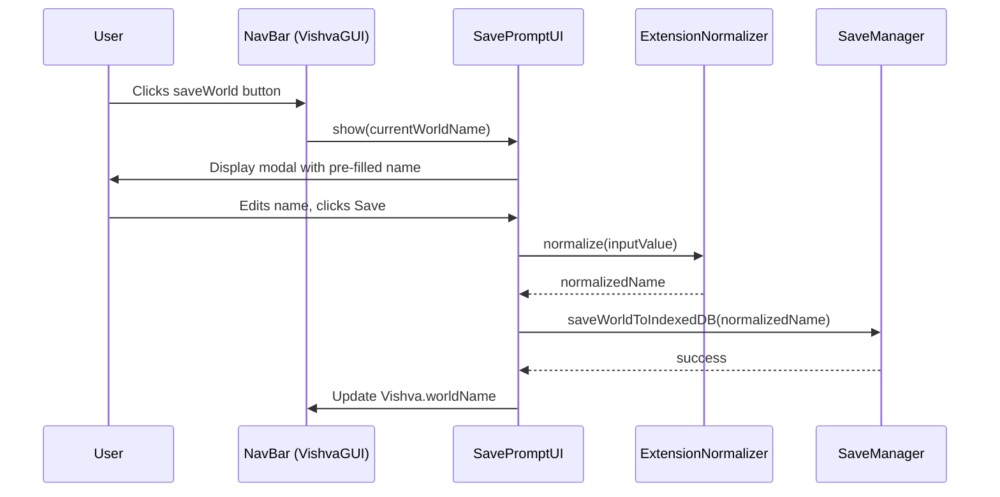

# Design Document: Save World Name Prompt

## Overview

This feature intercepts the existing "save world to browser" flow to display a modal prompt dialog before saving. The prompt pre-fills the current world name, allows the user to edit it, normalizes the `.tar.gz` extension, validates against empty input, and only proceeds with the save if the user confirms a valid name.

The design leverages the existing `VDiag` modal dialog component and `SaveManager.saveWorldToIndexedDB()` method, inserting a prompt step between the button click and the actual save operation.

## Architecture



**Cancel flow:**
- User clicks Cancel or closes the dialog → no save occurs, `Vishva.worldName` unchanged.

**Validation flow:**
- User confirms with empty/whitespace-only input → dialog remains open, no save occurs.

## Components and Interfaces

### 1. SavePromptUI (`src/gui/SavePromptUI.ts`)

Handles the logic and event wiring for the save prompt dialog. Follows the project's `*UI.ts` convention.

```typescript
export class SavePromptUI {
    private _dialog: VDiag;
    private _nameInput: HTMLInputElement;
    private _errorMsg: HTMLElement;
    private _onSaveConfirmed: ((normalizedName: string) => Promise<void>) | null;

    constructor();

    /** Show the prompt pre-filled with the given world name */
    public show(currentWorldName: string): void;

    /** Hide the prompt without saving */
    public hide(): void;
}
```

**Responsibilities:**
- Creates a `VDiag` modal dialog with a text input and Save/Cancel buttons
- Pre-fills the input with `currentWorldName` (defaults to `"empty"` if falsy)
- On confirm: validates input, normalizes extension, calls `SaveManager.saveWorldToIndexedDB()`, updates `Vishva.worldName`
- On cancel: hides dialog, no side effects
- On validation failure: shows inline error, keeps dialog open

### 2. ExtensionNormalizer (`src/gui/SavePromptLogic.ts`)

A pure function module containing the extension normalization and validation logic. Separated for testability.

```typescript
/**
 * Ensures the name ends with ".tar.gz".
 * Case-insensitive check — if the name already ends with any case variant
 * of ".tar.gz", it is returned as-is.
 * Otherwise, ".tar.gz" is appended.
 */
export function normalizeWorldName(name: string): string;

/**
 * Returns true if the name is valid (non-empty after trimming).
 */
export function isValidWorldName(name: string): boolean;

/**
 * Returns the default world name to pre-fill when the current name is
 * empty or undefined.
 */
export function getDefaultWorldName(currentName: string | undefined | null): string;
```

### 3. Modified `VishvaGUI._createNavMenu()` (`src/gui/VishvaGUI.ts`)

The `saveWorld` button click handler is updated to show the `SavePromptUI` instead of directly calling `saveManager.saveWorldToIndexedDB()`.

**Before:**
```typescript
saveWorld.onclick = async (e) => {
    var saved: boolean = await this._vishva.saveManager.saveWorldToIndexedDB();
    return false;
};
```

**After:**
```typescript
saveWorld.onclick = (e) => {
    if (this._savePromptUI == null) {
        this._savePromptUI = new SavePromptUI();
    }
    this._savePromptUI.show(Vishva.worldName);
    return false;
};
```

### 4. Modified `SaveManager.saveWorldToIndexedDB()` (`src/managers/SaveManager.ts`)

Add an optional `worldName` parameter so the caller can pass the user-confirmed name:

```typescript
public async saveWorldToIndexedDB(worldName?: string): Promise<boolean> {
    // Use provided name or fall back to Vishva.worldName
    const name = worldName || this.vishva.constructor.worldName || "world";
    // ... rest of existing logic using `name` instead of reading from constructor
}
```

## Data Models

No new persistent data models are introduced. The feature operates on:

| Data | Type | Location | Description |
|------|------|----------|-------------|
| `Vishva.worldName` | `string` (static) | `src/Vishva.ts` | Current world name, updated after successful save |
| IndexedDB key | `string` | Browser IndexedDB `VishvaWorlds.worlds` | The normalized name used as the storage key |

The dialog state is transient (DOM elements created once, shown/hidden as needed).

## Correctness Properties

*A property is a characteristic or behavior that should hold true across all valid executions of a system — essentially, a formal statement about what the system should do. Properties serve as the bridge between human-readable specifications and machine-verifiable correctness guarantees.*

### Property 1: Extension normalization is idempotent

*For any* string `s`, applying `normalizeWorldName` once should produce a result ending with `".tar.gz"`, and applying `normalizeWorldName` a second time to that result should produce the same string (idempotent: `normalizeWorldName(normalizeWorldName(s)) === normalizeWorldName(s)`).

**Validates: Requirements 3.1, 3.2, 3.3**

### Property 2: Whitespace-only names are always rejected

*For any* string composed entirely of whitespace characters (spaces, tabs, newlines, etc.), `isValidWorldName` should return `false`.

**Validates: Requirements 6.1**

### Property 3: Cancel preserves world name

*For any* current world name value, if the user cancels the save prompt, the application's `worldName` should remain equal to its value before the prompt was shown.

**Validates: Requirements 4.1, 4.2**

### Property 4: Pre-fill reflects current world name

*For any* non-empty world name string, when the save prompt is shown, the input field value should equal that string. For empty/undefined/null values, the input should equal `"empty"`.

**Validates: Requirements 1.2, 1.3**

### Property 5: Successful save updates world name to normalized value

*For any* valid (non-whitespace) world name string, after a successful save confirmation, `Vishva.worldName` should equal `normalizeWorldName(inputValue)`.

**Validates: Requirements 2.2, 5.1**

## Error Handling

| Scenario | Behavior |
|----------|----------|
| Empty/whitespace-only name confirmed | Inline error message displayed below input; dialog stays open; no save attempted |
| Save fails (IndexedDB error) | Dialog closes; existing `DialogMgr.showAlertDiag()` displays the error (current behavior preserved from `SaveManager`) |
| Edit mode active or focus not on avatar | Pre-existing guards in `SaveManager.saveWorldToIndexedDB()` show alert and return `false`; prompt should still close gracefully |

The validation error message is cleared whenever the user modifies the input text, providing immediate feedback.

## Testing Strategy

### Property-Based Tests (`src/gui/SavePromptLogic.property.test.ts`)

Using **fast-check** with minimum 100 iterations per property:

| Test | Property | Library |
|------|----------|---------|
| Extension normalization idempotence | Property 1 | fast-check `fc.string()` |
| Whitespace rejection | Property 2 | fast-check `fc.stringOf(fc.constantFrom(' ', '\t', '\n', '\r'))` |
| Pre-fill default logic | Property 4 | fast-check `fc.option(fc.string())` |
| Save updates world name | Property 5 | fast-check `fc.string()` filtered to non-whitespace |

Each property test is tagged with:
```
Feature: save-world-name-prompt, Property {N}: {property_text}
```

Configuration: minimum 100 runs per property (`{ numRuns: 100 }`).

### Unit Tests (`src/gui/SavePromptLogic.test.ts`)

Example-based tests for:
- `normalizeWorldName("myworld")` → `"myworld.tar.gz"`
- `normalizeWorldName("myworld.tar.gz")` → `"myworld.tar.gz"`
- `normalizeWorldName("myworld.TAR.GZ")` → `"myworld.TAR.GZ"` (preserved as-is)
- `normalizeWorldName("myworld.tar.GZ")` → `"myworld.tar.GZ"` (mixed case preserved)
- `isValidWorldName("")` → `false`
- `isValidWorldName("   ")` → `false`
- `isValidWorldName("hello")` → `true`
- `getDefaultWorldName(undefined)` → `"empty"`
- `getDefaultWorldName("")` → `"empty"`
- `getDefaultWorldName("myworld")` → `"myworld"`

### Integration Tests (Manual)

- Click save button → prompt appears with current name
- Edit name → confirm → world saved under new name in IndexedDB
- Cancel → no save, name unchanged
- Empty input → error shown, dialog stays open
- Verify subsequent saves default to last-used name
