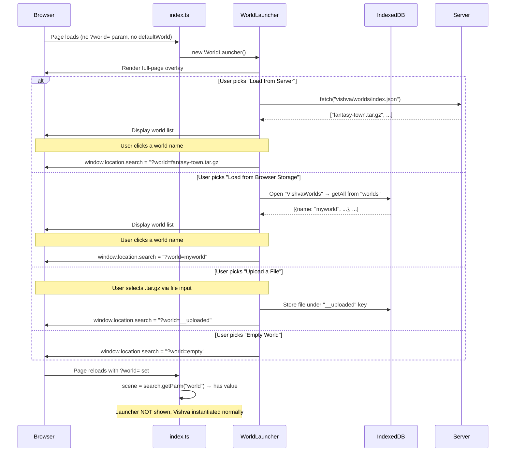

# Design Document: World Launcher Chooser

## Overview

This feature adds a launcher/chooser UI that appears as a full-page overlay before Vishva is instantiated, when no `?world=` query parameter is present and no `defaultWorld` config is set. The launcher presents the user with three world-loading options (server worlds, browser-saved worlds, file upload) plus an "Empty World" fallback. Once a selection is made, the page reloads with the appropriate `?world=` parameter, causing the standard initialization path to handle the actual world loading.

The key architectural insight is that the launcher lives entirely *before* Vishva construction. The decision logic in `index.ts` either shows the launcher OR instantiates Vishva — never both. This keeps the launcher completely decoupled from the 3D engine and avoids any WebGL context issues.

The flow:
1. `index.ts` checks URL params and `defaultWorld` config
2. If no world is specified → create and show the `WorldLauncher` overlay
3. User picks an option → page reloads with `?world=<selection>`
4. On reload, `index.ts` sees the `?world=` param → instantiates Vishva normally

## Architecture



### Design Decisions

1. **Launcher as a separate module (`src/gui/WorldLauncher.ts`)**: The launcher is independent of Vishva internals. It only needs DOM access and IndexedDB. This keeps it testable and avoids circular dependencies with the engine.

2. **Decision logic stays in `index.ts`**: The `shouldShowLauncher(worldParam, defaultWorld)` check is a simple pure function. `index.ts` either calls `new WorldLauncher()` or `new Vishva(...)` — never both.

3. **Server world list via static `index.json`**: Rather than implementing directory listing (which requires server-side logic), we use a static `vishva/worlds/index.json` file that lists available world filenames. This is simple to maintain and works with any static file server.

4. **Reuse existing upload mechanism**: The file upload panel reuses `LoadManager.loadWorldFromFile()` logic (validate → store in IndexedDB → reload with `?world=__uploaded`). Since `LoadManager` requires a Vishva instance, the launcher extracts the core logic into a standalone function (`storeUploadedWorld`) that can run without Vishva.

5. **Page reload as the transition mechanism**: Every selection results in a page reload with `?world=<value>`. This guarantees a clean state and reuses all existing world-loading paths without modification.

6. **W3.CSS + VTheme colors**: The launcher uses W3.CSS utility classes for layout and applies colors from `VThemes.CurrentTheme` for visual consistency with the editor.

## Components and Interfaces

### New: `WorldLauncher` (src/gui/WorldLauncher.ts)

The main launcher class. Creates the full-page overlay DOM, manages the three panels, and handles user interactions.

```typescript
/**
 * Full-page launcher UI shown when no world is specified.
 * Creates DOM dynamically, presents world-loading options,
 * and triggers page reload with the appropriate ?world= parameter.
 */
export class WorldLauncher {
    private _overlay: HTMLDivElement;

    constructor();

    /** Remove the launcher DOM from the page */
    public dispose(): void;
}
```

### New: `WorldLauncherLogic` (src/gui/WorldLauncherLogic.ts)

Pure functions extracted for testability. No DOM or IndexedDB dependencies.

```typescript
/**
 * Determine whether the launcher should be displayed.
 * Returns true when no world param is present AND defaultWorld is not configured.
 */
export function shouldShowLauncher(worldParam: string | null, defaultWorld: string | undefined): boolean;

/**
 * Build the reload URL search string for a given world selection.
 * Returns the query string (e.g., "?world=fantasy-town.tar.gz").
 */
export function buildWorldQueryString(worldName: string): string;

/**
 * Filter and sort the server world list for display.
 * Excludes non-.tar.gz entries and sorts alphabetically.
 * Returns display-friendly names (without extension) paired with raw filenames.
 */
export function processServerWorldList(filenames: string[]): Array<{ display: string; filename: string }>;

/**
 * Validate and store an uploaded .tar.gz file in IndexedDB, then trigger reload.
 * This is the standalone version of LoadManager.loadWorldFromFile for use
 * before Vishva is instantiated.
 */
export async function storeUploadedWorld(file: File): Promise<{ success: boolean; error?: string }>;
```

### Modified: `index.ts`

The `main()` function gains a branch that shows the launcher instead of instantiating Vishva:

```typescript
function main() {
    // ... existing style setup ...

    let search: HREFsearch = new HREFsearch();
    let scene = search.getParm("world");

    if (!scene) {
        if (typeof (defaultWorld) !== "undefined" && defaultWorld !== "") {
            scene = defaultWorld;
        } else {
            // No world specified — show launcher instead of Vishva
            new WorldLauncher();
            return;
        }
    }

    // ... existing Vishva instantiation ...
}
```

### New: Server World Index (`vishva/worlds/index.json`)

A static JSON file listing available server worlds:

```json
[
    "fantasy-town.tar.gz",
    "fantasy-town2.tar.gz",
    "fantasy-town2-gltf.tar.gz",
    "fantasy-standalone.tar.gz",
    "new.tar.gz",
    "test-obj.tar.gz",
    "test-obj-2.tar.gz"
]
```

### Unchanged: `LoadManager`, `Vishva`, `UploadUI`

No modifications needed. The launcher operates entirely before these are instantiated. The upload flow reuses the same IndexedDB schema and `__uploaded` sentinel that `LoadManager.loadUploadedWorld()` already handles post-reload.

## Data Models

### IndexedDB Schema (existing, reused)

Database: `VishvaWorlds`, Object Store: `worlds` (keyPath: `"name"`)

**Saved world entry** (written by SaveManager):
```typescript
{
    name: string,           // World name (e.g., "myworld")
    data: Blob,             // Raw .tar.gz compressed bytes
    timestamp: string       // ISO date string
}
```

**Uploaded world entry** (written by launcher upload flow):
```typescript
{
    name: "__uploaded",     // Sentinel key
    data: ArrayBuffer,     // Raw .tar.gz compressed bytes
    timestamp: number      // Date.now()
}
```

### Server World Index Schema

`vishva/worlds/index.json`:
```typescript
// Array of filenames available on the server
type WorldIndex = string[];  // e.g., ["fantasy-town.tar.gz", "new.tar.gz"]
```

### URL Query Parameter Values

| `?world=` value | Source | Meaning |
|-----------------|--------|---------|
| (absent) | — | Show launcher (if no defaultWorld) |
| `empty` | Launcher "Empty World" button | Load empty world |
| `__uploaded` | Launcher file upload | Load from IndexedDB uploaded entry |
| `<filename>` | Launcher server/browser selection | Load from server or IndexedDB by name |

### Launcher Display State

```typescript
interface LauncherState {
    activePanel: "none" | "server" | "browser" | "upload";
    serverWorlds: string[] | null;      // null = not yet fetched
    browserWorlds: string[] | null;     // null = not yet queried
    loading: boolean;                    // true while fetching/querying
    error: string | null;               // error message to display
}
```

## Correctness Properties

*A property is a characteristic or behavior that should hold true across all valid executions of a system — essentially, a formal statement about what the system should do. Properties serve as the bridge between human-readable specifications and machine-verifiable correctness guarantees.*

### Property 1: Launcher display decision is a complete partition

*For any* combination of `worldParam` (string or null) and `defaultWorld` (string or undefined), `shouldShowLauncher` returns `true` if and only if `worldParam` is null AND `defaultWorld` is either undefined or the empty string. In all other cases it returns `false`. No input combination produces an ambiguous result.

**Validates: Requirements 1.1, 1.2, 1.3, 6.2**

### Property 2: Server world list processing preserves all .tar.gz entries

*For any* array of filenames, `processServerWorldList` returns an entry for every filename that ends with `.tar.gz` (case-insensitive) and excludes all filenames that do not. The returned entries are sorted alphabetically by display name, and each entry's `filename` field exactly matches the original input filename.

**Validates: Requirements 3.2**

### Property 3: World query string construction produces valid reload URLs

*For any* non-empty world name string, `buildWorldQueryString` returns a string of the form `"?world=<encodedName>"` where `<encodedName>` is the URI-encoded world name. Parsing the returned query string back extracts the original world name.

**Validates: Requirements 3.3, 4.3, 7.2**

## Error Handling

### Server World List Errors

| Error Condition | Handling | User Feedback |
|----------------|----------|---------------|
| `index.json` fetch returns non-200 | Catch in panel handler | Display "Could not load server world list" message in panel |
| `index.json` fetch throws (network error) | Catch in panel handler | Display "Could not load server world list: network error" in panel |
| `index.json` contains invalid JSON | Catch JSON.parse error | Display "Server world list is malformed" in panel |
| `index.json` is empty array | Normal flow | Display "No worlds available on server" message |

### Browser Storage Errors

| Error Condition | Handling | User Feedback |
|----------------|----------|---------------|
| IndexedDB not available (private browsing, etc.) | Catch `indexedDB.open` error | Display "Browser storage is unavailable" in panel |
| IndexedDB open fails | Catch error event | Display "Could not access browser storage" in panel |
| Object store doesn't exist yet | Check `objectStoreNames` | Display "No saved worlds found" (treat as empty) |
| No entries in store | Normal flow (empty result) | Display "No saved worlds found" message |

### File Upload Errors

| Error Condition | Handling | User Feedback |
|----------------|----------|---------------|
| File is not .tar.gz | Check filename before processing | Display "Please select a .tar.gz world file" |
| File fails gzip decompression | Catch in validation | Display "Not a valid world file: decompression failed" |
| File missing Vishva.json or Scene.babylon | Validation returns error | Display specific missing-file error message |
| IndexedDB write fails | Catch store error | Display "Failed to save file for loading: [error]" |
| File read fails | Catch `file.arrayBuffer()` error | Display "Failed to read file" |

### General Principles

- Errors are displayed inline within the relevant panel (not as browser alerts)
- Errors do not crash the launcher — the user can try another option
- No page reload occurs on error — the launcher remains interactive
- Console.error is used for debugging details alongside user-facing messages

## Testing Strategy

### Property-Based Tests (fast-check + Vitest)

Property-based testing is appropriate for this feature because:
- The launcher display decision is a pure function with clear boolean output based on two inputs
- The server world list processing is a pure transformation (filter + sort + map) over an arbitrary input array
- The URL query string construction is a pure function with a round-trip property (build → parse → original)

**Library**: fast-check 4.7.0 (already in devDependencies)
**Runner**: Vitest 4.1.5
**Minimum iterations**: 100 per property
**File**: `src/gui/WorldLauncher.property.test.ts`

Each property test will be tagged with:
- **Feature: world-launcher-chooser, Property {N}: {property_text}**

| Property | What's Generated | What's Verified |
|----------|-----------------|-----------------|
| 1: Launcher display decision | Random strings (worldParam) + random strings/undefined (defaultWorld) | `shouldShowLauncher` returns true iff worldParam is null AND defaultWorld is undefined/empty |
| 2: Server world list processing | Random arrays of filenames (mix of .tar.gz and non-.tar.gz) | Output contains exactly the .tar.gz entries, sorted, with correct display names |
| 3: World query string round-trip | Random non-empty world name strings | `buildWorldQueryString(name)` parsed back via URLSearchParams yields original name |

### Unit Tests (Example-Based)

**File**: `src/gui/WorldLauncher.test.ts`

| Test | What's Verified |
|------|-----------------|
| shouldShowLauncher returns true for null param + undefined defaultWorld | Specific positive case |
| shouldShowLauncher returns true for null param + empty string defaultWorld | Edge case |
| shouldShowLauncher returns false for "empty" param | Specific negative case |
| processServerWorldList handles empty array | Returns empty array |
| processServerWorldList strips .tar.gz for display | "fantasy-town.tar.gz" → display: "fantasy-town" |
| buildWorldQueryString encodes special characters | Names with spaces/unicode produce valid URLs |
| storeUploadedWorld rejects invalid file | Returns { success: false, error: "..." } |
| storeUploadedWorld stores valid file and returns success | IndexedDB contains "__uploaded" entry |
| Launcher DOM is created with correct structure | Overlay, title, three panels, empty world button exist |
| Server panel shows loading indicator during fetch | Loading element visible before fetch resolves |
| Server panel shows error on fetch failure | Error message displayed in panel |
| Browser panel shows "no saved worlds" when empty | Message displayed when IndexedDB is empty |
| Browser panel shows error when IndexedDB unavailable | Error message displayed |
| Upload panel shows error for invalid file | Error message displayed, no reload |
| Empty World button triggers reload with ?world=empty | location.search set correctly |

### Integration Tests

| Test | What's Verified |
|------|-----------------|
| Full browser storage flow: save world → launcher lists it | SaveManager writes, launcher reads from same IndexedDB |
| Upload flow: select file → store → verify IndexedDB entry | End-to-end with fake-indexeddb |

