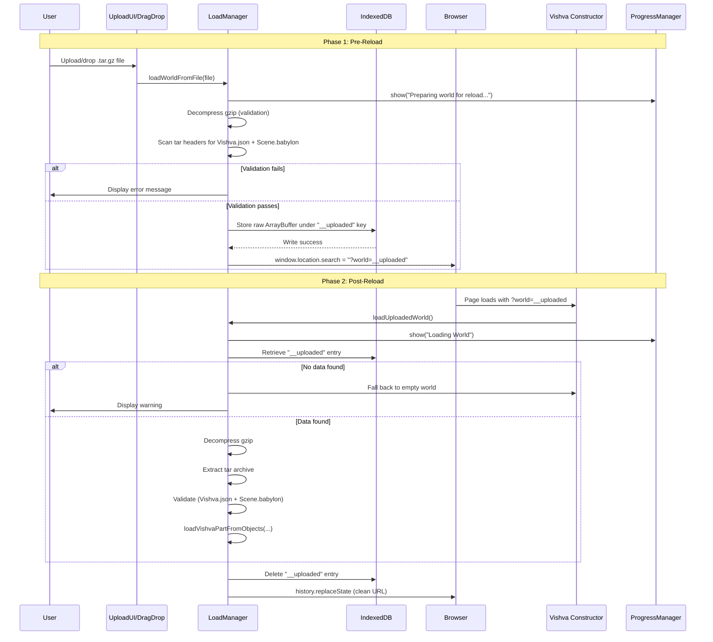

# Design Document: World Load Page Reload

## Overview

This feature replaces the current in-place world loading from local files (which causes scene accumulation bugs due to stale WebGL state) with a page-reload strategy. The core idea is simple: instead of trying to load a new world into an already-initialized BabylonJS scene, we store the uploaded file in IndexedDB, reload the page to get a fresh WebGL context, and then load the world through the standard initialization path.

The flow has two distinct phases:
1. **Pre-reload phase**: Validate the uploaded `.tar.gz` file, store it in IndexedDB, and trigger a page reload with `?world=__uploaded`
2. **Post-reload phase**: Detect the `__uploaded` flag, retrieve the file from IndexedDB, decompress/extract/load it through the existing pipeline, then clean up

This approach guarantees a clean WebGL context for every world load while reusing the existing `loadVishvaPartFromObjects` pipeline that already works correctly for server-loaded worlds.

## Architecture



### Design Decisions

1. **Store raw ArrayBuffer, not extracted data**: We store the original compressed `.tar.gz` bytes in IndexedDB rather than pre-extracted JSON. This keeps the IndexedDB write fast (single blob) and reuses the existing decompression/extraction pipeline on reload. The validation in Phase 1 only checks tar headers — it doesn't need to fully parse the JSON.

2. **Lightweight pre-reload validation**: Before storing, we decompress and scan tar headers to confirm `Vishva.json` and `Scene.babylon` exist. We do NOT parse the JSON contents — that happens post-reload. This gives fast feedback on obviously invalid files without duplicating the full load logic.

3. **Reuse existing `loadVishvaPartFromObjects` pipeline**: The post-reload path mirrors `loadZipWorld`'s existing IndexedDB-first path. This ensures consistent behavior between server-loaded and uploaded worlds.

4. **`__uploaded` as a reserved sentinel**: The value `__uploaded` in the `?world=` parameter is a sentinel that cannot conflict with real world filenames (which are always `.tar.gz` or `.js` files on the server).

5. **Always clean up**: Both success and failure paths delete the IndexedDB entry and clean the URL. This prevents stale data from causing repeated failures on refresh.

## Components and Interfaces

### Modified: `LoadManager` (src/managers/LoadManager.ts)

**New public method:**
```typescript
/**
 * Validate a .tar.gz world file, store in IndexedDB, and reload the page.
 * Replaces the current in-place loading behavior of loadWorldFromFile.
 */
public async loadWorldFromFile(file: File): Promise<void>
```

**New public method:**
```typescript
/**
 * Load a world from IndexedDB after page reload.
 * Called by Vishva constructor when sceneFile === "__uploaded".
 * Retrieves, decompresses, extracts, validates, and loads the world.
 * Falls back to empty world if data is missing or invalid.
 * Always cleans up IndexedDB entry and URL parameter.
 */
public async loadUploadedWorld(): Promise<void>
```

**New private method:**
```typescript
/**
 * Store raw ArrayBuffer in IndexedDB under the given key.
 * Uses the existing "VishvaWorlds" database and "worlds" object store.
 */
private _storeInIndexedDB(key: string, data: ArrayBuffer): Promise<void>
```

**New private method:**
```typescript
/**
 * Retrieve raw ArrayBuffer from IndexedDB by key.
 * Returns null if not found.
 */
private _getFromIndexedDB(key: string): Promise<ArrayBuffer | null>
```

**New private method:**
```typescript
/**
 * Delete an entry from IndexedDB by key.
 */
private _deleteFromIndexedDB(key: string): Promise<void>
```

**New public method (pure, testable):**
```typescript
/**
 * Validate tar archive headers by decompressing and checking for required entries.
 * Returns { valid: true } or { valid: false, error: string }.
 * This is the lightweight pre-reload validation.
 */
public async validateWorldFile(data: ArrayBuffer): Promise<{ valid: boolean; error?: string }>
```

### Modified: `Vishva` (src/Vishva.ts)

The constructor's branching logic changes from:

```typescript
if (sceneFile == "empty") {
    this.loadBabylonjsPart(this.scene, true);
} else {
    this.loadManager.sceneLoad1(scenePath, sceneFile, this.scene);
}
```

To:

```typescript
if (sceneFile == "empty") {
    this.loadBabylonjsPart(this.scene, true);
} else if (sceneFile == "__uploaded") {
    this.loadManager.loadUploadedWorld();
} else {
    this.loadManager.sceneLoad1(scenePath, sceneFile, this.scene);
}
```

### Unchanged: `UploadUI` (src/gui/UploadUI.ts)

No changes needed. `UploadUI` already calls `this._vishva.loadManager.loadWorldFromFile(worldFile)` — the method signature stays the same, only its internal behavior changes.

### Unchanged: `index.ts`

No changes needed. `HREFsearch` already parses `?world=__uploaded` and passes it to the Vishva constructor.

### Unchanged: Drag-and-drop in `LoadManager.setupDragAndDrop`

The drag-and-drop handler already routes `.tar.gz` files to `loadWorldFromFile`. Since we're changing `loadWorldFromFile`'s internals (not its signature), drag-and-drop automatically uses the new page-reload flow.

## Data Models

### IndexedDB Schema

Uses the existing `VishvaWorlds` database with `worlds` object store (keyPath: `"name"`).

**Uploaded world entry:**
```typescript
{
    name: "__uploaded",       // Well-known key (matches query param value)
    data: ArrayBuffer,       // Raw .tar.gz compressed bytes
    timestamp: number        // Date.now() at time of storage (for debugging/staleness)
}
```

### URL Query Parameter

| Parameter | Value | Meaning |
|-----------|-------|---------|
| `?world=empty` | `"empty"` | Load empty world (existing) |
| `?world=__uploaded` | `"__uploaded"` | Load from IndexedDB uploaded entry |
| `?world=<filename>` | Any other string | Load from server (existing) |

### Validation Result Type

```typescript
interface ValidationResult {
    valid: boolean;
    error?: string;  // Human-readable error message when valid === false
}
```

## Correctness Properties

*A property is a characteristic or behavior that should hold true across all valid executions of a system — essentially, a formal statement about what the system should do. Properties serve as the bridge between human-readable specifications and machine-verifiable correctness guarantees.*

### Property 1: Archive validation correctness

*For any* tar archive (represented as a `Map<string, Uint8Array>`), `validateWorldArchive` returns `{ valid: true }` if and only if the map contains both a `"Vishva.json"` key and a `"Scene.babylon"` key. For any map missing either or both keys, it returns `{ valid: false }` with a descriptive error message.

**Validates: Requirements 1.1, 3.4**

### Property 2: Scene file routing is a complete partition

*For any* scene file string, the Vishva constructor routes to exactly one of three paths: (1) `"empty"` → `loadBabylonjsPart`, (2) `"__uploaded"` → `loadUploadedWorld`, (3) any other string → `sceneLoad1`. No string triggers more than one path, and no string triggers zero paths.

**Validates: Requirements 2.2, 2.3**

### Property 3: Tar archive round-trip preserves file contents

*For any* set of files (filename → Uint8Array pairs), creating a tar archive via `createTarArchive` and then extracting it via `extractTarArchive` produces a map containing all original filenames with byte-identical data.

**Validates: Requirements 3.2**

### Property 4: File type classification partitions world files from asset files

*For any* filename string, `isTarGzFile` returns `true` if and only if the filename ends with `.tar.gz` (case-insensitive). This cleanly partitions all possible filenames into world files (page-reload flow) and asset files (append flow), with no filename unclassified and no filename in both categories.

**Validates: Requirements 5.1, 5.3**

## Error Handling

### Pre-Reload Phase Errors

| Error Condition | Handling | User Feedback |
|----------------|----------|---------------|
| File cannot be read (corrupt/empty) | Catch in `loadWorldFromFile`, abort | Alert: "Failed to load world: [error]" |
| Gzip decompression fails | Catch DecompressionStream error | Alert: "Not a valid Vishva world file: decompression failed" |
| Tar extraction fails (invalid format) | Catch in `_extractTarArchive` | Alert: "Not a valid Vishva world file: invalid archive format" |
| Missing Vishva.json or Scene.babylon | `validateWorldArchive` returns error | Alert: specific missing-file message |
| IndexedDB write fails | Catch in `_storeInIndexedDB` | Alert: "Failed to save world for reload: [error]" |
| IndexedDB not available | Catch `indexedDB.open` error | Alert: "Browser storage not available. Cannot load world." |

### Post-Reload Phase Errors

| Error Condition | Handling | User Feedback |
|----------------|----------|---------------|
| No `__uploaded` entry in IndexedDB | Fall back to empty world | Console warning: "No uploaded world found in storage" |
| Stored data fails decompression | Fall back to empty world, delete entry | Alert: "Uploaded world data is corrupted" |
| Stored data fails validation | Fall back to empty world, delete entry | Alert: specific validation error |
| JSON parse error in Vishva.json/Scene.babylon | Fall back to empty world, delete entry | Alert: "Failed to parse world data" |
| `loadVishvaPartFromObjects` throws | Caught by existing error handling in BabylonJS | Existing error display |

### Cleanup Guarantees

- IndexedDB `__uploaded` entry is **always** deleted after `loadUploadedWorld` completes (success or failure)
- URL query parameter is **always** cleaned via `history.replaceState` after load attempt
- These cleanups happen in a `finally` block to ensure execution regardless of error path

## Testing Strategy

### Property-Based Tests (fast-check + Vitest)

Property-based testing is appropriate for this feature because:
- The validation logic is a pure function with clear input/output behavior
- The routing logic is a pure decision based on string input
- The tar round-trip involves data transformation with a universal preservation property
- The file classification is a pure function over an infinite input space (all possible filenames)

**Library**: fast-check 4.7.0 (already in devDependencies)
**Runner**: Vitest 4.1.5
**Minimum iterations**: 100 per property
**File**: `src/managers/LoadManager.pageReload.property.test.ts`

Each property test will be tagged with:
- **Feature: world-load-page-reload, Property {N}: {property_text}**

| Property | What's Generated | What's Verified |
|----------|-----------------|-----------------|
| 1: Archive validation | Random `Map<string, Uint8Array>` with varying key sets | `validateWorldArchive` returns valid iff both required keys present |
| 2: Scene file routing | Random strings including "empty", "__uploaded", and arbitrary values | Routing decision matches expected path for each category |
| 3: Tar round-trip | Random file sets (name → bytes pairs) | `extractTarArchive(createTarArchive(files))` preserves all entries |
| 4: File classification | Random filenames with various extensions | `isTarGzFile` returns true iff filename ends with `.tar.gz` |

### Unit Tests (Example-Based)

**File**: `src/managers/LoadManager.pageReload.test.ts`

| Test | What's Verified |
|------|-----------------|
| loadWorldFromFile shows error on invalid file | Error displayed, no IndexedDB write, no reload |
| loadWorldFromFile stores and reloads on valid file | IndexedDB write with correct key, reload triggered |
| loadUploadedWorld falls back on missing data | Empty world loaded, warning displayed |
| loadUploadedWorld cleans up on success | IndexedDB entry deleted, URL cleaned |
| loadUploadedWorld cleans up on failure | IndexedDB entry deleted, URL cleaned |
| Progress messages shown during pre-reload | ProgressManager.show/update called |
| Progress messages shown during post-reload | ProgressManager.show/update called |

### Integration Tests

| Test | What's Verified |
|------|-----------------|
| Full flow: upload → store → reload → load → cleanup | End-to-end with real IndexedDB (via fake-indexeddb) |
| Drag-and-drop .tar.gz triggers page-reload flow | setupDragAndDrop routes correctly |
| Drag-and-drop .glb continues to append | Non-.tar.gz files still use loadDroppedAsset |

