# Design Document: IndexedDB Asset Storage

## Overview

This feature replaces the current in-memory `Map<string, Uint8Array>` asset storage with an IndexedDB-backed `AssetStore` module that persists assets on disk and serves them on-demand. It also introduces structured path preservation in tar archives (replacing the flat `assets/` layout with `vishva/assets/<relative-path>`) and enables a direct IndexedDB save/load path that bypasses intermediate tar.gz creation.

The three changes work together:
1. **IndexedDB storage** — reduces JS heap pressure by moving assets out of memory
2. **Structured paths** — eliminates filename collisions and makes IDB keys predictable
3. **Direct IDB save/load** — faster "save world in browser" without tar.gz intermediary

### Design Rationale

The current approach holds all decompressed assets in `vishva._loadedAssetMap` for the entire session because `SaveManager` needs them for re-save. For large worlds (50MB+ of textures), this consumes significant heap memory. IndexedDB provides persistent browser storage with no heap cost for idle assets, and the browser manages disk I/O transparently.

Structured paths (`vishva/assets/audio/footstep.ogg` instead of `assets/footstep.ogg`) eliminate the disambiguation logic currently needed when multiple files share the same basename, and make IDB keys self-documenting.

## Architecture

```mermaid
graph TD
    subgraph "World Load Flow (from .tar.gz)"
        A[Fetch .tar.gz] --> B[Decompress + Extract]
        B --> C[AssetStore.clearSession]
        C --> C2[AssetStore.putBatch to session]
        C2 --> D[Release in-memory data]
        D --> E[AssetResolver.activate with AssetStore ref]
    end

    subgraph "Asset Serving (on-demand)"
        F[BabylonJS requests asset] --> G[AssetResolver intercepts]
        G --> H[AssetStore.get from session]
        H --> I[Create Blob URL]
        I --> J[Return to BabylonJS]
    end

    subgraph "Save to File (.tar.gz)"
        K[SaveManager._getWorldZipBlob] --> L[AssetStore.listKeys from session]
        L --> M[AssetStore.get each asset]
        M --> N[Build TAR archive]
        N --> O[Compress + Download]
    end

    subgraph "Save World in Browser"
        P[User clicks Save] --> Q[AssetCollector scans scene]
        Q --> Q2{Asset in session store?}
        Q2 -->|Yes| Q3[Read from session store]
        Q2 -->|No| Q4[Fetch from server]
        Q3 --> R[AssetStore.saveWorldBatch to saved store]
        Q4 --> R
        R --> R2[Store Vishva.json + Scene.babylon to saved store]
    end

    subgraph "Load Saved World from Browser"
        S[User selects saved world] --> S2[AssetStore.clearSession]
        S2 --> S3[Copy saved assets to session]
        S3 --> T[AssetResolver.activate with AssetStore ref]
    end
```



### Key Design Decisions

1. **Single IDB database, two object stores**: One database `VishvaAssetStore` with two object stores:
   - `session` — holds assets for the currently-loaded world. Cleared on every new world load. This is the working set.
   - `saved` — holds explicitly-saved worlds (via "Save World in Browser"). Persisted until the user deletes them. Keyed by `{worldName}/{assetPath}`.

   This separation ensures that loading a new world never destroys previously-saved worlds.

2. **No LRU cache**: The initial implementation serves assets directly from IDB without an in-memory cache. IDB reads are typically 1-5ms which is acceptable for BabylonJS texture loading. A cache can be added later if profiling shows a need.

3. **Structured paths as IDB keys**: Assets are keyed by their full structured path (e.g., `vishva/assets/audio/footstep.ogg`). This makes lookups O(1) and debugging straightforward.

4. **Structured paths only**: All archives use the new structured path format (`vishva/assets/path/filename.ext`). Old flat `assets/` archives are not supported — they must be re-saved in the new format.

5. **World name scoping for saved worlds**: Saved worlds are namespaced by world name in the `saved` store. Keys follow the pattern `{worldName}/{assetPath}` (e.g., `fantasy-town/vishva/assets/audio/footstep.ogg`). This allows multiple worlds to coexist without collision.

## Components and Interfaces

### AssetStore (new module)

```typescript
// src/managers/AssetStore.ts

export class AssetStore {
    private dbName = "VishvaAssetStore";
    private sessionStoreName = "session";
    private savedStoreName = "saved";
    private db: IDBDatabase | null = null;

    /** Open the database connection. Must be called before other operations. */
    async open(): Promise<void>;

    // --- Session store operations (active world) ---

    /** Store a single asset in the session store. Key is the structured path. */
    async put(key: string, data: Uint8Array): Promise<void>;

    /** Store multiple assets in the session store in a single transaction. */
    async putBatch(entries: Array<{ key: string; data: Uint8Array }>): Promise<void>;

    /** Retrieve an asset from the session store by its structured path key. Returns null if not found. */
    async get(key: string): Promise<Uint8Array | null>;

    /** List all asset keys in the session store. */
    async listKeys(): Promise<string[]>;

    /** Delete all assets from the session store (called on new world load). */
    async clearSession(): Promise<void>;

    // --- Saved worlds store operations ---

    /** Save an asset to the saved store, scoped by world name. */
    async saveWorldAsset(worldName: string, key: string, data: Uint8Array): Promise<void>;

    /** Save multiple assets to the saved store in a single transaction. */
    async saveWorldBatch(worldName: string, entries: Array<{ key: string; data: Uint8Array }>): Promise<void>;

    /** Retrieve an asset from a saved world. */
    async getSavedAsset(worldName: string, key: string): Promise<Uint8Array | null>;

    /** List all asset keys for a saved world. */
    async listSavedKeys(worldName: string): Promise<string[]>;

    /** List all saved world names. */
    async listSavedWorlds(): Promise<string[]>;

    /** Delete an entire saved world and all its assets. */
    async deleteSavedWorld(worldName: string): Promise<void>;

    // --- General ---

    /** Close the database connection. */
    close(): void;

    /** Check if IndexedDB is available and accessible. */
    static isAvailable(): boolean;
}
```

### Modified AssetResolver

The existing `AssetResolver` is modified to read from `AssetStore` instead of an in-memory `Map<string, Uint8Array>`:

```typescript
export class AssetResolver {
    private blobUrls: string[] = [];
    private assetStore: AssetStore | null = null;

    /** Activate with IndexedDB-backed store. */
    activate(store: AssetStore): void;

    /** Resolve asset paths in VishvaSerialized using full structured paths. */
    resolveAssetPaths(obj: any): void;

    /** Deactivate and revoke all Blob URLs. */
    deactivate(): void;
}
```

### Modified AssetCollector

`AssetCollector` is updated to preserve structured paths:

```typescript
// Changes to _generateFilename for server assets:
// Before: vishva/assets/audio/footstep.ogg → footstep.ogg
// After:  vishva/assets/audio/footstep.ogg → vishva/assets/audio/footstep.ogg

// Data URI assets go under: vishva/assets/data/<generated_name>
// Blob textures go under:   vishva/assets/blob/<generated_name>
```

### Modified TarUtils

`TarUtils` is extended to support UStar long paths:

```typescript
// createTarArchive: When filename > 100 bytes, split into prefix (345-499) + name (0-99)
// extractTarArchive: Concatenate prefix + "/" + name when prefix field is non-empty
```

### Modified LoadManager

```typescript
// New flow (from .tar.gz):
// 1. Fetch + decompress + extract tar
// 2. AssetStore.clearSession() (remove previous session's working set)
// 3. AssetStore.putBatch(extractedAssets)
// 4. Release tar data and in-memory map
// 5. AssetResolver.activate(assetStore)

// Direct IDB load (from saved world):
// 1. AssetStore.listSavedKeys(worldName) to get all assets
// 2. AssetStore.clearSession()
// 3. Copy saved world assets into session store (or read directly from saved store)
// 4. AssetResolver.activate(assetStore)
```

### Modified SaveManager

```typescript
// Save to file (.tar.gz):
// 1. AssetStore.listKeys() to get all carried-forward assets from session
// 2. AssetStore.get(key) for each asset needed in archive
// 3. Build tar with structured paths

// Direct IDB save ("Save World in Browser"):
// Works regardless of whether world was loaded from .tar.gz or server.
// 1. AssetCollector scans scene to gather all referenced asset URLs
// 2. For each asset:
//    a. Check session store (AssetStore.get) — use if present
//    b. If not in session store, fetch from server via HTTP
// 3. AssetStore.saveWorldBatch(worldName, allAssets)
// 4. AssetStore.saveWorldAsset(worldName, "Vishva.json", serializedVishva)
// 5. AssetStore.saveWorldAsset(worldName, "Scene.babylon", serializedScene)
// No tar.gz intermediate created
// Session store is NOT modified — user continues working
```

## Data Models

### IndexedDB Schema

```
Database: VishvaAssetStore (version 1)
├── Object Store: "session" (active world working set)
│   ├── keyPath: "key"
│   └── Records:
│       {
│           key: string,          // e.g., "vishva/assets/audio/footstep.ogg"
│           data: Uint8Array,     // Binary asset data
│           timestamp: number     // Date.now() when stored
│       }
│
└── Object Store: "saved" (explicitly-saved worlds, persisted)
    ├── keyPath: "key"
    ├── index: "worldName" (for efficient per-world queries)
    └── Records:
        {
            key: string,          // e.g., "fantasy-town/vishva/assets/audio/footstep.ogg"
            worldName: string,    // e.g., "fantasy-town" (indexed for range queries)
            data: Uint8Array,     // Binary asset data
            timestamp: number     // Date.now() when saved
        }
```

### Archive Path Structure (new)

```
world.tar.gz
├── Vishva.json
├── Scene.babylon
└── vishva/
    └── assets/
        ├── audio/
        │   └── footstep.ogg
        ├── textures/
        │   ├── ground.jpg
        │   └── brick.jpg
        ├── curated/
        │   └── skyboxes/
        │       └── TropicalSunnyDay/
        │           ├── TropicalSunnyDay_px.jpg
        │           └── ...
        ├── data/
        │   └── embedded_texture_0.png
        └── blob/
            └── a1b2c3d4-uuid.bin
```

### Path Mapping Rules

| Asset Source | Current Archive Path | New Archive Path |
|---|---|---|
| Server asset `vishva/assets/audio/footstep.ogg` | `assets/footstep.ogg` | `vishva/assets/audio/footstep.ogg` |
| Data URI (embedded base64) | `assets/data_asset.png` | `vishva/assets/data/data_asset.png` |
| Blob URL texture | `assets/uuid.bin` | `vishva/assets/blob/uuid.bin` |
| Already-archived (carry-forward) | `assets/filename.ext` | Re-mapped to `vishva/assets/<path>/filename.ext` |

## Correctness Properties

*A property is a characteristic or behavior that should hold true across all valid executions of a system — essentially, a formal statement about what the system should do. Properties serve as the bridge between human-readable specifications and machine-verifiable correctness guarantees.*

### Property 1: AssetStore Round-Trip

*For any* valid structured path key and any binary data (0 to 100KB), storing the data in the AssetStore via `put(key, data)` and then retrieving it via `get(key)` SHALL return byte-for-byte identical data.

**Validates: Requirements 1.3, 6.2**

### Property 2: No Asset Loss During Ingestion

*For any* set of extracted archive entries (1 to 50 entries with unique keys), after calling `putBatch(entries)`, calling `listKeys()` SHALL return exactly the same set of keys that were stored, with no entries missing.

**Validates: Requirements 1.1**

### Property 3: Session Cleanup Completeness

*For any* set of assets stored in the AssetStore session store, after calling `clearSession()`, calling `listKeys()` SHALL return an empty array, and `get(key)` for any previously-stored key SHALL return null. Assets in the `saved` store SHALL remain unaffected.

**Validates: Requirements 3.1, 3.3**

### Property 4: Blob URL Tracking Invariant

*For any* sequence of N distinct asset requests served by the AssetResolver (where each request corresponds to a stored asset), the resolver's tracked Blob URL list SHALL contain exactly N entries, and after `deactivate()` the list SHALL be empty.

**Validates: Requirements 2.2, 3.2**

### Property 5: Server Asset Structured Path Preservation

*For any* server asset URL matching the pattern `vishva/assets/<path>/<filename.ext>`, the AssetCollector SHALL produce an `archiveFilename` equal to the original URL (preserving the full `vishva/assets/` prefix and all intermediate directory segments).

**Validates: Requirements 4.1, 4.2**

### Property 6: Data URI Subdirectory Placement

*For any* data URI asset with any MIME type, the AssetCollector SHALL produce an `archiveFilename` that starts with `vishva/assets/data/` followed by a generated filename with the correct extension for the MIME type.

**Validates: Requirements 4.3**

### Property 7: Blob Texture Subdirectory Placement

*For any* blob URL texture, the AssetCollector SHALL produce an `archiveFilename` that starts with `vishva/assets/blob/` followed by a generated filename derived from the blob URL's UUID.

**Validates: Requirements 4.4**

### Property 8: Path Rewriting with Structured Paths

*For any* object tree containing string values that match collected asset entries' `originalUrl`, after `PathRewriter.rewrite()` is called, every occurrence of those original URLs SHALL be replaced with the corresponding full structured archive path (e.g., `vishva/assets/audio/footstep.ogg`).

**Validates: Requirements 5.1**

### Property 9: Full-Path Matching Disambiguation

*For any* two assets with the same basename but different directory paths (e.g., `vishva/assets/textures/brick.jpg` and `vishva/assets/curated/walls/brick.jpg`), the AssetResolver SHALL return the correct distinct data for each when requested by their full structured path.

**Validates: Requirements 5.2**

### Property 10: TAR Long Path Round-Trip

*For any* set of files where at least one filename is between 101 and 255 bytes long, creating a TAR archive via `createTarArchive` and extracting via `extractTarArchive` SHALL preserve the full filename and binary data for every entry.

**Validates: Requirements 7.1, 7.2**

### Property 11: VishvaSerialized Structured Path Resolution

*For any* object tree containing `vishva/assets/`-prefixed string values that correspond to assets stored in the AssetStore, after `resolveAssetPaths()` is called, every such string SHALL be replaced with a valid Blob URL (starting with `blob:`).

**Validates: Requirements 8.1, 8.2**

### Property 12: Asset Key Enumeration Completeness

*For any* set of N assets stored via `put()` or `putBatch()` with unique keys, `listKeys()` SHALL return a set of exactly N keys matching the stored keys (order-independent).

**Validates: Requirements 6.3**

### Property 13: Saved World Isolation

*For any* two saved worlds with distinct names, saving assets to world A and then saving assets to world B SHALL NOT modify or delete world A's assets. Calling `listSavedKeys(worldA)` after saving world B SHALL return the same keys as before world B was saved.

**Validates: Requirements 10.1, 10.2**

### Property 14: Session-Save Independence

*For any* set of assets in the session store, calling `clearSession()` SHALL NOT affect any assets in the saved store. Conversely, calling `deleteSavedWorld(name)` SHALL NOT affect the session store.

**Validates: Requirements 3.1, 10.1**

## Error Handling

### IndexedDB Unavailability (Requirement 9.1)

- `AssetStore.open()` checks `AssetStore.isAvailable()` first
- If `indexedDB` global is undefined or `open()` rejects, throw a descriptive error
- `LoadManager` catches this and displays a user-facing alert: "Cannot load world: IndexedDB is not available in this browser. Please check your browser settings."

### Storage Quota Exceeded (Requirement 9.2)

- During `putBatch()`, if any write throws a `QuotaExceededError` (DOMException name), stop ingestion
- Surface error to user: "This world is too large for available browser storage. Try clearing browser data or using a smaller world."
- Partial writes that succeeded before the quota error remain (best-effort)

### Individual Asset Write Failure (Requirement 1.4)

- During `putBatch()`, if a single write fails with a non-quota error, log the error with the asset key
- Continue storing remaining assets
- Report count of failed assets at the end (non-blocking warning)

### Blob URL Fetch Failure

- If `AssetResolver` cannot read an asset from IDB (returns null), fall through to original BabylonJS loading behavior
- Log a warning but don't block scene loading

## Testing Strategy

### Property-Based Tests (fast-check + Vitest)

Property-based testing is appropriate for this feature because:
- The AssetStore has clear input/output behavior (store/retrieve binary data)
- Universal properties hold across a wide input space (any path, any binary data)
- The TAR utility has a well-defined round-trip property
- Path generation logic must hold for all valid URL patterns

**Configuration:**
- Library: `fast-check` (already in devDependencies)
- Minimum 100 iterations per property test
- Each test tagged with: `Feature: indexeddb-asset-storage, Property N: <title>`
- Use `fake-indexeddb` (already in devDependencies) for IDB mocking in tests

**Property tests to implement:**
- Property 1: AssetStore round-trip (`AssetStore.property.test.ts`)
- Property 2: No asset loss during ingestion (`AssetStore.property.test.ts`)
- Property 3: Session cleanup completeness (`AssetStore.property.test.ts`)
- Property 4: Blob URL tracking invariant (`AssetResolver.indexeddb.property.test.ts`)
- Property 5: Server asset structured path preservation (`AssetCollector.structuredPaths.property.test.ts`)
- Property 6: Data URI subdirectory placement (`AssetCollector.structuredPaths.property.test.ts`)
- Property 7: Blob texture subdirectory placement (`AssetCollector.structuredPaths.property.test.ts`)
- Property 8: Path rewriting with structured paths (`PathRewriter.structuredPaths.property.test.ts`)
- Property 9: Full-path matching disambiguation (`AssetResolver.indexeddb.property.test.ts`)
- Property 10: TAR long path round-trip (`TarRoundTrip.longPaths.property.test.ts`)
- Property 11: VishvaSerialized structured path resolution (`AssetResolver.indexeddb.property.test.ts`)
- Property 12: Asset key enumeration completeness (`AssetStore.property.test.ts`)
- Property 13: Saved world isolation (`AssetStore.property.test.ts`)
- Property 14: Session-save independence (`AssetStore.property.test.ts`)

### Unit Tests (example-based)

- IndexedDB unavailability error handling (Requirement 9.1)
- Quota exceeded error handling (Requirement 9.2)
- Memory release after ingestion (Requirement 1.2)
- Direct IDB save stores Vishva.json + Scene.babylon (Requirement 10.2)

### Integration Tests

- Full save-to-file flow reads from AssetStore (Requirement 6.1)
- Direct IDB save bypasses tar creation (Requirement 10.1)
- Direct IDB load bypasses decompression (Requirement 10.4)
- New assets collected and stored during direct save (Requirement 10.3)


## Post-Implementation Changes

The following changes were made after the initial implementation to fix integration issues and improve the workflow.

### WorldLauncher Integration

`WorldLauncher._loadBrowserWorlds()` now reads saved worlds directly from the `VishvaAssetStore/saved` object store via `AssetStore.listSavedWorlds()`, replacing the old `VishvaWorlds` IndexedDB database query. When a user selects a saved world from the browser list, the launcher sets the URL parameter `?world=__saved:<worldName>` to trigger the saved-world load path.

In `Vishva.ts`, the constructor routing was updated to detect the `__saved:` prefix on the `sceneFile` parameter. When found, it extracts the world name and calls `loadManager.loadSavedWorld(savedWorldName)` instead of the normal server-fetch path.

### Removal of Legacy VishvaWorlds Check

`LoadManager.loadZipWorld()` no longer calls `_loadWorldFromIndexedDB()`. The `_loadWorldFromIndexedDB` method (which opened the old `VishvaWorlds` database) was removed entirely. `loadZipWorld` now goes directly to server fetch. All browser-saved world loading is handled exclusively through the `AssetStore` saved store and the `__saved:` URL routing.

### SaveManager On-Demand AssetStore Creation

`SaveManager.saveWorldToIndexedDB()` now creates and opens an `AssetStore` instance if `this.vishva._assetStore` is undefined. This handles the case where a user starts from an empty world (no .tar.gz loaded, so no AssetStore was initialized during load). If `AssetStore.open()` fails, it falls back to the legacy tar.gz blob save path.

### AssetCollector Filtering for Generated Archive Paths

`AssetCollector._isServerAssetString()` now skips paths prefixed with `vishva/assets/data/` and `vishva/assets/blob/`. These are generated archive paths (for data-URI textures and blob textures respectively) that exist only inside saved archives — they are not fetchable from the server.

Additionally, `_scanTextureArray()` and `_scanMaterials()` now skip texture names prefixed with `vishva/assets/` since these represent already-archived textures that don't need to be re-collected from the scene.

### SavePromptLogic Changes

`normalizeWorldName()` no longer appends `.tar.gz` to the world name — it only trims whitespace. This reflects the shift toward IndexedDB saves where the world name is a plain identifier, not a filename.

`getDefaultWorldName()` now strips the `.tar.gz` suffix from server-loaded world names and defaults to `"world"` instead of `"empty"` for new worlds.

### URL Decoding Fix

`src/util/HREFsearch.ts` — `getParm()` now calls `decodeURIComponent()` on URL parameter values. This ensures world names containing special characters (spaces, colons, etc.) are correctly decoded from the URL query string.


## Known Issues

### Blob URL Leak in VishvaSerialized on Re-Save

**Fixed in:** `.kiro/specs/0.4.0-alpha.42-blob-url-resave-fix/`

The `resolveAssetPaths()` method (Property 11) destructively mutates VishvaSerialized, replacing `"vishva/assets/..."` strings with blob URLs. This works correctly for runtime asset serving, but creates a bug on re-save: `SNAManager.serializeSnAs()` captures the blob URLs because the original paths are lost. The `AssetCollector` correctly rejects blob URLs (they aren't server-fetchable), so the blob URL is serialized as-is into Vishva.json, and the asset binary data is not included in the archive.

**Impact:** Save-load-save cycle breaks SNA actuator asset references (Dialog HTML files, Sound files, etc.)

**Fix approach:** AssetResolver maintains a reverse mapping (blob URL → original asset path). At save time, SaveManager uses this mapping to restore original paths in VishvaSerialized before serialization, and sources asset binary data from the session store or active blob URL.
