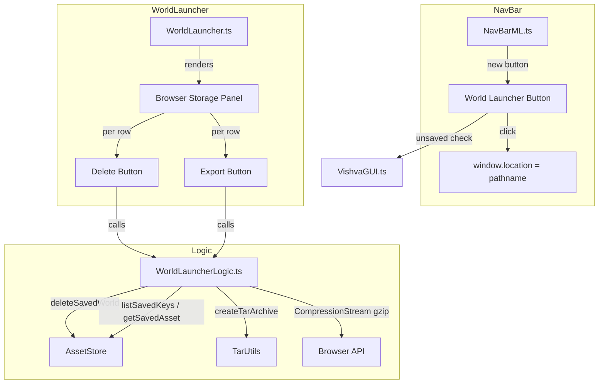

# Design Document: World Launcher Enhancements

## Overview

This design adds three enhancements to the Vishva World Launcher:

1. **Navbar Icon** — A new button in the editor's navigation bar that navigates back to the World Launcher overlay, enabling quick world switching without manual URL editing.
2. **Delete Saved World** — Action buttons in the Browser Storage panel that let users delete saved worlds from IndexedDB with confirmation and inline feedback.
3. **Export as tar.gz** — Action buttons that export a saved world's assets as a downloadable `.tar.gz` archive using the existing `TarUtils.createTarArchive` and the Compression Streams API.

All three features build on existing infrastructure (`NavBarML`, `WorldLauncher`, `AssetStore`, `TarUtils`) and follow the project's vanilla DOM + W3.CSS patterns.

## Architecture



### Component Responsibilities

| Component | Role |
|-----------|------|
| `NavBarML.ts` | Adds the World Launcher button markup to the navbar HTML template |
| `VishvaGUI.ts` | Wires the navbar button click handler (unsaved-changes guard + navigation) |
| `WorldLauncher.ts` | Renders delete/export buttons per world row, handles UI state (disable, error messages, list updates) |
| `WorldLauncherLogic.ts` | Pure logic: delete world, export world (asset retrieval → tar → gzip → download trigger) |
| `AssetStore.ts` | Existing IndexedDB API — `deleteSavedWorld`, `listSavedKeys`, `getSavedAsset` (no changes needed) |
| `TarUtils.ts` | Existing tar archive creation (no changes needed) |

## Components and Interfaces

### 1. NavBar World Launcher Button

**Markup change in `NavBarML.ts`:**

Insert a new button as the **first child** of `#navMenubar`:

```html
<button id="worldLauncher" title="world launcher">
  <span class="material-icons-outlined">public</span>
</button>
```

**Event wiring in `VishvaGUI._createNavMenu()`:**

```typescript
// World Launcher button — navigate to launcher (strip query params)
const worldLauncherBtn = document.getElementById("worldLauncher");
worldLauncherBtn.onclick = (e) => {
    if (this._vishva.isDirty()) {
        if (!confirm("You have unsaved changes. Leave this world?")) {
            return false;
        }
    }
    window.location.href = window.location.pathname;
    return false;
};
```

**Key design decisions:**
- Uses `window.location.pathname` (strips all query params) which causes a full page reload showing the World Launcher overlay (since no `?world=` param is present).
- The unsaved-changes check uses `Vishva.isDirty()` (or equivalent dirty flag) with a native `confirm()` dialog, consistent with browser beforeunload patterns.
- Icon choice: `public` (globe) — recognizable as "world" without being confused with existing icons.

### 2. Delete Saved World

**UI changes in `WorldLauncher._showBrowserStoragePanel()`:**

Each world row gains a delete button. The row structure changes from a single clickable div to a flex container:

```typescript
private _createBrowserWorldRow(
    worldName: string,
    listContainer: HTMLDivElement,
    onLoad: () => void
): HTMLDivElement {
    const row = document.createElement("div");
    row.style.display = "flex";
    row.style.alignItems = "center";
    row.style.borderBottom = "1px solid rgba(255,255,255,0.1)";

    // World name (clickable to load)
    const nameSpan = document.createElement("span");
    nameSpan.className = "w3-button w3-hover-dark-grey";
    nameSpan.style.flex = "1";
    nameSpan.style.color = VThemes.CurrentTheme.darkColors.f;
    nameSpan.style.padding = "10px 16px";
    nameSpan.style.textAlign = "left";
    nameSpan.textContent = worldName;
    nameSpan.onclick = onLoad;

    // Export button
    const exportBtn = document.createElement("button");
    exportBtn.className = "w3-button w3-hover-dark-grey";
    exportBtn.title = "export as tar.gz";
    exportBtn.innerHTML = '<span class="material-icons-outlined" style="font-size:18px">download</span>';
    exportBtn.style.color = VThemes.CurrentTheme.darkColors.f;
    exportBtn.onclick = (e) => {
        e.stopPropagation();
        this._exportWorld(worldName, exportBtn, row);
    };

    // Delete button
    const deleteBtn = document.createElement("button");
    deleteBtn.className = "w3-button w3-hover-dark-grey";
    deleteBtn.title = "delete world";
    deleteBtn.innerHTML = '<span class="material-icons-outlined" style="font-size:18px">delete</span>';
    deleteBtn.style.color = "#ff6b6b";
    deleteBtn.onclick = (e) => {
        e.stopPropagation();
        this._deleteWorld(worldName, row, listContainer);
    };

    row.appendChild(nameSpan);
    row.appendChild(exportBtn);
    row.appendChild(deleteBtn);
    return row;
}
```

**Delete logic (new method in `WorldLauncher.ts`):**

```typescript
private async _deleteWorld(
    worldName: string,
    row: HTMLDivElement,
    listContainer: HTMLDivElement
): Promise<void> {
    if (!confirm(`Delete world "${worldName}"? This cannot be undone.`)) {
        return;
    }

    try {
        await deleteWorldFromStore(worldName);
        row.remove();

        // Show empty state if no worlds remain
        if (listContainer.children.length === 0) {
            this._showEmptyState();
        }
    } catch (err) {
        const msg = err instanceof Error ? err.message : String(err);
        this._showInlineError(`Failed to delete "${worldName}": ${msg}`);
    }
}
```

**Pure logic function in `WorldLauncherLogic.ts`:**

```typescript
/**
 * Delete a saved world from the AssetStore.
 * Opens a new AssetStore connection, deletes, and closes.
 */
export async function deleteWorldFromStore(worldName: string): Promise<void> {
    const store = new AssetStore();
    try {
        await store.open();
        await store.deleteSavedWorld(worldName);
    } finally {
        store.close();
    }
}
```

### 3. Export Saved World as tar.gz

**Export logic (new function in `WorldLauncherLogic.ts`):**

```typescript
/**
 * Export a saved world as a tar.gz file download.
 *
 * Steps:
 * 1. Open AssetStore, list all keys for the world
 * 2. Retrieve each asset's data
 * 3. Build tar archive with TarUtils.createTarArchive
 * 4. Compress with gzip via CompressionStream
 * 5. Trigger browser download as {worldName}.tar.gz
 *
 * @throws Error with descriptive message on failure at any step
 */
export async function exportWorldAsTarGz(worldName: string): Promise<void> {
    const store = new AssetStore();
    try {
        await store.open();

        // Step 1: List all asset keys for this world
        const keys = await store.listSavedKeys(worldName);
        if (keys.length === 0) {
            throw new Error("No assets found for this world");
        }

        // Step 2: Retrieve all asset data
        const files: Array<{ filename: string; data: Uint8Array }> = [];
        for (const key of keys) {
            const data = await store.getSavedAsset(worldName, key);
            if (data !== null) {
                files.push({ filename: key, data });
            }
        }

        // Step 3: Create tar archive
        const tarData = await createTarArchive(files);

        // Step 4: Compress with gzip
        const gzipBlob = await compressGzip(tarData);

        // Step 5: Trigger download
        triggerDownload(gzipBlob, `${worldName}.tar.gz`);
    } finally {
        store.close();
    }
}

/**
 * Compress data using the Compression Streams API (gzip).
 */
export async function compressGzip(data: Uint8Array): Promise<Blob> {
    const stream = new ReadableStream({
        start(controller) {
            controller.enqueue(data);
            controller.close();
        }
    });

    const compressedStream = stream.pipeThrough(
        new CompressionStream("gzip") as any
    );

    const reader = compressedStream.getReader();
    const chunks: Uint8Array[] = [];

    let result = await reader.read();
    while (!result.done) {
        chunks.push(result.value as Uint8Array);
        result = await reader.read();
    }

    const totalLength = chunks.reduce((acc, curr) => acc + curr.length, 0);
    const compressedData = new Uint8Array(totalLength);
    let offset = 0;
    for (const chunk of chunks) {
        compressedData.set(chunk, offset);
        offset += chunk.length;
    }

    return new Blob([compressedData], { type: "application/gzip" });
}

/**
 * Trigger a browser file download for a Blob.
 */
export function triggerDownload(blob: Blob, filename: string): void {
    const url = URL.createObjectURL(blob);
    const a = document.createElement("a");
    a.href = url;
    a.download = filename;
    document.body.appendChild(a);
    a.click();
    document.body.removeChild(a);
    URL.revokeObjectURL(url);
}
```

**UI handler in `WorldLauncher.ts`:**

```typescript
private async _exportWorld(
    worldName: string,
    exportBtn: HTMLButtonElement,
    row: HTMLDivElement
): Promise<void> {
    exportBtn.disabled = true;
    exportBtn.style.opacity = "0.5";

    try {
        await exportWorldAsTarGz(worldName);
    } catch (err) {
        const msg = err instanceof Error ? err.message : String(err);
        this._showInlineError(`Export failed: ${msg}`);
    } finally {
        exportBtn.disabled = false;
        exportBtn.style.opacity = "1";
    }
}
```

## Data Models

No new data models are introduced. The feature operates on existing structures:

### Existing IndexedDB Schema (`VishvaAssetStore`)

| Store | Key Pattern | Fields | Index |
|-------|-------------|--------|-------|
| `saved` | `{worldName}/{assetPath}` | `key`, `worldName`, `data` (Uint8Array), `timestamp` | `worldName` (non-unique) |

### Tar Archive Structure (output of export)

```
{worldName}.tar.gz
├── Vishva.json          # World metadata
├── Scene.babylon        # BabylonJS scene file
├── textures/foo.jpg     # Referenced textures
├── models/bar.glb       # Referenced models
└── ...                  # Other assets
```

Each entry's filename in the tar corresponds to the asset key portion (after stripping the `{worldName}/` prefix), which is exactly what `AssetStore.listSavedKeys` returns.

### Navigation URL Model

| State | URL |
|-------|-----|
| World Launcher shown | `http://host/bin/` (no query params) |
| Saved world loaded | `http://host/bin/?world=__saved:MyWorld` |
| Server world loaded | `http://host/bin/?world=myworld.tar.gz` |

The navbar button navigates to `window.location.pathname` (e.g., `/bin/`), which strips all query parameters and triggers the World Launcher overlay.

## Correctness Properties

*A property is a characteristic or behavior that should hold true across all valid executions of a system — essentially, a formal statement about what the system should do. Properties serve as the bridge between human-readable specifications and machine-verifiable correctness guarantees.*

### Property 1: Navigation strips all query parameters

*For any* URL with any combination of query parameters (including none), navigating via the World Launcher button SHALL produce a URL equal to `window.location.pathname` — containing no query string and no fragment.

**Validates: Requirements 1.3**

### Property 2: Delete confirmation and API call use correct world name

*For any* valid world name string, when the user initiates deletion, the confirmation prompt SHALL contain that exact world name, and upon confirmation, `AssetStore.deleteSavedWorld` SHALL be called with that exact world name as its argument.

**Validates: Requirements 2.2, 2.3**

### Property 3: List integrity after deletion

*For any* list of N saved world names (N ≥ 1), after successfully deleting one world, the displayed list SHALL contain exactly N-1 entries, and those entries SHALL be exactly the original list minus the deleted world name, in the same relative order.

**Validates: Requirements 2.4, 2.7**

### Property 4: Export archive round-trip preserves assets

*For any* set of assets (each with a non-empty key string and arbitrary binary data), creating a tar archive with `createTarArchive` and then compressing with gzip, followed by decompressing and extracting, SHALL yield the exact same set of filenames and binary data as the original input.

**Validates: Requirements 3.3, 3.4**

### Property 5: Export download filename format

*For any* valid world name string, the triggered download filename SHALL equal `"{worldName}.tar.gz"` — the world name concatenated with the `.tar.gz` extension.

**Validates: Requirements 3.5**

## Error Handling

| Scenario | Handling |
|----------|----------|
| IndexedDB unavailable | Show inline error "Browser storage is unavailable" in the content area (existing behavior) |
| `deleteSavedWorld` rejects | Show inline error with failure reason; leave world entry in list unchanged |
| Export: `listSavedKeys` returns empty | Throw error "No assets found for this world" → show inline error |
| Export: `getSavedAsset` returns null for a key | Skip that asset (defensive — shouldn't happen in practice) |
| Export: `createTarArchive` throws | Propagate error → show "Export failed: archive creation failed" |
| Export: `CompressionStream` throws | Propagate error → show "Export failed: compression failed" |
| Navbar click with unsaved changes + user cancels | No navigation; return early |

All errors are displayed inline in the Browser Storage Panel using a styled `<div>` with red text (`#ff6b6b`), consistent with existing error display patterns in `WorldLauncher.ts`.

## Testing Strategy

### Property-Based Tests (fast-check + Vitest)

Property-based testing is appropriate for this feature because several acceptance criteria involve universal properties over varying inputs (world names, asset sets, URLs).

**Library:** fast-check 4.7.0 (already in project)
**Config:** Minimum 100 iterations per property test
**File:** `src/gui/WorldLauncher.property.test.ts` (extends existing file)

Each property test is tagged with:
```
// Feature: world-launcher-enhancements, Property N: <property text>
```

| Property | What to generate | What to assert |
|----------|-----------------|----------------|
| 1: Navigation strips query params | Random URL paths + query strings | Result equals pathname only |
| 2: Delete uses correct world name | Random world name strings | Confirm prompt contains name; deleteSavedWorld called with name |
| 3: List integrity after deletion | Random arrays of world names + index to delete | Remaining list = original minus deleted, same order |
| 4: Export round-trip | Random arrays of `{filename, data}` pairs | tar→gzip→gunzip→untar yields identical entries |
| 5: Download filename format | Random world name strings | Filename === `${name}.tar.gz` |

### Unit Tests (example-based)

**File:** `src/gui/WorldLauncher.test.ts` (extends existing file)

| Test | Validates |
|------|-----------|
| Navbar button exists with correct icon and title | Req 1.1, 1.2 |
| Unsaved changes triggers confirm dialog | Req 1.4 |
| Delete button click does not trigger world load | Req 2.1 |
| Cancel confirmation leaves list unchanged | Req 2.6 |
| Deletion failure shows inline error | Req 2.5 |
| Export button disabled during export | Req 3.7 |
| Export button re-enabled after success | Req 3.8 |
| Export failure shows error and re-enables button | Req 3.6 |
| Empty state shown when last world deleted | Req 2.7 |

### Integration Considerations

The `AssetStore` operations (`deleteSavedWorld`, `listSavedKeys`, `getSavedAsset`) are already tested in `src/managers/AssetStore.test.ts`. The `TarUtils.createTarArchive` round-trip is tested in `src/managers/TarRoundTrip.property.test.ts`. This feature's tests mock these dependencies and focus on the orchestration logic and UI behavior.
