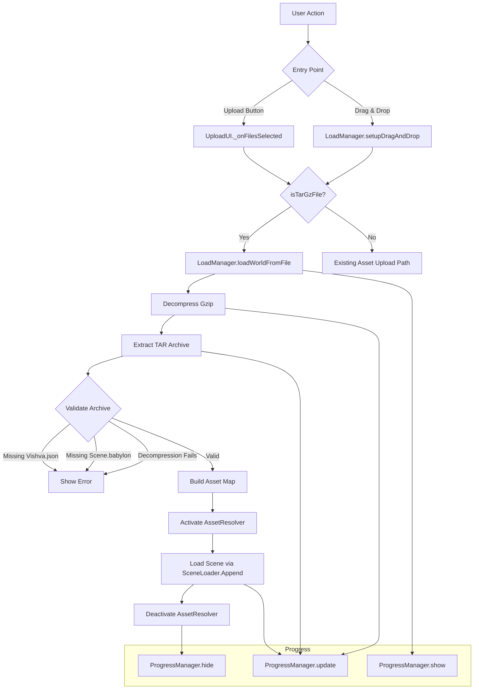

# Design Document: World File Loading

## Overview

This feature adds the ability to load Vishva world files (`.tar.gz` archives) from the user's local filesystem, either via the existing upload button in the navigation bar or by dragging and dropping onto the 3D scene canvas. The implementation extends the existing upload and drag-and-drop infrastructure to detect `.tar.gz` files and route them through the world loading pipeline instead of the asset upload pipeline.

The design leverages the existing `LoadManager.loadZipWorld()` decompression/extraction logic, `AssetResolver` for in-memory asset serving, and `ProgressManager` for user feedback. The key new components are a file extension validator utility and routing logic in both the upload button and drag-and-drop handlers.

## Architecture



### Design Decisions

1. **Reuse existing upload button** rather than adding a new button. The tooltip changes to "load assets or world" and the routing logic determines behavior based on file extension. This keeps the UI simple and avoids navbar clutter.

2. **File extension detection as a pure utility function** (`isTarGzFile`). This makes the routing logic testable independently of DOM/BabylonJS and reusable across both upload and drag-and-drop paths.

3. **Reuse existing `_decompressGzip` and `_extractTarArchive` methods** from `LoadManager`. The server-based world loading already implements these — the local file loading path just needs to feed a `File` object into the same pipeline.

4. **Validation before scene replacement**. The archive is validated for required entries (`Vishva.json`, `Scene.babylon`) before any scene mutation occurs, ensuring the user gets clear error messages without corrupting their current session.

5. **Visual drag feedback via CSS class** rather than canvas overlay. Adding/removing a class on `dragenter`/`dragleave` is lightweight and lets the styling be controlled via CSS.

## Components and Interfaces

### FileValidator (new utility — `src/managers/FileValidator.ts`)

```typescript
/**
 * Determines if a filename represents a world file (.tar.gz).
 * Case-insensitive check for the compound extension.
 */
export function isTarGzFile(filename: string): boolean;

/**
 * Normalizes a .tar.gz extension to consistent lowercase.
 * Returns null if the filename does not end with .tar.gz.
 */
export function normalizeTarGzExtension(filename: string): string | null;
```

### LoadManager (extended — `src/managers/LoadManager.ts`)

```typescript
/**
 * Load a world from a local File object (from upload or drag-and-drop).
 * Decompresses, extracts, validates, and loads the world into the scene.
 */
public async loadWorldFromFile(file: File): Promise<void>;

/**
 * Validate that a tar archive contains the required world entries.
 * Returns { valid: true } or { valid: false, error: string }.
 */
public validateWorldArchive(files: Map<string, Uint8Array>): { valid: boolean; error?: string };
```

### UploadUI (modified — `src/gui/UploadUI.ts`)

```typescript
// Modified _onFilesSelected to check for .tar.gz and route accordingly
private _onFilesSelected(files: FileList): void;
```

### LoadManager.setupDragAndDrop (modified)

```typescript
// Modified drop handler to check for .tar.gz files before processing as assets
// Modified dragover handler to add visual feedback class for .tar.gz files
```

### NavBarML (modified — `src/gui/NavBarML.ts`)

```typescript
// Upload button tooltip changed from "upload file to scene" to "load assets or world"
```

## Data Models

### World Archive Structure (unchanged from SaveManager output)

```
archive.tar.gz
├── Vishva.json          # VishvaSerialized metadata
├── Scene.babylon        # BabylonJS scene serialization
└── assets/              # All referenced textures and models
    ├── ground.jpg
    ├── model.glb
    └── ...
```

### ValidationResult (internal type)

```typescript
interface ValidationResult {
    valid: boolean;
    error?: string;
}
```

### File routing decision

```typescript
// Pseudocode for the routing logic in both upload and drag-and-drop paths:
if (isTarGzFile(file.name)) {
    loadManager.loadWorldFromFile(file);
} else {
    // existing asset upload/drop behavior
    loadManager.processDroppedFiles(files);
}
```

## Correctness Properties

*A property is a characteristic or behavior that should hold true across all valid executions of a system — essentially, a formal statement about what the system should do. Properties serve as the bridge between human-readable specifications and machine-verifiable correctness guarantees.*

### Property 1: File extension detection is a biconditional

*For any* filename string, `isTarGzFile(filename)` returns true if and only if the filename ends with `.tar.gz` (case-insensitive). Filenames ending with only `.gz` (without `.tar`), only `.tar` (without `.gz`), or any other extension are never identified as world files.

**Validates: Requirements 1.2, 3.1, 5.1, 5.2, 5.3**

### Property 2: Archive validation is a biconditional on required entries

*For any* tar archive (represented as a `Map<string, Uint8Array>`), `validateWorldArchive` returns `{ valid: true }` if and only if the map contains both a `Vishva.json` key and a `Scene.babylon` key. If either is missing, it returns `{ valid: false }` with an appropriate error message.

**Validates: Requirements 3.2, 3.3, 3.4, 3.5**

### Property 3: Tar.gz round-trip preserves all files

*For any* set of files (filename/data pairs) including `Vishva.json` and `Scene.babylon`, creating a tar archive, compressing with gzip, decompressing, and extracting should yield a map containing all original filenames with identical binary data.

**Validates: Requirements 4.1, 4.2**

### Property 4: Corrupted data produces a decompression error

*For any* byte array that is not a valid gzip stream, attempting to decompress it should result in an error (thrown exception or error result), never silently produce incorrect data.

**Validates: Requirements 3.6**

### Property 5: Extension normalization round-trip consistency

*For any* filename that ends with `.tar.gz` (in any case), `normalizeTarGzExtension` produces a consistent lowercase `.tar.gz` result. Applying detection after normalization always returns true.

**Validates: Requirements 5.4**

## Error Handling

| Error Condition | Detection Point | User Feedback |
|---|---|---|
| File is not valid gzip | `_decompressGzip` throws | Alert: "File is corrupted or not a valid gzip archive" |
| Archive missing `Vishva.json` | `validateWorldArchive` | Alert: "Not a valid Vishva world file: missing Vishva.json" |
| Archive missing `Scene.babylon` | `validateWorldArchive` | Alert: "Not a valid Vishva world file: missing Scene.babylon" |
| Tar extraction fails | `extractTarArchive` returns empty map | Alert: "Failed to extract archive contents" |
| File read fails | `FileReader` error event | Alert: "Failed to read file: [error message]" |

All errors hide the progress indicator and do not mutate the current scene. The user's existing session remains intact after any error.

## Testing Strategy

### Property-Based Tests (fast-check + Vitest)

Property-based testing is appropriate for this feature because:
- The file extension detection is a pure function with a large input space (all possible filenames)
- Archive validation is a pure function over map contents
- The tar.gz round-trip is a classic serialization property

**Library**: `fast-check` (already in use in the project)
**Configuration**: Minimum 100 iterations per property test
**Tag format**: `Feature: world-file-loading, Property {number}: {property_text}`

Tests will be placed in:
- `src/managers/FileValidator.property.test.ts` — Properties 1 and 5
- `src/managers/WorldLoading.property.test.ts` — Properties 2, 3, and 4

### Unit Tests (Vitest)

- **Tooltip update**: Verify the upload button's `title` attribute is "load assets or world"
- **Routing logic**: Verify `.tar.gz` files are routed to `loadWorldFromFile` and other files to `processDroppedFiles`
- **Drag visual feedback**: Verify CSS class is added on dragenter with `.tar.gz` file and removed on dragleave
- **Progress updates**: Verify `ProgressManager` methods are called during world loading stages
- **Error display**: Verify error messages are shown via `alert()` or `DialogMgr` for each error condition

### Integration Tests

- End-to-end test: Create a valid `.tar.gz` world file in memory, trigger load via the upload path, verify scene is replaced
- End-to-end test: Same via drag-and-drop path
- Verify `AssetResolver` is activated with correct asset map and deactivated after scene load
