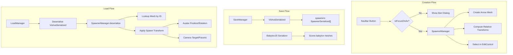

# Design Document: Spawner

## Overview

The Spawner system provides a dedicated mechanism for controlling avatar and camera placement when a scene loads. It replaces the legacy `spawnPointId` approach with a fully-featured system that supports multiple spawn points, stores complete relative transform data (position + rotation for both avatar and camera), and provides a visual arrow-shaped mesh indicator in the scene.

**Key design decisions:**
- Transforms are stored *relative* to the Spawner_Mesh, so moving/rotating the mesh in the editor automatically adjusts the spawn location without recalculation
- The Spawner_Mesh uses BabylonJS's world matrix for coordinate space conversions (local ↔ world)
- Multiple spawners are supported with uniform random selection at load time
- The system integrates with existing VishvaSerialized, MeshMetadata, and "reveal invisibles" patterns

## Architecture



The SpawnerManager is a new class that lives in `src/managers/spawner/SpawnerManager.ts`. It is instantiated by Vishva during scene initialization and holds the collection of Spawner objects. It coordinates with:
- **Vishva** — for avatar/camera state access and EditControl selection
- **VishvaSerialized** — for persistence (new `spawners` array field)
- **NavBar / VishvaGUI** — for the creation button
- **LoadManager** — for deserialization and spawn application after load

## Components and Interfaces

### SpawnerManager

The central class managing all spawner lifecycle operations.

```typescript
// src/managers/spawner/SpawnerManager.ts

import { Mesh, Vector3, Quaternion, Matrix, Scene, AbstractMesh } from "babylonjs";

export class SpawnerManager {
    private _spawners: Spawner[] = [];
    private _scene: Scene;

    constructor(scene: Scene) { ... }

    /** Create a new spawner at the avatar's current position/rotation */
    public createSpawner(
        avatarPosition: Vector3,
        avatarRotationY: number,
        avatarEllipsoidHeight: number,
        cameraAlpha: number,
        cameraBeta: number,
        cameraRadius: number,
        cameraTarget: Vector3
    ): Spawner { ... }

    /** Update an existing spawner's position to current avatar state */
    public updateSpawner(
        spawner: Spawner,
        avatarPosition: Vector3,
        avatarRotationY: number,
        avatarEllipsoidHeight: number,
        cameraAlpha: number,
        cameraBeta: number,
        cameraRadius: number,
        cameraTarget: Vector3
    ): void { ... }

    /** Remove a spawner by its mesh reference */
    public removeSpawner(mesh: AbstractMesh): void { ... }

    /** Get all spawners */
    public getSpawners(): Spawner[] { ... }

    /** Select a random spawner for application */
    public selectRandom(): Spawner | null { ... }

    /** Serialize all spawners for VishvaSerialized */
    public serialize(): SpawnerSerialized[] { ... }

    /** Deserialize spawners from VishvaSerialized and associate with scene meshes */
    public deserialize(data: SpawnerSerialized[], scene: Scene): void { ... }

    /** Compute world-space avatar position/rotation from a spawner */
    public computeSpawnTransform(spawner: Spawner): SpawnResult { ... }

    /** Dispose all spawners and cleanup */
    public dispose(): void { ... }
}
```

### Spawner

Represents a single spawn point with its mesh and relative transform data.

```typescript
// src/managers/spawner/Spawner.ts

export interface Spawner {
    mesh: Mesh;                         // The arrow-shaped indicator mesh
    relativeAvatarPosition: Vector3;    // Avatar position in spawner-mesh local space
    relativeAvatarRotationY: number;    // Avatar Y rotation relative to spawner mesh Y rotation
    cameraAlpha: number;                // ArcRotateCamera alpha
    cameraBeta: number;                 // ArcRotateCamera beta
    cameraRadius: number;              // ArcRotateCamera radius
    cameraTargetOffset: Vector3;       // Displacement from avatar position to camera target
}
```

### SpawnerSerialized

The serialization format stored in VishvaSerialized.

```typescript
// src/managers/spawner/SpawnerSerialized.ts

export interface SpawnerSerialized {
    meshId: string;                     // ID of the Spawner_Mesh in the scene
    relativeAvatarPosition: { x: number; y: number; z: number };
    relativeAvatarRotationY: number;
    cameraAlpha: number;
    cameraBeta: number;
    cameraRadius: number;
    cameraTargetOffset: { x: number; y: number; z: number };
}
```

### SpawnResult

The computed world-space transforms returned when applying a spawner.

```typescript
export interface SpawnResult {
    avatarPosition: Vector3;    // World-space avatar position
    avatarRotationY: number;    // World-space avatar Y rotation
    cameraAlpha: number;
    cameraBeta: number;
    cameraRadius: number;
    cameraTarget: Vector3;      // World-space camera target
}
```

### SpawnerMeshFactory

Creates the arrow-shaped indicator mesh.

```typescript
// src/managers/spawner/SpawnerMeshFactory.ts

export class SpawnerMeshFactory {
    /** Create a flat arrow mesh (≤20 triangles, ≤0.05 Y thickness) */
    public static createArrowMesh(scene: Scene, name: string): Mesh { ... }
}
```

### Integration Points

**VishvaSerialized** — new field:
```typescript
export class VishvaSerialized {
    // ... existing fields ...
    public spawners: SpawnerSerialized[];  // NEW
}
```

**NavBarML** — new button added to the nav menu:
```html
<button id="navAddSpawner" title="add spawner">
    <span class="material-icons-outlined">my_location</span>
</button>
```

**VishvaGUI._createNavMenu()** — new click handler wiring the button to `SpawnerManager.createSpawner()` or `updateSpawner()`. The handler first checks `Vishva.vishva.isFocusOnAv`; if false, it shows an alert dialog and returns early without invoking SpawnerManager.

**Vishva** — new `spawnerManager: SpawnerManager` field, initialized during `loadBabylonjsPart`.

## Data Models

### Relative Transform Computation

**On creation** (world → local):
```
relativeAvatarPosition = inverse(spawnerMesh.worldMatrix) × avatarWorldPosition
relativeAvatarRotationY = avatarWorldRotationY - spawnerMesh.worldRotationY
cameraTargetOffset = cameraTarget - avatarWorldPosition
```

**On application** (local → world):
```
avatarWorldPosition = spawnerMesh.worldMatrix × relativeAvatarPosition
avatarWorldRotationY = spawnerMesh.worldRotationY + relativeAvatarRotationY
cameraTarget = avatarWorldPosition + cameraTargetOffset
```

The key insight: since relative transforms are stored and never recomputed on save, moving the Spawner_Mesh in the editor changes its world matrix, which automatically produces different world-space results when the relative transforms are applied on next load.

### Spawner Mesh Placement

When creating a spawner:
- **Position**: `avatarPosition - Vector3(0, ellipsoidHeight, 0)` — places the mesh at the avatar's feet
- **Rotation**: `Quaternion.RotationAxis(Vector3.Up(), avatarRotationY)` — points the arrow in the avatar's forward direction

The mesh is then the reference frame for all relative computations.

### Serialization in VishvaSerialized

```typescript
// Within VishvaSerialized
{
    // ... existing fields ...
    "spawners": [
        {
            "meshId": "spawner_mesh_abc123",
            "relativeAvatarPosition": { "x": 0, "y": 0.8, "z": 0 },
            "relativeAvatarRotationY": 0,
            "cameraAlpha": -1.57,
            "cameraBeta": 1.4,
            "cameraRadius": 4,
            "cameraTargetOffset": { "x": 0, "y": 1.5, "z": 0 }
        }
    ]
}
```

### MeshMetadata for Spawner Meshes

Each Spawner_Mesh gets metadata entries:
```typescript
meshMetadata[spawnerMeshId] = {
    meshId: spawnerMeshId,
    isInternal: true,
    isInvisible: true
};
```

This ensures spawner meshes participate in the existing "reveal invisibles" system and are recognized as Vishva internal meshes during serialization.

## Correctness Properties

*A property is a characteristic or behavior that should hold true across all valid executions of a system — essentially, a formal statement about what the system should do. Properties serve as the bridge between human-readable specifications and machine-verifiable correctness guarantees.*

### Property 1: Avatar position round-trip

*For any* valid avatar world position, avatar world Y rotation, and any spawner mesh world matrix (with position and rotation), computing the relative avatar transforms (world-to-local via inverse world matrix) and then reconstructing the world transforms (local-to-world via the same world matrix) SHALL produce the original avatar world position (within floating-point tolerance) and the original avatar world Y rotation.

**Validates: Requirements 3.1, 3.4, 6.1, 6.2**

### Property 2: Camera parameter round-trip

*For any* valid camera state (alpha, beta, radius, target position) and any avatar world position, storing the camera target offset as `cameraTarget - avatarPosition` and the alpha/beta/radius directly, then reconstructing as `avatarPosition + storedOffset` for target and using stored alpha/beta/radius directly, SHALL produce the original camera state values.

**Validates: Requirements 3.2, 3.5, 6.3**

### Property 3: Spawner serialization round-trip

*For any* valid spawner data (meshId, relativeAvatarPosition, relativeAvatarRotationY, cameraAlpha, cameraBeta, cameraRadius, cameraTargetOffset), serializing to the SpawnerSerialized format and then deserializing SHALL produce an equivalent spawner data object with all required fields present and values matching the original.

**Validates: Requirements 3.6, 5.1, 5.3, 5.5**

### Property 4: Ground-level placement with correct orientation

*For any* avatar position (x, y, z) with y > 0, any ellipsoid height > 0, and any avatar Y rotation, creating a spawner SHALL place the Spawner_Mesh at position (x, y - ellipsoidHeight, z) and orient it with Y rotation matching the avatar's Y rotation.

**Validates: Requirements 1.4, 1.5, 2.2, 2.4**

### Property 5: Non-uniform scale preserves rotation

*For any* spawner mesh with non-uniform scale (sx, sy, sz where not all equal), and any stored relative avatar position and rotation, reconstructing the world-space avatar position SHALL apply the scale factors to the position offset, but the reconstructed avatar Y rotation SHALL equal `spawnerMeshRotationY + relativeAvatarRotationY` regardless of scale values.

**Validates: Requirements 3.7**

### Property 6: Collection addition preserves existing spawners

*For any* existing collection of N spawners (N ≥ 0), adding a new spawner SHALL result in a collection of size N+1 where all N original spawners retain their exact mesh references and relative transform data unchanged.

**Validates: Requirements 4.1, 4.2**

### Property 7: Collection deletion removes exactly one

*For any* collection of N spawners (N ≥ 1) and any valid index i into that collection, removing the spawner at index i SHALL result in a collection of size N-1 containing all spawners except the one at index i, with their data unchanged.

**Validates: Requirements 4.3, 4.5**

### Property 8: Random selection always returns a valid member

*For any* non-empty collection of spawners, the random selection function SHALL return a spawner that is a member of that collection.

**Validates: Requirements 6.4**

## Error Handling

| Scenario | Handling |
|----------|----------|
| Spawner button clicked while camera not focused on avatar | Show alert dialog: "cannot create spawner. focus is not on avatar. press esc to switch focus to avatar and try again". Do not create or update any spawner. |
| Deserialized spawner references non-existent mesh ID | Discard that spawner, log `console.warn("Spawner references missing mesh: <id>, discarding")`, continue with remaining spawners |
| All spawners reference invalid meshes on load | Fall back to default spawn position (0, 0.2, 0) |
| Legacy world with `spawnPointId` and no spawners | Use legacy spawn point position as fallback |
| Legacy world with both `spawnPointId` and spawners | Ignore legacy, use spawner system |
| Spawner mesh disposed during edit session | `onDispose` observable fires → SpawnerManager removes that spawner from collection |
| Avatar not yet initialized when spawner tries to apply | SpawnerManager.apply is called only after avatar and CharacterController are initialized (in `sceneLoad4` flow) |
| Empty spawner collection on load | Use default spawn behavior: avatar at (0, 0.2, 0) |

## Testing Strategy

### Property-Based Tests (fast-check + Vitest)

Property-based testing is appropriate for this feature because the core logic involves mathematical transformations (coordinate space conversions, round-trips) with large input spaces (any 3D position, any rotation, any matrix).

**Library**: fast-check 4.7.0
**Configuration**: Minimum 100 iterations per property test
**File**: `src/managers/spawner/SpawnerManager.property.test.ts`
**Tag format**: `Feature: spawner, Property {N}: {description}`

Each correctness property (1–8) maps to a single property-based test:
1. Avatar position round-trip — generates random Vector3 positions, Y rotations, and world matrices
2. Camera parameter round-trip — generates random alpha/beta/radius/target values
3. Serialization round-trip — generates random SpawnerSerialized objects
4. Ground-level placement — generates random avatar positions and ellipsoid heights
5. Non-uniform scale — generates random scale vectors and relative transforms
6. Collection addition — generates random spawner collections, adds one, verifies invariant
7. Collection deletion — generates random collections, removes one, verifies invariant
8. Random selection — generates random collections, verifies selection is always a member

### Unit Tests (Vitest)

**File**: `src/managers/spawner/SpawnerManager.test.ts`

Focus on specific examples and integration scenarios:
- Spawner creation blocked when isFocusOnAv is false: verify no spawner created and alert shown
- Spawner update blocked when isFocusOnAv is false: verify existing spawner unchanged and alert shown
- Spawner mesh geometry: verify ≤ 20 triangles, ≤ 0.05 Y thickness
- Spawner mesh metadata: verify `isInternal` and `isInvisible` are set
- Legacy fallback: world with `spawnPointId` and no spawners uses legacy position
- Legacy override: world with both uses spawner system
- Invalid mesh ID during deserialization: spawner is discarded with console warning
- Default spawn when no spawners exist: avatar at (0, 0.2, 0)
- NavBar button exists with correct tooltip and icon

### Integration Considerations

- EditControl selection after creation (manual verification)
- Reveal/hide invisibles includes spawner meshes (covered by existing metadata system)
- `onDispose` observable cleanup (verify subscription in unit test)
- Load ordering: spawner application after full scene + VishvaSerialized load (verified by placement in `sceneLoad4` flow)
