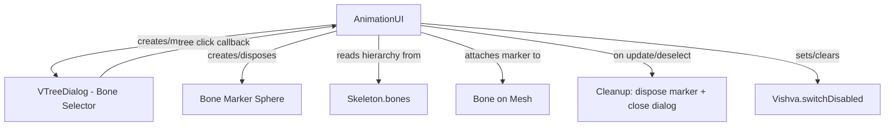

# Design Document

## Overview

This feature replaces the existing "show all bone markers at once" behavior with a VTreeDialog-based bone selector. When the user clicks "show bone selector," a tree dialog opens showing the skeleton's bone hierarchy. Clicking any bone in the tree places a single sphere marker at that bone's position. Clicking a different bone moves the marker. Closing the dialog (or deselecting the mesh) disposes the marker.

The design leverages the existing `VTreeDialog` component (already used for internal assets) and the BabylonJS `Bone.attachToBone()` API for marker positioning. The "hide bone selector" button is removed since the dialog's close button and toggle behavior handle cleanup.

While the bone selector dialog is open, mesh selection is locked to prevent the user from accidentally selecting a different mesh or deselecting the current mesh. This uses the existing `Vishva.switchDisabled` flag to block `switchEditControl()` and a guard on `removeEditControl()` to prevent deselection. The lock is released when the dialog closes.

## Architecture



**Key architectural decisions:**

1. **VTreeDialog reuse**: The existing `VTreeDialog` component provides tree rendering, filtering, expand/collapse, and dialog lifecycle — no new UI component needed.

2. **Single marker approach**: Instead of creating instances for every bone (current behavior), a single `Mesh.CreateSphere` is created on first bone click and reattached on subsequent clicks via `detachFromBone()` / `attachToBone()`.

3. **Ownership in AnimationUI**: The `AnimationUI` class owns both the dialog instance and the marker mesh. This keeps the feature self-contained within the animation/skeleton UI area, matching the existing pattern where `AnimationUI` manages skeleton-related interactions.

4. **Non-modal dialog**: The bone selector dialog is non-modal (unlike some other VTreeDialog usages) so the user can interact with the 3D scene while the dialog is open.

5. **Mesh selection lock via `switchDisabled`**: While the dialog is open, `Vishva.switchDisabled` is set to `true`. This prevents `switchEditControl()` from executing (blocks selecting a different mesh). Additionally, the escape-key deselection path in `Vishva`'s key handler already checks `VDiag._modalOn` before calling `removeEditControl()` — but since our dialog is non-modal, we also guard deselection by having `AnimationUI` set `switchDisabled` and checking it in the deselection flow. The lock is released in the `onHide` callback when the dialog closes.

## Components and Interfaces

### Modified: AnimationUI (src/gui/propspanel/AnimationUI.ts)

New private fields:
```typescript
private _boneSelectorDialog: VTreeDialog | null = null;
private _boneMarker: Mesh | null = null;
private _selectedBoneIndex: number = -1;
```

New private methods:
```typescript
// Builds VTreeDialog tree data from skeleton bone hierarchy
private _buildBoneTreeData(skel: Skeleton): Array<string | object>

// Handles bone click from VTreeDialog
private _onBoneSelected(boneName: string, path: string, isLeaf: boolean): void

// Disposes marker and nulls reference
private _disposeBoneMarker(): void

// Creates or gets the bone selector dialog (lazy init)
private _toggleBoneSelectorDialog(): void

// Locks mesh selection by setting Vishva.switchDisabled = true
private _lockMeshSelection(): void

// Unlocks mesh selection by setting Vishva.switchDisabled = false
private _unlockMeshSelection(): void
```

#### Mesh Selection Lock Lifecycle

The lock is managed as part of the dialog open/close lifecycle:

```typescript
private _toggleBoneSelectorDialog(): void {
    if (this._boneSelectorDialog != null && this._boneSelectorDialog.isOpen()) {
        this._boneSelectorDialog.close();
        // onHide callback handles unlock + marker cleanup
    } else {
        // ... create/open dialog ...
        this._lockMeshSelection();
    }
}

private _lockMeshSelection(): void {
    this._vishva.switchDisabled = true;
}

private _unlockMeshSelection(): void {
    this._vishva.switchDisabled = false;
}
```

The `onHide` callback registered on the dialog's `VDiag` calls `_unlockMeshSelection()` alongside `_disposeBoneMarker()`, ensuring the lock is always released when the dialog closes — whether by the user clicking the close button, toggling via the "show bone selector" button, or programmatically via `update()` on mesh deselection.

### Modified: AnimationML (src/gui/propspanel/AnimationML.ts)

- Remove the `<button id="animDBS">hide bone selector</button>` element from the HTML template.
- The `animSBS` button remains and toggles the dialog.

### Unchanged: VTreeDialog (src/gui/components/VTreeDialog.ts)

Used as-is. The existing API provides everything needed:
- `constructor(vishva, title, pos, treeData, filter?, openAll?, modal?)` — create with bone tree data
- `addTreeListener(cb)` — register bone selection callback
- `toggle()` / `open()` / `close()` / `isOpen()` — lifecycle control
- `refresh(treeData)` — update tree if skeleton changes (future-proofing)

### Unchanged: VDiag (src/gui/components/VDiag.ts)

The `onHide(f)` method is used to register cleanup logic when the dialog is closed.

### Removed from Vishva.ts (usage only)

The `animSBS` button no longer calls `Vishva._addBoneSelectors()`. The existing `_addBoneSelectors` and `_delBoneSelectors` methods remain in Vishva.ts (they may be used elsewhere or for the attach-to-bone workflow), but are no longer invoked by the bone selector button.

### Used from Vishva.ts: `switchDisabled` property

The existing `public switchDisabled: boolean` property on `Vishva` is used to lock mesh selection. When set to `true`:
- `switchEditControl(mesh)` returns immediately without switching (prevents selecting another mesh)
- The escape-key deselection path should also respect this flag to prevent deselection

`AnimationUI` sets this to `true` when the bone selector dialog opens and back to `false` when it closes.

## Data Models

### Bone Tree Data Format

The VTree/VTreeDialog expects data in this format:
```typescript
type TreeNode = string | { d: string; f: TreeNode[] };
type TreeData = TreeNode[];
```

For the bone hierarchy, each bone becomes a node:
- **Leaf bones** (no children): represented as a folder node `{ d: boneName, f: [] }` — this ensures all bones are clickable via the folder text click, and the tree visually shows the hierarchy even for leaf bones. Alternatively, bones with children are folders and bones without children are strings. However, since we need to handle clicks on both leaf and non-leaf bones, and the VTree click listener provides `isLeaf` to distinguish them, we use:
  - Bones with children → `{ d: boneName, f: [...childNodes] }`
  - Bones without children → plain `string` (the bone name)

The click listener fires for both folder text clicks (`isLeaf=false`) and leaf clicks (`isLeaf=true`), so both are handled.

### Tree Building Algorithm

```typescript
_buildBoneTreeData(skel: Skeleton): Array<string | object> {
    // 1. Find root bones (bones with no parent)
    // 2. For each root bone, recursively build tree nodes
    // 3. Return array of root-level nodes
}

// Recursive helper:
_buildBoneNode(bone: Bone): string | object {
    if (bone.children.length === 0) {
        return bone.name;  // leaf
    }
    return {
        d: bone.name,
        f: bone.children.map(child => _buildBoneNode(child))
    };
}
```

### Bone Lookup Strategy

When a bone is clicked in the tree, the callback receives `(boneName, path, isLeaf)`. To find the correct bone in the skeleton:
- Use `path` + `boneName` to reconstruct the full hierarchy path
- Walk the skeleton's bone tree matching names along the path
- This handles duplicate bone names (rare but possible) by using the full path

Alternatively, since bone names within a skeleton are typically unique, a simple `skeleton.bones.find(b => b.name === boneName)` suffices for the common case. If duplicates exist, the path-based lookup provides disambiguation.

### Bone Marker Mesh

```typescript
// Created once on first bone selection
let marker = MeshBuilder.CreateSphere("boneSelector-marker", { diameter: 0.05 }, scene);
let mat = new StandardMaterial("boneSelector-mat", scene);
mat.emissiveColor = new Color3(0, 1, 0);  // bright green, unaffected by lighting
mat.disableLighting = true;
marker.material = mat;
marker.isPickable = false;  // don't interfere with scene picking
marker.attachToBone(selectedBone, skeletonMesh);
```

On subsequent selections:
```typescript
marker.detachFromBone();
marker.attachToBone(newBone, skeletonMesh);
```

On cleanup:
```typescript
marker.detachFromBone();
marker.material.dispose();
marker.dispose();
```

## Correctness Properties

*A property is a characteristic or behavior that should hold true across all valid executions of a system — essentially, a formal statement about what the system should do. Properties serve as the bridge between human-readable specifications and machine-verifiable correctness guarantees.*

### Property 1: Tree structure preserves skeleton hierarchy

*For any* skeleton with N bones arranged in any valid parent-child hierarchy (including multiple roots, deep nesting, and zero bones), the `_buildBoneTreeData` function SHALL produce tree data where:
- Every bone in the skeleton appears exactly once in the tree (by name)
- Bones with no parent appear as top-level entries
- Each bone's children in the skeleton appear as nested entries under that bone's node, in the same sibling order as `bone.children`

**Validates: Requirements 1.2, 2.1, 2.2, 2.3, 2.4, 2.5**

### Property 2: Bone selection state machine maintains single-marker invariant

*For any* valid skeleton and any sequence of bone selections (including repeated selections of the same bone), after processing each selection the system SHALL have exactly one marker attached to the most recently selected bone, and no other markers exist in the scene.

**Validates: Requirements 3.3, 4.1, 4.2, 4.4**

## Error Handling

| Scenario | Handling |
|----------|----------|
| Skeleton is null when button clicked | Button is hidden via `_skelFound` display logic (existing behavior) — dialog cannot be opened |
| Skeleton has zero bones | Tree data is empty array `[]`, dialog shows empty tree |
| Bone name lookup fails (name not found in skeleton) | Log warning, do not create/move marker |
| Marker disposal called when no marker exists | No-op — check `_boneMarker !== null` before disposing |
| Dialog close called when already closed | VDiag.hide() is already idempotent (checks `isHidden` flag) |
| Mesh deselected while dialog open | `update()` method disposes marker, closes dialog, and releases lock |
| `attachToBone` fails (mesh disposed) | Wrap in try-catch, log error, dispose marker gracefully |
| User clicks different mesh while dialog open | `switchDisabled = true` causes `switchEditControl()` to return early — selection unchanged |
| User presses Escape while dialog open | `switchDisabled` flag is checked; deselection is blocked while lock is active |
| Dialog closed but `switchDisabled` not reset (bug guard) | `_unlockMeshSelection()` is called in `onHide` callback — always paired with dialog close |
| Multiple rapid open/close toggles | Lock state follows dialog visibility: open → locked, closed → unlocked. No stale state possible since `onHide` always fires on close |

## Testing Strategy

### Property-Based Tests (fast-check + Vitest)

**Library**: fast-check 4.7.0 (already in project)
**Config**: Minimum 100 iterations per property test
**File**: `src/gui/propspanel/AnimationUI.property.test.ts`

Each property test references its design document property via tag comment:
- Tag format: `Feature: bone-selector-tree-dialog, Property {number}: {property_text}`

**Property 1 test approach**:
- Generate arbitrary skeleton structures using fast-check arbitraries (random tree depth, branching factor, bone names)
- Mock the `Skeleton` and `Bone` objects with the generated hierarchy
- Call `_buildBoneTreeData(mockSkeleton)` 
- Assert: all bone names present, hierarchy preserved, root bones at top level, sibling order maintained

**Property 2 test approach**:
- Generate a random skeleton (reuse generator from Property 1)
- Generate a random sequence of bone selection indices
- Simulate the selection state machine (create marker, move marker, same-bone click)
- After each selection, assert: exactly one marker reference, attached to the correct bone

### Unit Tests (Vitest)

**File**: `src/gui/propspanel/AnimationUI.test.ts`

Example-based tests for:
- Dialog opens on button click (1.1)
- Dialog toggles on second click (1.4)
- Button hidden when no skeleton (1.3)
- Tree built in collapsed state (2.6, verify `openAll=false`)
- Marker created with correct properties (diameter 0.05, emissive green, non-pickable) (3.1, 3.4)
- Non-leaf bone click creates marker (3.2)
- Marker disposed on dialog close (5.1)
- No-op when no marker on close (5.2)
- Cleanup on mesh deselection (5.3)
- Clean state after reopen (5.4)
- "hide bone selector" button absent (6.1)
- Mesh selection locked when dialog opens — `switchDisabled` set to true (7.1)
- Selecting another mesh blocked while dialog open — `switchEditControl` is no-op (7.1)
- Deselection blocked while dialog open — escape key does not call `removeEditControl` (7.2)
- Mesh selection unlocked when dialog closes — `switchDisabled` set to false (7.3)
- Lock released on all close paths: close button, toggle, and programmatic close via `update()` (7.3)

### Edge Cases (covered by property generators)

- Empty skeleton (zero bones) → empty tree data
- Single bone skeleton (one root, no children)
- Deep linear chain (each bone has exactly one child)
- Wide flat skeleton (many roots, no children)
- Clicking same bone repeatedly (idempotent)
- Rapid successive clicks on different bones
