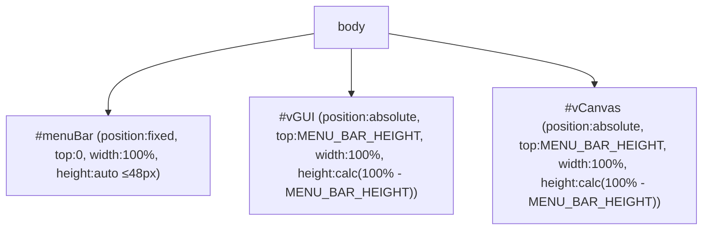
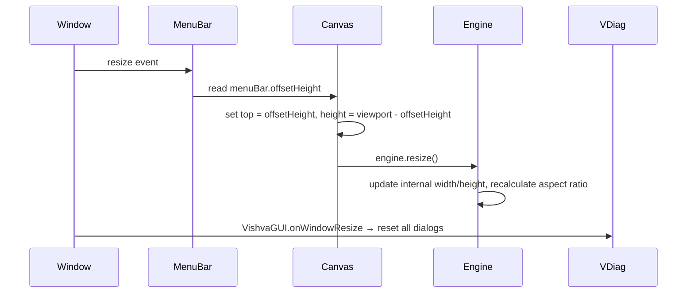

# Design Document: Navbar to Menubar

## Overview

This feature converts the existing floating navbar (a `<div>` with `z-index: 999` containing an absolutely-positioned `<nav>`) into a fixed menu bar that occupies a dedicated horizontal strip at the top of the viewport. The canvas and GUI container are resized to fill the remaining viewport height below the menu bar.

The key layout change is moving from an overlay model (navbar floats over the canvas) to a stacked model (menu bar sits above the canvas). This eliminates the z-index layering complexity between the navbar and canvas, gives the editor a traditional desktop-application feel, and ensures the 3D scene is never obscured by the menu bar.

### Design Goals

- Minimal code change: reuse existing button IDs, event handlers, and theme system
- No new dependencies or frameworks
- Preserve all 16 action buttons and their existing behavior
- Ensure BabylonJS engine correctly adapts to the reduced canvas height
- Keep VDiag positioning logic working within the new GUI container bounds

## Architecture

The layout changes from a single full-viewport layer to a two-region vertical stack:

```
┌─────────────────────────────────────────────┐
│  Menu Bar (fixed, top:0, height:48px max)   │
├─────────────────────────────────────────────┤
│                                             │
│  Canvas + GUI Container                     │
│  (fills remaining viewport height)          │
│                                             │
└─────────────────────────────────────────────┘
```

### Layout Strategy



The menu bar uses `position: fixed` so it stays at the top regardless of any scroll state. The canvas and GUI container both shift down by the menu bar height and shrink their height accordingly.

### Resize Flow



## Components and Interfaces

### Modified Files

| File | Change |
|------|--------|
| `src/gui/NavBarML.ts` | Rewrite HTML template to produce a fixed menu bar instead of a floating nav. Remove the outer wrapper div with z-index 999. |
| `src/index.html` | Update `#vGUI` and `#vCanvas` styles to account for menu bar height offset. |
| `src/gui/VishvaGUI.ts` | Update constructor to insert menu bar as a direct child of `<body>` (before `#vGUI`), and add resize logic that synchronizes canvas/GUI top offset with menu bar height. |
| `src/Vishva.ts` | Ensure `onWindowResize` calls `engine.resize()` after layout has settled (already does this). |
| `src/gui/components/VDiag.ts` | Update `_moveIt` clamping — `Vishva.gui.offsetTop` already accounts for the new top offset, so no code change needed if `#vGUI` top is set correctly. |
| `src/gui/UIConst.ts` | Add `MENU_BAR_HEIGHT` constant (48). |

### NavBar Class Changes

The `NavBar` class constructor currently:
1. Creates a wrapper `<div>` with `z-index: 999`
2. Sets `innerHTML` to the nav HTML (absolutely positioned)
3. Appends to `document.body`

After the change:
1. Creates a `<div id="menuBar">` with `position: fixed; top: 0; left: 0; width: 100%; z-index: 999`
2. Sets `innerHTML` to a flat horizontal button row (no nested `<nav>` with absolute positioning)
3. Applies theme colors: `darkColors.b` background, `darkColors.f` foreground, `lightColors.b` bottom border
4. The element is appended to `document.body` as the first child (before `#vGUI` and `#vCanvas`)

### Menu Bar HTML Structure

```html
<div id="menuBar" style="position:fixed; top:0; left:0; width:100%; 
     z-index:999; display:flex; align-items:center; padding:0 0.5em;
     border-bottom:1px solid {lightColors.b}; 
     background-color:{darkColors.b}; color:{darkColors.f};
     height:48px; box-sizing:border-box;">
  
  <button id="showNavMenu">☰</button>
  
  <nav id="navMenubar" style="display:inline-flex; align-items:center; flex-wrap:nowrap;">
    <button id="worldLauncher">...</button>
    <button id="downWorld">...</button>
    <!-- ... all 16 buttons in order ... -->
    <div style="display:inline-block; position:relative;">
      <button id="navCAssets">...</button>
      <div id="AddMenu" style="display:none; position:absolute; top:100%; left:0; z-index:1000;"></div>
    </div>
    <!-- ... remaining buttons ... -->
  </nav>
</div>
```

### Canvas/GUI Offset Logic

In `VishvaGUI` constructor (after appending the menu bar):

```typescript
const menuBar = document.getElementById("menuBar");
const updateLayout = () => {
    const h = menuBar.offsetHeight;
    Vishva.gui.style.top = h + "px";
    Vishva.gui.style.height = `calc(100% - ${h}px)`;
    const canvas = Vishva.vishva.canvas;
    canvas.style.top = h + "px";
    canvas.style.height = `calc(100% - ${h}px)`;
};
updateLayout();
// Also call on resize
window.addEventListener("resize", updateLayout);
```

This ensures that after any resize, the canvas and GUI container are correctly positioned below the menu bar, and `engine.resize()` (called separately in `Vishva.onWindowResize`) picks up the new canvas dimensions.

### Hamburger Toggle

The hamburger button (`#showNavMenu`) toggles `#navMenubar` between `display: inline-flex` and `display: none`. When hidden, only the hamburger button remains visible in the menu bar. The menu bar container itself always remains visible.

### Curated Assets Submenu (AddMenu)

The `#AddMenu` div uses `position: absolute` with `top: 100%; left: 0` relative to its parent wrapper (which has `position: relative`). This positions the dropdown directly below the `navCAssets` button. The submenu's z-index is set to 1000 (≥ menu bar) so it renders above the canvas.

### VDiag Positioning Compatibility

`VDiag._moveIt` clamps dialog positions using `Vishva.gui.offsetTop` and `Vishva.gui.offsetHeight`. Since `#vGUI` will have `top` set to the menu bar height, `offsetTop` will be non-zero, and dialogs will be clamped to the area below the menu bar. No code change is needed in VDiag — the existing clamping logic naturally prevents dialogs from overlapping the menu bar.

## Data Models

No new data models are introduced. This feature is purely a layout/DOM restructuring. The serialization format (`VishvaSerialized`) is unaffected.

### Constants

```typescript
// UIConst.ts
export class UIConst {
    public static _diagWidth: number = 480;
    public static _diagWidthS: string = "28em";
    public static _buttonHeight: number = 41;
    public static MENU_BAR_HEIGHT: number = 48;  // NEW: max height of the menu bar
}
```

The `MENU_BAR_HEIGHT` constant is used as a fallback/reference value. The actual layout uses `menuBar.offsetHeight` for precision, since the bar's rendered height may be slightly less than 48px depending on content.

## Correctness Properties

*A property is a characteristic or behavior that should hold true across all valid executions of a system — essentially, a formal statement about what the system should do. Properties serve as the bridge between human-readable specifications and machine-verifiable correctness guarantees.*

### Property 1: Dialog position clamping respects menu bar boundary

*For any* random top and left position values passed to the dialog clamping logic, the resulting dialog top position SHALL be greater than or equal to the GUI container's top offset (which equals the menu bar height), ensuring no dialog extends above the canvas area into the menu bar region.

**Validates: Requirements 7.3, 7.4**

## Error Handling

This feature has minimal error scenarios since it is a layout restructuring:

| Scenario | Handling |
|----------|----------|
| Menu bar element not found in DOM | Defensive check: if `getElementById("menuBar")` returns null, skip layout offset (fall back to full-viewport canvas). |
| `menuBar.offsetHeight` returns 0 (element hidden or not rendered) | Use `UIConst.MENU_BAR_HEIGHT` (48) as fallback value for canvas offset. |
| Resize event fires before menu bar is appended | The resize handler checks for menu bar existence before reading its height. |
| Theme not initialized when NavBar constructs | `Vishva.theme` is initialized as a static field with a default `DarkGreyTheme`, so it's always available. |

## Testing Strategy

### Approach

This feature is primarily a UI layout change. The testing strategy emphasizes:
- **Example-based unit tests** for DOM structure verification (button presence, order, attributes)
- **One property-based test** for the dialog clamping invariant
- **Manual integration testing** for visual layout correctness and resize behavior

### Unit Tests (Example-Based)

| Test | What it verifies |
|------|-----------------|
| Menu bar contains all 16 buttons by ID | Req 3.1, 3.3 |
| Buttons appear in correct left-to-right order | Req 3.2 |
| Button title attributes match expected values | Req 3.4 |
| AddMenu is a sibling of navCAssets within a shared parent | Req 3.5 |
| Menu bar has correct CSS: position:fixed, top:0, width:100% | Req 1.1, 1.2, 2.1 |
| Menu bar uses darkColors.b background, darkColors.f foreground | Req 2.5 |
| Menu bar has 1px bottom border with lightColors.b color | Req 2.3 |
| Hamburger button is first interactive element | Req 4.1 |
| Initial render shows navMenubar visible | Req 4.2 |
| Clicking hamburger toggles navMenubar visibility | Req 4.3, 4.4 |
| Menu bar remains visible when buttons are hidden | Req 4.5 |
| Menu bar z-index > canvas z-index | Req 7.1 |
| AddMenu z-index >= menu bar z-index | Req 7.2 |

### Property-Based Test

- **Library**: fast-check 4.7.0 (already in project)
- **File**: `src/gui/NavBarML.property.test.ts`
- **Iterations**: minimum 100
- **Tag**: `Feature: navbar-to-menubar, Property 1: Dialog position clamping respects menu bar boundary`

The test generates random `(top, left)` coordinate pairs and a random GUI container offset (simulating menu bar heights between 36–48px), then verifies that the clamping function always produces a top value ≥ the container's top offset.

### Integration / Manual Tests

| Test | What it verifies |
|------|-----------------|
| Resize browser window at various sizes | Canvas fills remaining space, no gap/overlap (Req 1.3, 1.4) |
| Open dialogs after layout change | Dialogs appear within canvas area, not overlapping menu bar (Req 7.3) |
| Click curated assets button | Submenu appears below button, not clipped (Req 6.1, 6.2) |
| engine.resize() called on load and resize | Scene renders without distortion (Req 5.1, 5.2, 5.3) |
| Call engine.resize() with unchanged dimensions | No errors or artifacts (Req 5.4) |

