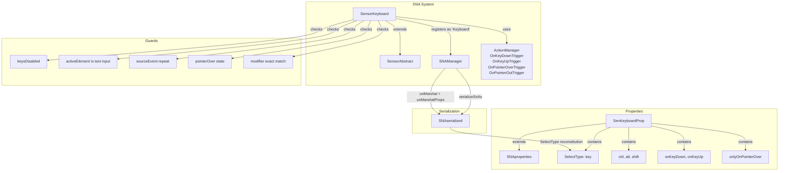

# Design Document: Sensor Keyboard

## Overview

This design introduces a keyboard event sensor for the SNA behavior system. SensorKeyboard detects keyboard key presses and/or releases via the mesh's ActionManager (`OnKeyDownTrigger` / `OnKeyUpTrigger`) and emits signals when the configured key combination (key + modifiers) is detected.

Key design aspects:
1. Follows the same pattern as SensorClick: a properties class (`SenKeyboardProp`) + sensor class (`SensorKeyboard`) + self-registration at module scope
2. Uses `SelectType` for key selection (58 predefined `KeyboardEvent.key` values)
3. Supports modifier key requirements (ctrl, alt, shift) with exact-match semantics
4. Supports event type selection (onKeyDown, onKeyUp, or both)
5. Optional pointer-on-mesh gating via pointer-over/pointer-out tracking actions
6. Edit mode awareness: suppresses signals when `keysDisabled` is true or a text input element is focused
7. Filters out repeat key events (`sourceEvent.repeat`)

## Architecture



### Key Design Decisions

1. **Exact modifier matching**: The sensor requires ALL three modifier states to match exactly. If `ctrl` is configured as `true`, the event must have `ctrlKey === true`. If `ctrl` is configured as `false`, the event must have `ctrlKey === false`. This prevents accidental triggers when holding extra modifiers and ensures Ctrl+A doesn't fire a sensor configured for just "A".

2. **Repeat key filtering in the action callback**: Rather than using a separate mechanism, the `sourceEvent.repeat` check happens inside the ExecuteCodeAction callback. This is the simplest approach since BabylonJS's ActionManager doesn't provide a built-in repeat filter.

3. **Pointer-over tracking via ActionManager actions**: When `onlyOnPointerOver` is enabled, the sensor registers `OnPointerOverTrigger` and `OnPointerOutTrigger` actions to track pointer state. This integrates naturally with the existing action lifecycle (stored in `this.actions`, cleaned up by `removeActions()`).

4. **Edit mode guards in the callback**: The `keysDisabled` and `activeElement` checks happen inside the key event callback rather than by unregistering/re-registering actions. This avoids complex state synchronization when dialogs open/close rapidly.

5. **SelectType for key selection**: Using the existing `SelectType` UI property type means the key dropdown renders automatically in the SNA edit dialog without any SnaUI changes. The `unMarshalProps` mechanism already handles `SelectType` reconstitution.

## Components and Interfaces

### SenKeyboardProp

```typescript
// src/sna/SensorKeyboard.ts
export class SenKeyboardProp extends SNAproperties {
    key: SelectType = new SelectType();
    ctrl: boolean = false;
    alt: boolean = false;
    shift: boolean = false;
    onKeyDown: boolean = true;
    onKeyUp: boolean = false;
    onlyOnPointerOver: boolean = false;

    constructor() {
        super();
        this.key.values = [
            // Letters A-Z
            "A","B","C","D","E","F","G","H","I","J","K","L","M",
            "N","O","P","Q","R","S","T","U","V","W","X","Y","Z",
            // Digits 0-9
            "0","1","2","3","4","5","6","7","8","9",
            // Function keys F1-F12
            "F1","F2","F3","F4","F5","F6","F7","F8","F9","F10","F11","F12",
            // Arrow keys
            "ArrowUp","ArrowDown","ArrowLeft","ArrowRight",
            // Common keys
            " ","Enter","Escape","Tab","Backspace","Delete",
            "Home","End","PageUp","PageDown"
        ];
        this.key.value = " "; // Default to Space (KeyboardEvent.key for spacebar is " ")
    }
}
```

**Note on Space key**: `KeyboardEvent.key` for the spacebar is the literal string `" "` (a single space character). The UI display label in the dropdown will show "Space" for readability, but the stored value is `" "` to match against actual keyboard events. Alternatively, we can store `" "` internally and use a display mapping. Given that the existing `SelectType` renders values directly, we'll use the string `" "` as the value and rely on the dropdown showing it (browsers render a space in `<option>` elements). If this proves problematic for UX, a display-name mapping can be added later.

**Revised approach**: To avoid UX issues with a blank-looking dropdown option, we'll use the convention from the requirements which says "Space" as the display value. We'll store `" "` as the internal match value but need a way to display "Space". Since `SelectType` only has a single `values` array, we'll keep the value as `" "` (matching `KeyboardEvent.key`) and accept that the dropdown will show a space character. The key matching logic compares against `sourceEvent.key` directly.

### SensorKeyboard

```typescript
// src/sna/SensorKeyboard.ts
export class SensorKeyboard extends SensorAbstract {
    private _pointerOver: boolean = false;

    override init() {}

    override getName(): string {
        return "Keyboard";
    }

    override getPropertiesType(): typeof SNAproperties {
        return SenKeyboardProp;
    }

    override getProperties(): SNAproperties {
        return this.properties;
    }

    override setProperties(properties: SNAproperties) {
        this.properties = properties;
    }

    override cleanUp() {
        this._pointerOver = false;
    }

    override onPropertiesChange() {
        let props = this.properties as SenKeyboardProp;

        if (!this.mesh.actionManager) {
            this.mesh.actionManager = new ActionManager(this.mesh.getScene());
        }

        // Register key-down action
        if (props.onKeyDown) {
            let action = new ExecuteCodeAction(
                ActionManager.OnKeyDownTrigger,
                (e) => this._handleKeyEvent(e)
            );
            this.mesh.actionManager.registerAction(action);
            this.actions.push(action);
        }

        // Register key-up action
        if (props.onKeyUp) {
            let action = new ExecuteCodeAction(
                ActionManager.OnKeyUpTrigger,
                (e) => this._handleKeyEvent(e)
            );
            this.mesh.actionManager.registerAction(action);
            this.actions.push(action);
        }

        // Register pointer-over tracking if enabled
        if (props.onlyOnPointerOver) {
            let overAction = new ExecuteCodeAction(
                ActionManager.OnPointerOverTrigger,
                () => { this._pointerOver = true; }
            );
            this.mesh.actionManager.registerAction(overAction);
            this.actions.push(overAction);

            let outAction = new ExecuteCodeAction(
                ActionManager.OnPointerOutTrigger,
                () => { this._pointerOver = false; }
            );
            this.mesh.actionManager.registerAction(outAction);
            this.actions.push(outAction);

            // Set hand cursor for interactivity feedback
            this.mesh.actionManager.hoverCursor = "pointer";
        }
    }

    private _handleKeyEvent(e: ActionEvent) {
        let props = this.properties as SenKeyboardProp;
        let sourceEvent: KeyboardEvent = e.sourceEvent;

        // Guard: repeat key filter
        if (sourceEvent.repeat) return;

        // Guard: edit mode — keys disabled
        if (Vishva.vishva.keysDisabled) return;

        // Guard: edit mode — active text input element
        let activeEl = document.activeElement;
        if (activeEl) {
            let tag = activeEl.tagName;
            if (tag === "TEXTAREA" || tag === "SELECT") return;
            if (tag === "INPUT") {
                let inputType = (activeEl as HTMLInputElement).type?.toLowerCase();
                if (["text","number","password","email","search","url","tel"].includes(inputType)) return;
            }
            if ((activeEl as HTMLElement).contentEditable === "true") return;
        }

        // Guard: pointer-over gating
        if (props.onlyOnPointerOver && !this._pointerOver) return;

        // Check key match
        if (sourceEvent.key !== props.key.value) return;

        // Check exact modifier match
        if (sourceEvent.ctrlKey !== props.ctrl) return;
        if (sourceEvent.altKey !== props.alt) return;
        if (sourceEvent.shiftKey !== props.shift) return;

        // All checks passed — emit signal
        this.emitSignal(e);
    }
}

SNAManager.getSNAManager().addSensor("Keyboard", SensorKeyboard);
```

### index.ts Side-Effect Import

```typescript
// Add to src/index.ts alongside existing sensor imports
import "./sna/SensorKeyboard";
```

## Data Models

### SenKeyboardProp

| Field | Type | Default | Description |
|-------|------|---------|-------------|
| signalId | string | "0" | Signal to emit (inherited from SNAproperties) |
| signalEnable | string | "" | Signal that re-enables this sensor (inherited) |
| signalDisable | string | "" | Signal that disables this sensor (inherited) |
| key | SelectType | value=" ", 58 entries | Which key to listen for |
| ctrl | boolean | false | Require Ctrl modifier |
| alt | boolean | false | Require Alt modifier |
| shift | boolean | false | Require Shift modifier |
| onKeyDown | boolean | true | Listen for key press events |
| onKeyUp | boolean | false | Listen for key release events |
| onlyOnPointerOver | boolean | false | Only emit when pointer is over mesh |

### Serialized Format (SNAserialized)

```json
{
    "name": "Keyboard",
    "type": "SENSOR",
    "meshId": "Vishva.uid.1234567890",
    "properties": {
        "signalId": "jumpSignal",
        "signalEnable": "",
        "signalDisable": "",
        "key": {
            "type": "SelectType",
            "values": ["A","B","C","...all 58..."],
            "value": " "
        },
        "ctrl": false,
        "alt": false,
        "shift": true,
        "onKeyDown": true,
        "onKeyUp": false,
        "onlyOnPointerOver": false
    }
}
```

The existing `unMarshalProps` mechanism in `SNAManager` already handles `SelectType` reconstitution (checks for `o["type"] === "SelectType"` and rebuilds the object with `values` and `value`). No changes to `unMarshalProps` are needed.

## Correctness Properties

*A property is a characteristic or behavior that should hold true across all valid executions of a system — essentially, a formal statement about what the system should do. Properties serve as the bridge between human-readable specifications and machine-verifiable correctness guarantees.*

### Property 1: Serialization round-trip preserves all properties

*For any* valid SenKeyboardProp configuration (any key from the 58-value SelectType list, any combination of ctrl/alt/shift booleans, any combination of onKeyDown/onKeyUp booleans, and any onlyOnPointerOver boolean), serializing the properties to a plain JSON object and then reconstructing via `unMarshalProps` SHALL produce a property object whose `key.value`, `key.values`, `ctrl`, `alt`, `shift`, `onKeyDown`, `onKeyUp`, and `onlyOnPointerOver` fields are all equal to the original configuration.

**Validates: Requirements 6.1, 6.2, 6.4, 6.5**

### Property 2: Signal emission requires exact key and modifier match

*For any* SensorKeyboard configuration (any key value, any ctrl/alt/shift settings) and *for any* keyboard event (any sourceEvent.key, any ctrlKey/altKey/shiftKey state, repeat=false), the sensor emits its signal if and only if: (a) sourceEvent.key equals the configured key value, AND (b) sourceEvent.ctrlKey equals the configured ctrl, AND (c) sourceEvent.altKey equals the configured alt, AND (d) sourceEvent.shiftKey equals the configured shift.

**Validates: Requirements 3.5, 3.6, 3.7, 4.4, 4.5, 4.6**

### Property 3: Guard conditions prevent signal emission

*For any* matching key event (correct key + correct modifiers), if ANY of the following guard conditions is active — (a) `Vishva.vishva.keysDisabled` is true, OR (b) `document.activeElement` is a text-entry INPUT/TEXTAREA/SELECT/contentEditable element, OR (c) `sourceEvent.repeat` is true — THEN the sensor SHALL NOT emit its signal.

**Validates: Requirements 4.7, 7.1, 7.2**

### Property 4: Trigger registration matches event type configuration

*For any* combination of onKeyDown and onKeyUp boolean values, after `onPropertiesChange()` completes, the number of keyboard trigger actions registered SHALL equal the count of true values among {onKeyDown, onKeyUp}. Specifically: if onKeyDown=true, exactly one OnKeyDownTrigger action is registered; if onKeyUp=true, exactly one OnKeyUpTrigger action is registered; if both are false, zero keyboard trigger actions are registered.

**Validates: Requirements 8.5, 8.6, 8.7, 8.8**

### Property 5: Pointer-over gating controls signal emission

*For any* matching key event (correct key + correct modifiers, no guard conditions active), the sensor emits its signal if and only if: `onlyOnPointerOver` is false, OR (`onlyOnPointerOver` is true AND the pointer is currently over the mesh).

**Validates: Requirements 9.3, 9.4, 9.5**

## Error Handling

| Scenario | Handling |
|----------|----------|
| Mesh has no ActionManager | `onPropertiesChange()` creates one (same pattern as SensorClick) |
| Both onKeyDown and onKeyUp are false | No keyboard actions registered; sensor exists but is inert |
| Key event fires while keysDisabled | Event callback returns early; no signal emitted |
| Key event fires while text input focused | Event callback returns early; no signal emitted |
| Repeat key event (key held down) | Event callback returns early; no signal emitted |
| Pointer leaves mesh while key held (onlyOnPointerOver=true) | `_pointerOver` set to false; subsequent key callbacks return early |
| Sensor disposed while disabled | Inherited `dispose()` calls `removeActions()` which handles cleanup regardless of disabled state |
| SelectType with unknown key value in serialized data | `unMarshalProps` reconstitutes it as-is; the key won't match any events but won't crash |

## Testing Strategy

### Property-Based Tests (fast-check + Vitest)

Property-based testing is appropriate here because:
- The serialization round-trip involves data transformation with a clear inverse (serialize → deserialize)
- The signal emission logic is a pure decision function over a large input space (58 keys × 8 modifier combos × 2 event types × pointer state × guard states)
- The trigger registration logic maps boolean configuration to a discrete set of registered actions

Each property test will run a minimum of 100 iterations and reference its design property.

**Library**: fast-check 4.7.0 (already in project)
**Naming**: `src/sna/SensorKeyboard.property.test.ts`
**Tag format**: `Feature: sensor-keyboard, Property N: <title>`

Tests:
1. **Property 1**: Generate random `SenKeyboardProp` instances (random key from 58 values, random booleans), serialize to JSON, run through `unMarshalProps`, assert equality.
2. **Property 2**: Generate random key configs and random key events, invoke the matching logic, assert signal emission iff all conditions match.
3. **Property 3**: Generate random matching events with at least one guard active, assert no emission.
4. **Property 4**: Generate random onKeyDown/onKeyUp combinations, invoke `onPropertiesChange()` on a mock, count registered actions by trigger type.
5. **Property 5**: Generate random matching events with random pointer-over state and onlyOnPointerOver config, assert emission iff gating allows.

### Unit Tests (Vitest)

**File**: `src/sna/SensorKeyboard.test.ts`

- Verify `SenKeyboardProp` defaults (key.value = " ", ctrl/alt/shift = false, onKeyDown = true, onKeyUp = false, onlyOnPointerOver = false)
- Verify key.values has exactly 58 entries
- Verify sensor registers as "Keyboard" with SNAManager
- Verify `getName()` returns "Keyboard"
- Verify `getType()` returns "SENSOR"
- Verify ActionManager is created if mesh doesn't have one
- Verify pointer-over actions are registered when onlyOnPointerOver = true
- Verify pointer-over actions are NOT registered when onlyOnPointerOver = false
- Verify hoverCursor is set to "pointer" when onlyOnPointerOver = true
- Verify disposal cleans up actions
- Verify disable/enable signal lifecycle

### Integration Tests

- Create SensorKeyboard on a mesh, serialize the world, deserialize, verify sensor is reconstructed with correct properties
- Verify SensorKeyboard appears in the sensor selection dropdown (SNAManager.getSensorList() includes "Keyboard")
