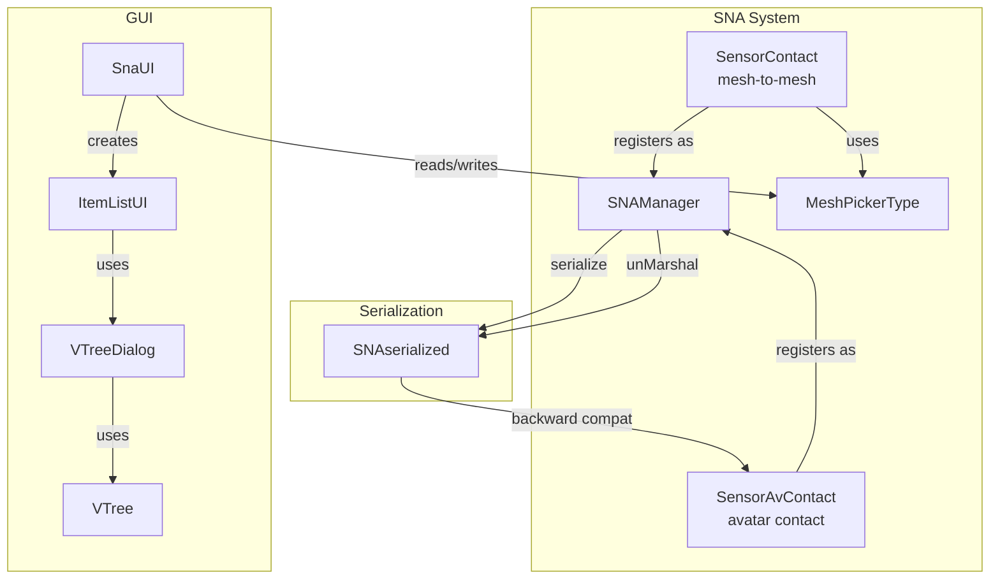

# Design Document: Sensor Mesh Contact

## Overview

This design introduces mesh-to-mesh contact detection in the SNA system by:
1. Renaming the existing `SensorContact` (avatar-only) to `SensorAvContact`
2. Creating a new `SensorContact` that detects intersection between any two meshes
3. Adding a `MeshPickerType` property type for mesh selection in the SNA editor
4. Refactoring `ItemListUI` to be reusable with a filter lambda
5. Extending `VTree` to render parenthesized labels as greyed-out/non-clickable

The design follows existing SNA patterns: a properties class + sensor class + self-registration at import time.

## Architecture



### Key Design Decisions

1. **Backward compatibility via `unMarshal` name remapping**: When deserializing, if a sensor named "Contact" has no `targetMesh` property, it's treated as the old avatar-contact sensor and instantiated as `SensorAvContact`. This avoids breaking existing saved worlds.

2. **MeshPickerType follows FileInputType pattern**: Just as `FileInputType` stores a file path and triggers a file browser dialog, `MeshPickerType` stores a mesh ID and triggers an `ItemListUI` dialog. Both are recognized by `SnaUI.formCreate()` as special object types.

3. **Parenthesized label convention in VTree**: Rather than adding a complex filter callback chain through VTreeDialog→VTree, we use a simple string convention: labels wrapped in `()` are rendered greyed out and non-clickable. This keeps VTree's API unchanged while enabling the "non-selectable" visual.

4. **ItemListUI reusability via filter + addTreeListener**: The filter lambda controls which nodes appear as selectable (non-parenthesized) vs non-selectable (parenthesized). The `addTreeListener` method allows callers to override the default `selectMesh` behavior.

## Components and Interfaces

### SensorAvContact (renamed from SensorContact)

```typescript
// src/sna/SensorAvContact.ts
export class SenAvContactProp extends SNAproperties {
    onEnter: boolean = false;
    onExit: boolean = false;
}

export class SensorAvContact extends SensorAbstract {
    override getName(): string { return "AvContact"; }
    override getPropertiesType(): typeof SNAproperties { return SenAvContactProp; }
    // ... same logic as current SensorContact (uses AnimUtils.getMeshSkel for avatar)
}

SNAManager.getSNAManager().addSensor("AvContact", SensorAvContact);
```

### SensorContact (new mesh-to-mesh)

```typescript
// src/sna/SensorContact.ts
export class SenContactProp extends SNAproperties {
    onEnter: boolean = false;
    onExit: boolean = false;
    targetMesh: MeshPickerType = new MeshPickerType();
}

export class SensorContact extends SensorAbstract {
    override getName(): string { return "Contact"; }
    override getPropertiesType(): typeof SNAproperties { return SenContactProp; }

    override onPropertiesChange() {
        let properties = this.properties as SenContactProp;
        let scene = this.mesh.getScene();

        if (!this.mesh.actionManager) {
            this.mesh.actionManager = new ActionManager(scene);
        }

        // Resolve target mesh by uniqueId
        let targetMeshId = properties.targetMesh.value;
        if (!targetMeshId || targetMeshId === "") {
            console.warn("SensorContact: no target mesh selected");
            return;
        }

        let otherMesh: AbstractMesh = null;
        for (let m of scene.meshes) {
            if (m.uniqueId.toString() === targetMeshId) {
                otherMesh = m;
                break;
            }
        }

        if (!otherMesh) {
            console.warn("SensorContact: target mesh not found in scene (id: " + targetMeshId + ")");
            return;
        }

        if (properties.onEnter) {
            let action = new ExecuteCodeAction(
                { trigger: ActionManager.OnIntersectionEnterTrigger, parameter: { mesh: otherMesh, usePreciseIntersection: false } },
                (e) => this.emitSignal(e)
            );
            this.mesh.actionManager.registerAction(action);
            this.actions.push(action);
        }

        if (properties.onExit) {
            let action = new ExecuteCodeAction(
                { trigger: ActionManager.OnIntersectionExitTrigger, parameter: { mesh: otherMesh, usePreciseIntersection: false } },
                (e) => this.emitSignal(e)
            );
            this.mesh.actionManager.registerAction(action);
            this.actions.push(action);
        }
    }
}

SNAManager.getSNAManager().addSensor("Contact", SensorContact);
```

### MeshPickerType

```typescript
// Added to src/gui/VishvaGUI.ts
export class MeshPickerType {
    public type: string = "MeshPickerType";
    public value: string = "";      // mesh uniqueId as string
    public meshName: string = "";   // display name

    constructor(value: string = "", meshName: string = "") {
        this.value = value;
        this.meshName = meshName;
    }
}
```

### ItemListUI Changes

```typescript
// src/gui/ItemListUI.ts
export class ItemListUI {
    constructor(
        vishva: Vishva,
        modal: boolean = true,
        filter?: (node: TransformNode) => boolean  // NEW optional parameter
    ) { ... }

    // NEW: allows callers to override the default tree listener
    public addTreeListener(listener: (leaf: string, path: string, isLeaf: boolean) => void) {
        this._itemsDiag.addTreeListener(listener);
    }
}
```

In `_addChildren()`, when a `filter` is provided:
- Default exclusions (ground, avatar, skybox, editControl) always apply (node is skipped entirely)
- For nodes that pass default exclusions but fail the filter: label is wrapped in parentheses
- For nodes that pass both: label is normal (current behavior)

### VTree Changes

In `_buildUL()` and `_treeClick()`:
- Leaf nodes whose text starts with `(` and ends with `)` get greyed-out CSS styling
- Click handler skips invoking `_clickListener` for parenthesized leaf nodes

### SnaUI Changes

In `formCreate()`, add a new branch for `MeshPickerType`:
```typescript
} else if (snaP[key] instanceof MeshPickerType) {
    let mpt: MeshPickerType = snaP[key];
    let h: HTMLElement = this._createMeshPicker(mpt);
    this.mapKey2Ele[key] = h;
    cell.appendChild(h);
}
```

The `_createMeshPicker` method:
1. Creates a label showing `mpt.meshName` (or "No mesh chosen")
2. Creates a "Choose Mesh" button
3. On click, creates an `ItemListUI` with a filter: `(node) => node instanceof AbstractMesh`
4. Calls `addTreeListener` to capture selection
5. On selection, updates `mpt.value` and `mpt.meshName`, updates the label

### SNAManager.unMarshal Backward Compatibility

In `unMarshal()`, before calling `createSensorByName`:
```typescript
if (sna.type === "SENSOR") {
    let name = sna.name;
    // Backward compat: old "Contact" sensors without targetMesh → AvContact
    if (name === "Contact" && !sna.properties["targetMesh"]) {
        name = "AvContact";
    }
    this.createSensorByName(name, mesh, sna.properties);
}
```

### SNAManager.unMarshalProps Extension

Add handling for `MeshPickerType`:
```typescript
} else if (o["type"] === "MeshPickerType") {
    let mpt: MeshPickerType = new MeshPickerType(o["value"], o["meshName"]);
    obj[pName] = mpt;
}
```

## Data Models

### SenContactProp (new)

| Field | Type | Default | Description |
|-------|------|---------|-------------|
| signalId | string | "" | Signal to emit (inherited from SNAproperties) |
| onEnter | boolean | false | Emit signal on intersection enter |
| onExit | boolean | false | Emit signal on intersection exit |
| targetMesh | MeshPickerType | new MeshPickerType() | The target mesh to detect |

### SenAvContactProp (renamed from SenContactProp)

| Field | Type | Default | Description |
|-------|------|---------|-------------|
| signalId | string | "" | Signal to emit (inherited from SNAproperties) |
| onEnter | boolean | false | Emit signal on avatar intersection enter |
| onExit | boolean | false | Emit signal on avatar intersection exit |

### MeshPickerType

| Field | Type | Default | Description |
|-------|------|---------|-------------|
| type | string | "MeshPickerType" | Serialization type identifier |
| value | string | "" | Selected mesh's uniqueId as string |
| meshName | string | "" | Selected mesh's display name |

### Serialized Format (SNAserialized)

```json
{
    "name": "Contact",
    "type": "SENSOR",
    "meshId": "Vishva.uid.1234567890",
    "properties": {
        "signalId": "meshHit",
        "onEnter": true,
        "onExit": false,
        "targetMesh": {
            "type": "MeshPickerType",
            "value": "42",
            "meshName": "MyBox"
        }
    }
}
```

## Correctness Properties

*A property is a characteristic or behavior that should hold true across all valid executions of a system — essentially, a formal statement about what the system should do. Properties serve as the bridge between human-readable specifications and machine-verifiable correctness guarantees.*

### Property 1: MeshPickerType serialization round trip

*For any* valid MeshPickerType instance with arbitrary `value` and `meshName` strings, serializing to a plain object (as JSON.parse(JSON.stringify(...)) would produce) and then reconstructing via `unMarshalProps` SHALL produce an equivalent MeshPickerType with the same `value`, `meshName`, and `type` fields.

**Validates: Requirements 3.4, 3.10, 6.1, 6.2**

### Property 2: Backward compatibility — old Contact sensors deserialize as AvContact

*For any* serialized sensor with name "Contact" and properties that do NOT contain a `targetMesh` field, the backward-compatibility name resolution logic SHALL map the sensor name to "AvContact".

**Validates: Requirements 1.8, 6.5**

### Property 3: New Contact sensors with targetMesh retain Contact name

*For any* serialized sensor with name "Contact" and properties that DO contain a `targetMesh` field (with any value/meshName), the name resolution logic SHALL keep the sensor name as "Contact".

**Validates: Requirements 6.3**

### Property 4: ItemListUI filter produces correct label wrapping

*For any* set of TransformNode objects and a filter function `(node: TransformNode) => boolean`, the ItemListUI tree data generation SHALL: (a) always exclude default nodes (ground, avatar, skybox, editControl) regardless of filter, and (b) wrap labels in parentheses for nodes that pass default exclusions but for which the filter returns false, while leaving labels unwrapped for nodes that pass both.

**Validates: Requirements 4.2, 4.3**

### Property 5: VTree parenthesized label behavior

*For any* tree data containing a mix of parenthesized and non-parenthesized leaf labels, VTree SHALL: (a) apply greyed-out styling to parenthesized labels, (b) not invoke the click listener when a parenthesized label is clicked, and (c) invoke the click listener normally when a non-parenthesized label is clicked.

**Validates: Requirements 5.1, 5.2, 5.4**

## Error Handling

| Scenario | Handling |
|----------|----------|
| Target mesh not found in scene (deleted or ID mismatch) | Log warning, skip action registration. Sensor exists but is inert. |
| Target mesh is a TransformNode but not AbstractMesh | Log warning, skip action registration. |
| MeshPickerType has empty value | Sensor logs warning and does not register intersection triggers. |
| Old "Contact" sensor in saved world | Automatically remapped to "AvContact" during deserialization. |
| User selects a greyed-out (parenthesized) node | Click is ignored by VTree — no callback fired. |

## Testing Strategy

### Property-Based Tests (fast-check + Vitest)

Property-based testing is appropriate here because:
- MeshPickerType serialization involves data transformation with clear round-trip properties
- Backward compatibility logic has universal rules that should hold for all possible serialized inputs
- The parenthesized label convention is a pure string transformation testable across all inputs

Each property test will run a minimum of 100 iterations and reference its design property.

**Library**: fast-check 4.7.0 (already in project)
**Naming**: `*.property.test.ts`
**Tag format**: `Feature: sensor-mesh-contact, Property N: <title>`

### Unit Tests (Vitest)

- SensorContact: verify action registration with mock ActionManager
- SensorAvContact: verify it still works identically to old SensorContact
- SnaUI MeshPickerType rendering: verify label + button creation
- ItemListUI filter: verify specific examples of node inclusion/exclusion

### Integration Tests

- End-to-end: create SensorContact, save world, load world, verify sensor still works
- Backward compat: load a world with old "Contact" sensor, verify it becomes AvContact
