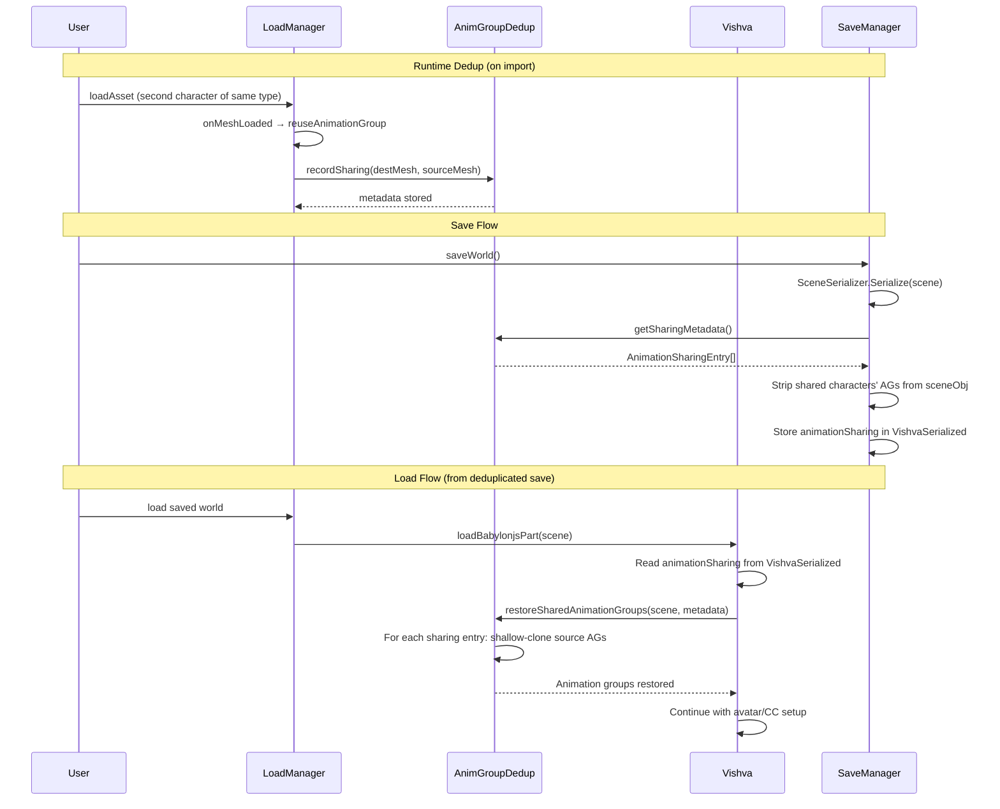

# Design Document: Animation Group Sharing

## Overview

When multiple characters of the same type exist in a scene, BabylonJS creates separate animation group instances for each, even though they share identical keyframe data. The existing `reuseAnimationGroup()` method in `LoadManager` handles sharing Animation objects at import time (when a new character is loaded into an existing scene), but this sharing is lost during scene serialization and reload — every character's animation groups are serialized independently, bloating the save file.

This feature implements a metadata-based sharing system with three phases:

1. **Runtime deduplication** — On first load or import, detect duplicate animation groups across characters and share Animation objects (keyframe data) via shallow references. Record which characters share with which source character.
2. **Save-time stripping** — Using the sharing metadata, strip animation groups from characters that share with a source. Persist the sharing metadata in `VishvaSerialized` so the relationship can be restored.
3. **Load-time restoration** — On loading a deduplicated save, read the sharing metadata and shallow-clone the source character's animation groups for each sharing character (new AnimationGroup + new TargetedAnimation entries pointing to the source's Animation objects).

The solution is backward-compatible — legacy saves (without sharing metadata) load normally since all animation groups are present in the file. The runtime deduplication can still share Animation objects for memory savings even on legacy loads.

## Architecture




## Components and Interfaces

### Component 1: AnimGroupDedup (new utility module)

**Purpose**: Provides logic for detecting duplicate animation groups, recording sharing relationships, stripping shared groups at save time, and restoring them at load time. Extracted as a standalone module for testability.

**Interface**:
```typescript
// src/util/AnimGroupDedup.ts

import { AnimationGroup, Scene, Node, TransformNode } from "babylonjs";

/**
 * Metadata entry recording that a character shares animations with a source.
 * Stored in VishvaSerialized.animationSharing (serialized form with string IDs).
 */
export interface AnimationSharingEntry {
    meshId: string;
    sourceMeshId: string;
}

/**
 * Runtime sharing entry that holds Node references instead of string IDs.
 * This avoids the problem of mesh IDs being renamed (by renameMeshIds) after
 * the sharing metadata is recorded. IDs are resolved at save time from the
 * live node references via resolveRuntimeEntries().
 */
export interface RuntimeSharingEntry {
    mesh: Node;
    sourceMesh: Node;
}

/**
 * Converts runtime sharing entries (with Node references) to serializable
 * AnimationSharingEntry objects (with current string IDs).
 * Call this at save time, AFTER renameMeshIds has run, to get correct IDs.
 */
export function resolveRuntimeEntries(entries: RuntimeSharingEntry[]): AnimationSharingEntry[];

export function areAnimationGroupsDuplicates(a: AnimationGroup, b: AnimationGroup): boolean;

/**
 * Runtime deduplication: returns RuntimeSharingEntry[] (Node references, not string IDs).
 */
export function deduplicateAtRuntime(scene: Scene): RuntimeSharingEntry[];

/**
 * Save-time stripping: accepts RuntimeSharingEntry[] directly.
 * Uses live Node references to determine which animation groups belong to
 * sharing characters (by checking target node hierarchy membership).
 * Removes corresponding entries from the serialized array by index
 * (SceneSerializer.Serialize preserves scene.animationGroups order).
 */
export function stripSharedAnimationGroups(
    sceneObj: SerializedScene,
    runtimeEntries: RuntimeSharingEntry[],
    scene: Scene
): number;

/**
 * Load-time restoration: accepts AnimationSharingEntry[] (string IDs from VishvaSerialized).
 */
export function restoreSharedAnimationGroups(
    scene: Scene,
    sharingEntries: AnimationSharingEntry[]
): number;

export function getRootMesh(node: Node): Node;
export function findNodeInHierarchy(root: Node, nodeName: string): Node | null;
```

**Key Design Decision — RuntimeSharingEntry vs AnimationSharingEntry**:

The system uses two entry types to handle the fact that `SaveManager.renameMeshIds()` reassigns all mesh IDs to sequential numbers before serialization:

- **`RuntimeSharingEntry`** (Node references) — used at runtime and during save. Stored on `Vishva._animationSharing`. Immune to ID renames since it holds live object references.
- **`AnimationSharingEntry`** (string IDs) — used only for serialization in VishvaSerialized. Created at save time via `resolveRuntimeEntries()` after IDs have been finalized.

**Responsibilities**:
- Detect duplicate animation groups by name + target node names + animation names
- Share Animation objects (keyframe data) at runtime between duplicate groups
- Track which characters share with which source character (via Node references)
- Strip shared characters' animation groups from serialized scene data (using live hierarchy checks, index-based removal)
- Restore animation groups via shallow clone on load from deduplicated saves
- Match target nodes by name within a character's subtree (not by ID)

### Component 2: VishvaSerialized Integration

**Purpose**: Store the sharing metadata so it persists across save/load cycles.

**Integration Point**:
```typescript
// In VishvaSerialized.ts — add field:
public animationSharing?: AnimationSharingEntry[];
```

**Responsibilities**:
- Persist the list of sharing relationships
- Backward compatible — field is optional, absent in legacy saves

### Component 3: LoadManager Integration

**Purpose**: Enhanced `reuseAnimationGroup` to record sharing metadata when a new character is imported into an existing scene.

**Integration Point**:
```typescript
// In LoadManager.onMeshLoaded, after reuseAnimationGroup loop:
// Record which root mesh's animation groups were shared with which source
```

**Responsibilities**:
- When `reuseAnimationGroup` finds a match, record the sharing relationship
- Store metadata on the Vishva instance so SaveManager can access it

### Component 4: SaveManager Integration

**Purpose**: Strip shared animation groups from the serialized scene and persist sharing metadata.

**Integration Point**:
```typescript
// In SaveManager._getWorldZipBlob(), saveWorldAsJson(), saveWorldToIndexedDB(), saveWorldToIndexedDBAsJson()
// After: let sceneObj = SceneSerializer.Serialize(this.vishva.scene);
// Strip using live Node references (immune to renameMeshIds):
//   stripSharedAnimationGroups(sceneObj, runtimeEntries, scene);
// Resolve to string IDs for serialization (after renameMeshIds has run):
//   vishvaSerialized.animationSharing = resolveRuntimeEntries(runtimeEntries);
```

**Responsibilities**:
- Read runtime sharing entries (Node references) from the Vishva instance
- Strip animation groups belonging to sharing characters using live hierarchy checks
- Resolve Node references to current string IDs via `resolveRuntimeEntries()` for VishvaSerialized
- Log the number of stripped groups for debugging

### Component 5: Vishva.loadBabylonjsPart Integration

**Purpose**: Restore shared animation groups after scene deserialization, before avatar/CC setup.

**Integration Point**:
```typescript
// In Vishva.loadBabylonjsPart(), after scene objects are found but before avatar setup:
// If vishvaSerialized.animationSharing exists:
//   restoreSharedAnimationGroups(scene, vishvaSerialized.animationSharing);
// Then run runtime dedup to share Animation objects:
//   deduplicateAtRuntime(scene);
```

**Responsibilities**:
- Restore animation groups for characters that had them stripped at save time
- Then run runtime dedup to share Animation objects for memory savings
- Must run before avatar setup and character controller initialization
- Must run before meshCC (character controller on meshes) setup

## Data Models

### AnimationSharingEntry (in VishvaSerialized — serialization only)

```typescript
export interface AnimationSharingEntry {
    meshId: string;        // ID of the character that shares (c2, c3)
    sourceMeshId: string;  // ID of the character that owns the canonical animations (c1)
}
```

### RuntimeSharingEntry (in-memory — used at runtime and during save)

```typescript
export interface RuntimeSharingEntry {
    mesh: Node;        // Live Node reference to the sharing character's root
    sourceMesh: Node;  // Live Node reference to the source character's root
}
```

This dual-type design exists because `SaveManager.renameMeshIds()` reassigns all mesh IDs to sequential numbers ("0", "1", "2"...) before serialization. Storing string IDs at runtime would become stale after renaming. Instead, Node references are stored at runtime and resolved to current IDs at save time via `resolveRuntimeEntries()`.

### Duplicate Detection Criteria

Two animation groups are considered duplicates when:
1. They have the **same name** (exact string match, e.g., "walk" === "walk")
2. They have the **same set of targeted animations** where for each:
   - **Same target node name** (e.g., "Hips" === "Hips") — note: different IDs are expected since they're different character instances
   - **Same animation name** (e.g., "walk_Hips" === "walk_Hips")

This means:
- Groups with the same name but different target node names or animation names are NOT duplicates (customized version)
- Groups with different names but identical animations are NOT duplicates (they serve different purposes)
- The target node IDs are expected to differ — matching is by node name within the character's subtree

### What Gets Shared vs What's New

| Aspect | Shared (same object reference) | New (created fresh) |
|--------|-------------------------------|---------------------|
| Runtime dedup | `Animation` objects (keyframe data, frame rates, keys arrays) | Nothing else changes |
| Load-time restore | `Animation` objects from source character | `AnimationGroup` object, `TargetedAnimation` entries (hold target node ref + animation ref) |

### Target Node Matching During Shallow Clone

When restoring c1's animation group for c2:
- c1's targetedAnimation targets a node named "Hips" (with some unique ID like "c1_Hips_123")
- Find the node named "Hips" within c2's hierarchy (different ID like "c2_Hips_456", same name)
- The match is by **node name**, searching within the **target character's subtree** only

## Key Functions with Formal Specifications

### Function 1: areAnimationGroupsDuplicates()

```typescript
function areAnimationGroupsDuplicates(a: AnimationGroup, b: AnimationGroup): boolean
```

**Preconditions:**
- Both `a` and `b` are valid BabylonJS AnimationGroup objects with `name` and `targetedAnimations` fields

**Postconditions:**
- Returns `true` if and only if:
  - `a.name === b.name`
  - For each targetedAnimation in `a`, there exists a targetedAnimation in `b` with the same `target.name` and same `animation.name`, and vice versa (set equality)
- Returns `false` otherwise
- No side effects

### Function 2: deduplicateAtRuntime()

```typescript
function deduplicateAtRuntime(scene: Scene): RuntimeSharingEntry[]
```

**Preconditions:**
- `scene` is a valid BabylonJS Scene with `animationGroups` array
- Scene has been fully deserialized (all animation groups and their targets exist)

**Postconditions:**
- Returns an array of `RuntimeSharingEntry` (Node references) recording which characters share with which source
- For each set of duplicate animation groups (same name + same target node names + same animation names):
  - The first one found (canonical) is preserved unchanged
  - Subsequent duplicates have their `targetedAnimations[].animation` references replaced with the canonical group's corresponding Animation objects (matched by animation name)
- Animation groups with unique signatures remain untouched
- The AnimationGroup objects themselves are NOT removed (they still exist, just share Animation data)

**Loop Invariants:**
- For each processed group signature, at most one canonical group exists
- All retargeted animations point to valid Animation objects from the canonical group

### Function 3: stripSharedAnimationGroups()

```typescript
function stripSharedAnimationGroups(
    sceneObj: SerializedScene,
    runtimeEntries: RuntimeSharingEntry[],
    scene: Scene
): number
```

**Preconditions:**
- `sceneObj` is a valid serialized scene object with `animationGroups` array
- `runtimeEntries` is a valid array of runtime sharing entries with live Node references
- `scene` is the live scene (its `animationGroups` array is in the same order as `sceneObj.animationGroups`)

**Postconditions:**
- Returns the number of animation groups removed from `sceneObj.animationGroups`
- For each sharing character (identified by `runtimeEntries[].mesh`):
  - All animation groups whose target nodes belong to that character's hierarchy are removed
- Animation groups belonging to source characters are never removed
- The `sceneObj` is mutated in place
- Uses index-based correlation: live `scene.animationGroups[i]` corresponds to `sceneObj.animationGroups[i]`

### Function 4: restoreSharedAnimationGroups()

```typescript
function restoreSharedAnimationGroups(
    scene: Scene,
    sharingEntries: AnimationSharingEntry[]
): number
```

**Preconditions:**
- `scene` is a valid BabylonJS Scene
- Source characters' animation groups exist in the scene
- Sharing characters exist in the scene (their meshes are present) but have no animation groups

**Postconditions:**
- Returns the number of animation groups created
- For each sharing entry (e.g., c2 shares with c1):
  - For each of c1's animation groups:
    - A new AnimationGroup is created with the same name
    - For each targetedAnimation in c1's group:
      - The target node name is used to find the corresponding node in c2's hierarchy
      - A new TargetedAnimation is created with target = c2's node and animation = c1's Animation object (shared reference, NOT cloned)
    - The new group is added to the scene
- If a target node cannot be found in c2's hierarchy, that targetedAnimation is skipped (with a warning)
- Source characters' animation groups are unchanged

## Example Usage

```typescript
// === Runtime deduplication (on import or first load) ===

// After loading a second character of the same type:
// LoadManager.onMeshLoaded calls reuseAnimationGroup for each AG
// This shares Animation objects and records metadata

// Or after loading a legacy save with all AGs present:
const sharingEntries = deduplicateAtRuntime(scene);
// sharingEntries = [{ meshId: "c2_root", sourceMeshId: "c1_root" }]
// Now c2's animation groups share Animation objects with c1's


// === Save-time stripping ===

let sceneObj = SceneSerializer.Serialize(scene);
// sceneObj.animationGroups has AGs for c1 AND c2

const removedCount = stripSharedAnimationGroups(sceneObj, sharingEntries, scene);
// removedCount === N (number of c2's AGs removed)
// sceneObj.animationGroups now only has c1's AGs

// Store metadata in VishvaSerialized
vishvaSerialized.animationSharing = sharingEntries;


// === Load-time restoration (from deduplicated save) ===

// After scene deserializes — only c1 has animation groups
// Read metadata from VishvaSerialized:
const metadata = vishvaSerialized.animationSharing;
// metadata = [{ meshId: "c2_root", sourceMeshId: "c1_root" }]

const createdCount = restoreSharedAnimationGroups(scene, metadata);
// createdCount === N (c2 now has animation groups again)
// c2's AGs share Animation objects with c1's (shallow clone)

// Then run runtime dedup to ensure sharing is active:
deduplicateAtRuntime(scene);
```

## Error Handling

### Error Scenario 1: Source character not found during restoration

**Condition**: `restoreSharedAnimationGroups` cannot find the source mesh (c1) by ID in the scene
**Response**: Skip that sharing entry entirely, log a warning
**Recovery**: The sharing character (c2) will have no animation groups — this is a data integrity issue in the save file

### Error Scenario 2: Target node not found in sharing character's hierarchy

**Condition**: During shallow clone, a target node name (e.g., "Hips") cannot be found in c2's subtree
**Response**: Skip that specific targetedAnimation entry, log a warning
**Recovery**: The animation group is still created but with fewer targeted animations. The character may have partial animations.

### Error Scenario 3: Legacy save without sharing metadata

**Condition**: Loading a world saved before this feature (no `animationSharing` field in VishvaSerialized)
**Response**: Skip restoration (nothing to restore). Run `deduplicateAtRuntime` which handles this transparently — it detects duplicates and shares Animation objects regardless.
**Recovery**: Full sharing is established at runtime for memory savings. Next save will include the metadata.

### Error Scenario 4: Sharing character has no animation groups to strip

**Condition**: During save-time stripping, the sharing character's animation groups are not found in the serialized data (perhaps already removed or never existed)
**Response**: No-op for that character, continue with others
**Recovery**: Normal operation — the save file is already compact for that character

### Error Scenario 5: Source character's animation group has no matching animation name

**Condition**: During runtime dedup, a duplicate's targeted animation has no matching animation name in the canonical group
**Response**: Skip that specific targeted animation (leave it pointing to its own Animation object)
**Recovery**: The animation still works, just doesn't share that particular Animation object reference. Log a warning.

## Testing Strategy

### Unit Testing Approach

- Test `areAnimationGroupsDuplicates` with various combinations of names, target node names, and animation names
- Test `deduplicateAtRuntime` with mock scenes containing duplicate and unique animation groups
- Test `stripSharedAnimationGroups` with mock serialized scene objects and sharing metadata
- Test `restoreSharedAnimationGroups` with mock scenes where source has AGs and sharing characters don't
- Test edge cases: empty arrays, single character, all duplicates, no duplicates, mixed
- Test that groups with same name but different target node names are NOT treated as duplicates

### Property-Based Testing Approach

**Property Test Library**: fast-check

- Round-trip property: strip then restore produces animation groups equivalent to the originals (same names, same animation names, same target node names)
- Preservation property: source character's animation groups are never removed or modified
- Sharing property: after restoration + runtime dedup, Animation objects are shared (same reference) between source and sharing characters
- Idempotence: running `deduplicateAtRuntime` twice produces the same sharing entries as running it once
- Backward compatibility: scenes without sharing metadata load and dedup correctly

### Integration Testing Approach

- Test the full save → load cycle with multiple characters sharing animation groups
- Verify that character controllers still work after restoration (they reference animation groups by name)
- Verify backward compatibility with worlds saved before this feature
- Verify that importing a new character into a scene with existing sharing still works correctly

## Performance Considerations

- Runtime deduplication is O(n²) where n is the number of animation groups (comparing each pair) — acceptable since it runs once at load time and n is typically small (< 50)
- Save-time stripping is O(n × m) where n is sharing entries and m is animation groups — single pass with ID lookups
- Load-time restoration is O(n × m × k) where n is sharing entries, m is source animation groups, and k is targeted animations per group — runs once at load time
- Memory savings are proportional to the number of duplicate characters × size of Animation keyframe data per character
- File size savings are proportional to the number of stripped animation groups × their serialized size

## Security Considerations

No security implications — this feature operates entirely on in-memory scene data during save/load operations.

## Correctness Properties

*A property is a characteristic or behavior that should hold true across all valid executions of a system — essentially, a formal statement about what the system should do.*

### Property 1: Duplicate Detection Symmetry

*For any* two animation groups A and B, `areAnimationGroupsDuplicates(A, B)` returns the same value as `areAnimationGroupsDuplicates(B, A)`.

**Validates: Requirements 1.1, 1.2**

### Property 2: Duplicate Detection Correctness

*For any* two animation groups A and B, `areAnimationGroupsDuplicates(A, B)` returns true if and only if A.name equals B.name AND the set of (targetNodeName, animationName) pairs in A equals the set in B.

**Validates: Requirements 1.1, 1.2, 1.3, 1.4, 1.5, 1.6**

### Property 3: Runtime Dedup Preserves Animation Group Count

*For any* scene, after `deduplicateAtRuntime` is applied, the number of AnimationGroup objects in the scene remains unchanged (groups are not removed, only Animation object references are shared).

**Validates: Requirements 5.3, 7.3**

### Property 4: Runtime Dedup Shares Animation Objects

*For any* scene containing duplicate animation groups, after `deduplicateAtRuntime`, for each pair of duplicate groups, corresponding targetedAnimations (matched by animation name) reference the same Animation object (`===` identity).

**Validates: Requirements 5.1, 5.2**

### Property 5: Strip-Restore Round Trip

*For any* scene with sharing metadata, stripping animation groups at save time and then restoring them at load time produces animation groups that are functionally equivalent: same group names, same animation names per group, same target node names per targeted animation, and Animation objects shared by reference with the source character.

**Validates: Requirements 2.2, 3.2, 3.3, 3.4, 3.6**

### Property 6: Source Character Preservation

*For any* save operation, the source character's animation groups are never stripped from the serialized scene. Only sharing characters' animation groups are removed.

**Validates: Requirements 2.3, 7.1, 7.2, 7.3**

### Property 7: Backward Compatibility

*For any* legacy save (no `animationSharing` field), loading the scene produces a fully functional scene with all animation groups intact. Running `deduplicateAtRuntime` on such a scene shares Animation objects without removing any groups.

**Validates: Requirements 4.1, 4.2, 5.3**

### Property 8: Idempotence of Runtime Dedup

*For any* scene, applying `deduplicateAtRuntime` twice produces the same sharing entries as applying it once — the second application finds no new duplicates to share (Animation objects are already shared).

**Validates: Requirements 10.1, 10.2**

## Dependencies

- BabylonJS core (`AnimationGroup`, `TargetedAnimation`, `Animation`, `Scene`, `Node`, `TransformNode`, `SceneSerializer`)
- No new external dependencies required

## Files to Modify

| File | Change |
|------|--------|
| `src/util/AnimGroupDedup.ts` | **New** — utility module with dedup/clone/strip/restore logic |
| `src/VishvaSerialized.ts` | Add `animationSharing?: AnimationSharingEntry[]` field |
| `src/managers/SaveManager.ts` | Strip shared animation groups after serialization, store metadata |
| `src/managers/LoadManager.ts` | Enhance `reuseAnimationGroup` to record sharing metadata |
| `src/Vishva.ts` | Add shallow-clone restoration in `loadBabylonjsPart`, run runtime dedup |
