# Design Document

## Overview

This design implements a metadata-based sharing system for skeleton bone animations (animation ranges), mirroring the existing animation group sharing pattern in `AnimGroupDedup.ts`. The system reduces runtime memory and save-file size for scenes containing multiple characters of the same type that use skeleton-based animation ranges (as opposed to animation groups).

The implementation follows four phases:
1. **Runtime Deduplication** — Detect skeletons with duplicate bone animations and share Animation object references from a canonical (source) skeleton to sharing skeletons
2. **Save-Time Stripping** — Remove bone animation data and ranges from sharing characters' serialized skeletons
3. **Load-Time Restoration** — Copy Animation object references from source skeleton bones to sharing skeleton bones and recreate animation ranges
4. **Metadata Persistence** — Store skeleton sharing relationships in `VishvaSerialized.animationRangeSharing`

The design closely follows the patterns established by the animation group sharing system (`AnimGroupDedup.ts`, `RuntimeSharingEntry`, `AnimationSharingEntry`) to maintain architectural consistency.

## Architecture

```mermaid
flowchart TD
    subgraph Runtime
        A[Scene loaded / Asset imported] --> B[deduplicateRangesAtRuntime]
        B --> C{Duplicate skeletons found?}
        C -->|Yes| D[Share Bone Animation references]
        C -->|No| E[No-op]
        D --> F[Return RuntimeRangeSharingEntry array]
        F --> G[Store in Vishva._animationRangeSharing]
    end

    subgraph Save
        H[SaveManager.saveWorld*] --> I[SceneSerializer.Serialize]
        I --> J[stripSharedSkeletonAnimations]
        J --> K[Remove bone animations + ranges from sharing skeletons]
        K --> L[resolveRuntimeRangeEntries]
        L --> M[Store AnimRangeSharingEntry in VishvaSerialized.animationRangeSharing]
    end

    subgraph Load
        N[LoadManager loads scene] --> O{animationRangeSharing present?}
        O -->|Yes| P[restoreSharedSkeletonAnimations]
        O -->|No| Q[Skip restoration]
        P --> R[Copy bone animations by reference + recreate ranges]
        R --> S[Apply fixAnimationRanges]
        S --> T[deduplicateRangesAtRuntime]
        Q --> T
    end
```



### Integration Points

The new module integrates with the existing codebase at these points:

1. **`Vishva.ts` — `loadBabylonjsPart()`**: After animation group restoration/dedup, invoke `restoreSharedSkeletonAnimations` (if metadata present) then `deduplicateRangesAtRuntime`. Store result in `Vishva._animationRangeSharing`. This must happen **before** `AvManager` creation and `CharacterController.start()`.

2. **`SaveManager.ts` — all save methods**: After `SceneSerializer.Serialize()`, invoke `stripSharedSkeletonAnimations` using `Vishva._animationRangeSharing`, then store resolved entries in `VishvaSerialized.animationRangeSharing`.

3. **`LoadManager.ts` — `onMeshLoaded()`**: After loading a new asset with skeletons, run `deduplicateRangesAtRuntime` and **replace** (not append to) `Vishva._animationRangeSharing` with the result. Since `deduplicateRangesAtRuntime` is idempotent and scans the entire scene, it always returns the complete set of sharing relationships — appending would cause duplicate entries to accumulate across save/load cycles.

4. **`VishvaSerialized.ts`**: Add optional `animationRangeSharing` field.

### Execution Order (Load)

```
1. SceneLoader.Append (BabylonJS deserializes scene)
2. loadBabylonjsPart:
   a. Restore animation groups (existing)
   b. Deduplicate animation groups (existing)
   c. Restore skeleton bone animations (NEW — if animationRangeSharing present)
   d. Deduplicate skeleton bone animations (NEW)
   e. AvManager creation + CharacterController.start()
```

## Components and Interfaces

### New Module: `src/util/AnimRangeDedup.ts`

```typescript
// ─── Interfaces ───

export interface AnimRangeSharingEntry {
    /** ID of the sharing character's skeleton */
    skeletonId: string;
    /** ID of the source character's skeleton */
    sourceSkeletonId: string;
}

export interface RuntimeRangeSharingEntry {
    /** The sharing character's skeleton (live reference) */
    skeleton: Skeleton;
    /** The source character's skeleton (live reference) */
    sourceSkeleton: Skeleton;
}

// ─── Exported Functions ───

/**
 * Pure function. Determines if two skeletons have duplicate bone animations.
 * Compares bone names (order-independent) and per-bone animation names (order-independent).
 * Returns false if either skeleton has no bone animations.
 */
export function areSkeletonsDuplicates(a: Skeleton, b: Skeleton): boolean;

/**
 * Runtime deduplication. Detects duplicate skeletons (excluding those driven by
 * animation groups) and shares Bone Animation references from the source skeleton.
 * Idempotent. Does not remove skeletons or ranges.
 */
export function deduplicateRangesAtRuntime(scene: Scene): RuntimeRangeSharingEntry[];

/**
 * Save-time stripping. Removes bone animation data and ranges from sharing
 * characters' serialized skeletons. Returns count of skeletons stripped.
 */
export function stripSharedSkeletonAnimations(
    sceneObj: SerializedScene,
    runtimeEntries: RuntimeRangeSharingEntry[],
    scene: Scene
): number;

/**
 * Load-time restoration. Copies bone Animation references from source skeletons
 * to sharing skeletons and recreates animation ranges. Applies fixAnimationRanges.
 * Returns count of skeletons restored.
 */
export function restoreSharedSkeletonAnimations(
    scene: Scene,
    sharingEntries: AnimRangeSharingEntry[],
    fixAnimationRanges: (skel: Skeleton) => void
): number;

/**
 * Pure function. Converts runtime entries to serializable entries by reading
 * current skeleton IDs.
 */
export function resolveRuntimeRangeEntries(
    entries: RuntimeRangeSharingEntry[]
): AnimRangeSharingEntry[];
```

### Modified: `src/VishvaSerialized.ts`

```typescript
// Add to VishvaSerialized class:
import { AnimRangeSharingEntry } from "./util/AnimRangeDedup";

export class VishvaSerialized {
    // ... existing fields ...

    /** Animation range sharing metadata — skeleton-level bone animation sharing */
    public animationRangeSharing?: AnimRangeSharingEntry[];
}
```

### Modified: `src/Vishva.ts`

```typescript
import { RuntimeRangeSharingEntry } from "./util/AnimRangeDedup";

export class Vishva {
    // ... existing fields ...

    /** Animation range sharing metadata: skeleton-level bone animation sharing */
    public _animationRangeSharing: RuntimeRangeSharingEntry[];
}
```

### Serialized Skeleton Structure (BabylonJS format)

The serialized scene's `skeletons[]` array contains objects with this relevant structure:

```typescript
interface SerializedSkeleton {
    id: string;
    name: string;
    bones: SerializedBone[];
    ranges?: SerializedRange[];
}

interface SerializedBone {
    name: string;
    animation?: any;  // The bone's Animation object (removed during stripping)
    // ... other bone fields
}

interface SerializedRange {
    name: string;
    from: number;
    to: number;
}
```

## Data Models

### Skeleton Duplicate Signature

A skeleton's "animation signature" is computed as:

```
signature = sorted(bone_name + "\0" + sorted(animation_names).join("\0")).join("\1")
```

Where:
- `bone_name` is each bone's `.name` property
- `animation_names` are the `.name` properties of each `bone.animations[]` entry
- Sorting is lexicographic, case-sensitive
- Bones with empty/missing `animations` arrays contribute their bone name with zero animation names

Two skeletons are duplicates if and only if their signatures are identical AND neither has an empty signature (no bone animations at all).

### RuntimeRangeSharingEntry (Runtime)

```typescript
{
    skeleton: Skeleton,       // Live reference to sharing skeleton
    sourceSkeleton: Skeleton  // Live reference to source skeleton
}
```

Holds live Skeleton references to remain valid across `renameMeshIds()` / skeleton ID changes. Resolved to string IDs only at save time.

### AnimRangeSharingEntry (Serialized)

```typescript
{
    skeletonId: string,       // Sharing skeleton's ID at save time
    sourceSkeletonId: string  // Source skeleton's ID at save time
}
```

Persisted in `VishvaSerialized.animationRangeSharing[]`.

### Animation Group Exclusion

A skeleton is "driven by animation groups" if any of its bones' Animation objects are targeted by any AnimationGroup in the scene. This is determined by checking if any node in the skeleton's mesh hierarchy is a target of any AnimationGroup's targetedAnimations. Such skeletons are excluded from range deduplication.

The check uses `AnimUtils.containsAG(meshWithSkeleton, scene.animationGroups, true)` — if the mesh hierarchy containing the skeleton is targeted by animation groups, the skeleton is excluded.

## Correctness Properties

*A property is a characteristic or behavior that should hold true across all valid executions of a system — essentially, a formal statement about what the system should do. Properties serve as the bridge between human-readable specifications and machine-verifiable correctness guarantees.*

### Property 1: Duplicate Detection Correctness

*For any* two Skeletons A and B, `areSkeletonsDuplicates(A, B)` shall return true if and only if: (1) both have at least one bone with a non-empty animations array, (2) they have the same set of bone names (case-sensitive, order-independent), and (3) for each bone name, they have the same set of animation names (case-sensitive, order-independent). Furthermore, calling the function shall not mutate either input skeleton.

**Validates: Requirements 1.1, 1.2, 1.3, 1.4, 1.5, 1.6, 1.7, 9.5**

### Property 2: AG-Driven Skeletons Excluded from Range Dedup

*For any* scene containing skeletons where some are driven by animation groups (their mesh hierarchy is targeted by at least one AnimationGroup), `deduplicateRangesAtRuntime` shall never include those AG-driven skeletons in the returned `RuntimeRangeSharingEntry` array, and shall never modify their bone Animation references.

**Validates: Requirements 2.1, 2.7, 11.1, 11.2, 11.5**

### Property 3: Runtime Dedup Shares Bone Animation References While Preserving Structure

*For any* scene with duplicate skeletons (not AG-driven), after `deduplicateRangesAtRuntime`: (1) the number of Skeleton objects in the scene is unchanged, (2) each skeleton's animation ranges are unchanged (same names, same from/to values), (3) for each sharing skeleton and each bone name matching the source skeleton, the bone's Animation objects are the same references (`===`) as the source skeleton's corresponding bone's Animation objects, and (4) skeletons with no duplicates have all their bone Animation references unchanged.

**Validates: Requirements 2.3, 2.5, 7.3, 8.2, 10.2, 13.2**

### Property 4: Runtime Dedup Is Idempotent

*For any* scene, applying `deduplicateRangesAtRuntime` twice consecutively shall produce the same `RuntimeRangeSharingEntry` array on both invocations (same skeleton pairs), and the second invocation shall not change any bone Animation references beyond what the first invocation already established.

**Validates: Requirements 10.1, 10.2, 10.3**

### Property 5: Strip Correctness — Sharing Skeletons Stripped, Source and Unique Preserved

*For any* serialized scene with sharing metadata, after `stripSharedSkeletonAnimations`: (1) each sharing skeleton's serialized bones have no `animation` field and the skeleton has no `ranges` array, (2) each source skeleton's serialized bones retain their `animation` fields and the skeleton retains its `ranges` array unchanged, and (3) skeletons with no duplicate in the scene retain all their bone animation data and ranges unchanged.

**Validates: Requirements 3.2, 3.3, 7.1, 7.2, 7.4**

### Property 6: Restoration Copies Bone Animations by Reference and Recreates Ranges

*For any* scene with a source skeleton and a sharing skeleton (identified by `AnimRangeSharingEntry`), after `restoreSharedSkeletonAnimations`: (1) for each bone name present in both skeletons, the sharing skeleton's bone `animations` array contains the same Animation object references (`===`) as the source skeleton's corresponding bone, (2) the sharing skeleton has the same animation range names with the same from/to values as the source skeleton (after fixAnimationRanges adjustment), and (3) bones in the source skeleton that have no matching bone name in the sharing skeleton are skipped without error.

**Validates: Requirements 4.2, 4.3, 4.4, 4.5**

### Property 7: resolveRuntimeRangeEntries Produces Correct IDs Without Mutation

*For any* array of `RuntimeRangeSharingEntry` objects (each holding Skeleton references with `.id` properties), `resolveRuntimeRangeEntries` shall return an `AnimRangeSharingEntry` array where each entry's `skeletonId` equals the corresponding input's `skeleton.id` and `sourceSkeletonId` equals the corresponding input's `sourceSkeleton.id`. The function shall not mutate any input Skeleton object.

**Validates: Requirements 6.4, 9.6**

### Property 8: fixAnimationRanges Applied to Restored Skeletons

*For any* restoration operation where the sharing skeleton is not driven by animation groups, `restoreSharedSkeletonAnimations` shall apply `fixAnimationRanges` to the restored skeleton, resulting in each animation range's `from` value being incremented by 1 compared to the source skeleton's original range values.

**Validates: Requirements 13.1, 13.2**

## Error Handling

### Graceful Degradation

All functions in `AnimRangeDedup.ts` follow a "skip and continue" error handling pattern:

| Scenario | Behavior |
|----------|----------|
| `scene.skeletons` is null/undefined/empty | Return early (0 removals / empty array) |
| `animationRangeSharing` is null/undefined/empty | Return 0 restorations |
| Source skeleton ID not found in scene | Skip entry, log warning, continue |
| Sharing skeleton ID not found in scene | Skip entry, log warning, continue |
| Source skeleton has no bone animations | Skip entry, log warning, continue |
| Bone name in source not found in sharing skeleton | Skip that bone, log warning, continue |
| Bone Animation name mismatch during dedup | Skip that animation, log warning, continue |
| Skeleton ID in RuntimeRangeSharingEntry not found in serialized skeletons | Skip entry, log warning, continue |

### Warning Logging

All warnings use `console.warn` with a `[AnimRangeDedup]` prefix and the function name for traceability:

```typescript
console.warn(`[AnimRangeDedup] restoreSharedSkeletonAnimations: source skeleton not found for ID "${entry.sourceSkeletonId}" — skipping entry.`);
```

### No Exceptions

The module never throws exceptions. All error conditions are handled internally with graceful degradation. This ensures the load sequence is never interrupted by sharing-related issues.

## Testing Strategy

### Property-Based Tests (fast-check + Vitest)

Property-based testing is appropriate for this feature because:
- The core functions are pure or have clear input/output behavior
- Universal properties hold across a wide range of inputs (skeleton structures, bone names, animation names)
- The input space is large (arbitrary bone/animation name combinations, varying skeleton counts)
- The existing `AnimGroupDedup.property.test.ts` establishes the pattern

**Test file**: `src/util/AnimRangeDedup.property.test.ts`

**Library**: fast-check 4.7.0 (already in project)

**Configuration**: Minimum 100 iterations per property test

**Tag format**: `Feature: animation-range-sharing, Property {number}: {property_text}`

Each correctness property (1–8) maps to one property-based test. Tests use mock Skeleton/Bone/Animation objects (same pattern as `AnimGroupDedup.property.test.ts`).

### Unit Tests (Vitest)

**Test file**: `src/util/AnimRangeDedup.test.ts`

Unit tests cover:
- Specific examples demonstrating correct behavior (e.g., two identical 3-bone skeletons → detected as duplicates)
- Edge cases: empty skeletons, single-bone skeletons, skeletons with no animations
- Error conditions: missing skeleton IDs, null inputs
- Integration with `fixAnimationRanges` (verify range values after restoration)

### Integration Tests

Integration points verified manually or via targeted tests:
- SaveManager correctly invokes `stripSharedSkeletonAnimations` and stores metadata
- LoadManager correctly invokes `restoreSharedSkeletonAnimations` before AvManager setup
- Execution order: AG restore → AG dedup → Range restore → Range dedup → AvManager
- CharacterController works correctly after restoration (manual verification)

### Test Arbitraries (fast-check generators)

```typescript
// Mock bone with animations
const arbBoneName = fc.stringMatching(/^[a-zA-Z][a-zA-Z0-9_]{0,14}$/);
const arbAnimName = fc.stringMatching(/^[a-zA-Z][a-zA-Z0-9_]{0,14}$/);

// Mock skeleton: array of {boneName, animationNames[]}
const arbSkeletonSpec = fc.array(
    fc.record({
        name: arbBoneName,
        animNames: fc.array(arbAnimName, { minLength: 0, maxLength: 4 })
    }),
    { minLength: 1, maxLength: 10 }
);

// Scene with N duplicate skeletons (same bone/anim structure)
const arbDuplicateScene = fc.record({
    skeletonSpec: arbSkeletonSpec,
    numCopies: fc.integer({ min: 2, max: 5 })
});
```

