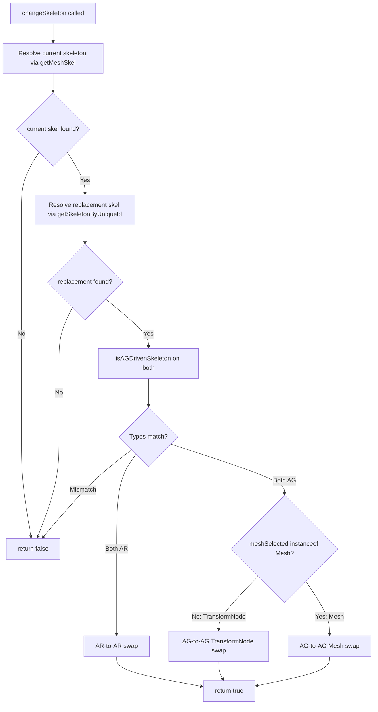

# Design Document — skeleton-change-ag-support

## Overview

The **Change Skeleton** operation in Vishva's Animation tab currently only handles AR-driven skeletons (skeletons whose bones carry keyframe data played via `AnimationRange`). AG-driven skeletons — where bones are linked to `TransformNode` objects and animations are driven by `AnimationGroup` — require a different swap strategy because their scene graph structure is fundamentally different.

This design extends `Vishva.changeSkeleton()` to:

1. Detect the animation-driving mode of both the current and replacement skeletons via a new `AnimUtils.isAGDrivenSkeleton()` helper.
2. Reject mismatched swaps (AR→AG or AG→AR) with an early `false` return.
3. Execute the correct swap logic for same-type pairs:
   - **AR+AR**: the existing behaviour, now made explicit and guarded.
   - **AG+AG (TransformNode selected)**: re-parent visual meshes under the replacement skeleton's host, then dispose the old root node and old skeleton.
   - **AG+AG (Mesh selected)**: reassign `.skeleton` and re-parent the single mesh, without disposing anything.

No changes are needed to `AnimationUI` beyond the `this.update()` call that is already present.

---

## Architecture

The feature is contained in two files:

```
src/util/AnimUtils.ts          ← new static helper: isAGDrivenSkeleton()
src/Vishva.ts                  ← rewritten changeSkeleton() method
```

The call chain is:

```
AnimationUI.animSkelChange.onclick
  └─ Vishva.changeSkeleton(skelId: string): boolean
        ├─ AnimUtils.getMeshSkel()           [existing — resolve current skeleton]
        ├─ scene.getSkeletonByUniqueId()     [existing — resolve replacement skeleton]
        ├─ AnimUtils.isAGDrivenSkeleton()    [NEW — classify each skeleton]
        ├─ [type-mismatch guard]             [NEW — reject AR↔AG]
        ├─ [AR-to-AR branch]                 [existing logic, now explicit]
        ├─ [AG-to-AG / TransformNode branch] [NEW]
        └─ [AG-to-AG / Mesh branch]          [NEW]
```



---

## Components and Interfaces

### `AnimUtils.isAGDrivenSkeleton(skel: Skeleton): boolean`

New static method on `AnimUtils` in `src/util/AnimUtils.ts`.

```typescript
/**
 * Returns true if the skeleton is driven by AnimationGroups — i.e., at least
 * one bone has a linked TransformNode (bone.getLinkedTransformNode() != null).
 * Returns false for null/undefined skeletons, null/empty bone arrays, or
 * skeletons where no bone has a linked TransformNode.
 */
public static isAGDrivenSkeleton(skel: Skeleton): boolean {
    if (skel == null) return false;
    if (skel.bones == null || skel.bones.length === 0) return false;
    return skel.bones.some(b => b.getLinkedTransformNode() != null);
}
```

**Decision rationale:** Using `bone.getLinkedTransformNode()` is the correct AG-driven indicator in BabylonJS v8. AG-driven characters loaded from GLB have each bone linked to a `TransformNode` in the hierarchy; AR-driven characters (classic `.babylon` rigs) do not use linked TransformNodes. The existing `AnimUtils.skelDrivenByAG()` method checks whether a skeleton's animations are referenced by `AnimationGroup.targetedAnimations`, which is fragile (depends on `skel.animations` being populated). The new helper is simpler and more reliable.

### `Vishva.changeSkeleton(skelId: string): boolean`

Fully rewritten method in `src/Vishva.ts`. Replaces the existing implementation.

**Signature is unchanged** — `AnimationUI` continues to call `this._vishva.changeSkeleton(skelId)` with no modifications.

**Key local helpers needed inside `changeSkeleton`:**

- **`findHostMesh(skel: Skeleton): AbstractMesh | null`** — scans `scene.meshes` for the first `AbstractMesh` whose `.skeleton === skel`. Used only in AG-to-AG paths.

---

## Data Models

No new serialized data structures are introduced. The operation is a runtime scene-graph mutation only.

Relevant existing types (BabylonJS v8):

| Type | Relevant property / method |
|---|---|
| `Skeleton` | `.bones: Bone[]`, `.dispose()` |
| `Bone` | `.getLinkedTransformNode(): TransformNode \| null` |
| `AbstractMesh` | `.skeleton: Skeleton`, `.parent: Node` |
| `Mesh` | `instanceof Mesh` — used to distinguish Mesh from plain TransformNode |
| `TransformNode` | `.getChildMeshes(directDescendantsOnly: boolean): AbstractMesh[]`, `.dispose()` |
| `Scene` | `.getSkeletonByUniqueId(id: number): Skeleton \| null`, `.meshes: AbstractMesh[]` |

**Re-parenting note:** Setting `mesh.parent = hostMesh` directly preserves the mesh's existing local (relative) transform without any world-space decomposition. This is intentional — BabylonJS stores position/rotation/scaling relative to the parent, so a direct parent assignment keeps local coordinates intact.

**Disposal note:** In the AG+AG TransformNode case, `originalTransformNode.dispose()` is called after all child meshes have been re-parented out. The `dispose()` call removes the node from the scene; any non-mesh children it still owns are disposed with it. The current skeleton is also disposed (`currentSkel.dispose()`) because the original character's animation data is no longer needed.

In the AG+AG Mesh case, neither the TransformNode nor the skeleton is disposed — the mesh is simply migrated, and the original parent hierarchy may still be in use.

---

## Correctness Properties

*A property is a characteristic or behavior that should hold true across all valid executions of a system — essentially, a formal statement about what the system should do. Properties serve as the bridge between human-readable specifications and machine-verifiable correctness guarantees.*

### Property 1: `isAGDrivenSkeleton` reflects linked TransformNode presence

*For any* skeleton object (including null, skeletons with empty bone lists, skeletons with bones where none have linked TransformNodes, and skeletons where at least one bone has a linked TransformNode), `AnimUtils.isAGDrivenSkeleton` SHALL return `true` if and only if at least one bone's `getLinkedTransformNode()` is non-null, and `false` in all other cases.

**Validates: Requirements 1.1, 1.2, 1.3, 1.4, 1.5**

---

### Property 2: Type-mismatch guard always rejects mismatched pairs

*For any* pair of skeletons where one is AR-driven (no bones have linked TransformNodes) and the other is AG-driven (at least one bone has a linked TransformNode), `changeSkeleton` SHALL return `false` and SHALL NOT mutate the `.skeleton` property of any mesh, the `.parent` property of any node, or dispose any scene node — regardless of which skeleton is current and which is the replacement.

**Validates: Requirements 2.3, 2.4**

---

### Property 3: AG-to-AG TransformNode swap collects all and only Mesh descendants

*For any* `TransformNode` hierarchy of arbitrary depth and width containing a mix of `Mesh` and non-`Mesh` children, the AG-to-AG TransformNode swap path SHALL process exactly the set of nodes that are `instanceof Mesh` reachable via `getChildMeshes(false)` — no more, no fewer.

**Validates: Requirements 4.1, 4.3**

---

### Property 4: Host mesh resolution finds the first matching mesh

*For any* array of scene mesh objects with arbitrary `.skeleton` assignments, the host mesh resolution logic SHALL return the first element whose `.skeleton` strictly references the target skeleton object, or `null` if no such element exists.

**Validates: Requirements 6.1, 6.2**

---

## Error Handling

All failure paths return `false` without throwing. The calling code in `AnimationUI` displays an alert on `false`:

```
DialogMgr.showAlertDiag("Error: unable to switch");
```

Specific failure conditions and their handling:

| Condition | Return value | Side effects |
|---|---|---|
| `getMeshSkel()` returns null (no skeleton on selected node) | `false` | none |
| `getSkeletonByUniqueId()` returns null (bad ID) | `false` | none |
| AR current + AG replacement (or vice versa) | `false` | none |
| AR-to-AR: `meshSelected` is not `AbstractMesh` | `false` | none |
| AG-to-AG: TransformNode has no Mesh descendants | `false` | none |
| AG-to-AG: host mesh for replacement skeleton not found | `false` | none |

All `false` returns happen before any scene mutations, so partial state is never left behind.

---

## Testing Strategy

This feature uses a **dual testing approach**: example-based unit tests for specific scenarios and guard conditions, and property-based tests for the four universally-quantified properties above.

### Property-Based Testing

Library: **fast-check 4.7.0** (already in the project).  
Test runner: **Vitest 4.1.5**.  
File convention: `src/util/AnimUtils.property.test.ts` (for Property 1) and `src/Vishva.changeSkeleton.property.test.ts` (for Properties 2–4).  
Minimum iterations: **100 per property**.

Because `Vishva` and BabylonJS types have complex constructors, tests use lightweight plain-object mocks rather than real BabylonJS instances. The code under test (`isAGDrivenSkeleton` and the logic inside `changeSkeleton`) operates on duck-typed inputs, so mocking with matching shapes is valid.

**Tag format for each property test:**
```
// Feature: skeleton-change-ag-support, Property N: <property text>
```

**Property 1 — `isAGDrivenSkeleton` input/output correctness:**

Generator: `fc.array(fc.option(fc.constant({ name: 'tn' })))` to produce arrays of nullable linked-TransformNode slots. Wrap into a mock skeleton object `{ bones: [...] }` where each bone's `getLinkedTransformNode()` returns the generated value. Assert `isAGDrivenSkeleton(mock) === mock.bones.some(b => b.getLinkedTransformNode() != null)`.

**Property 2 — Type-mismatch guard:**

Generator: produce one AR skeleton mock (all bones have `getLinkedTransformNode() === null`) and one AG skeleton mock (at least one bone returns non-null). Randomly assign one as current and one as replacement. Assert that the guard logic returns `false` and that a captured spy on any mutation method (`.skeleton` setter, `.parent` setter, `.dispose`) is never called.

**Property 3 — Mesh collection completeness:**

Generator: produce a mock `TransformNode` hierarchy via recursive `fc.letrec` with random depth (1–4) and branching (0–4 children). Children are randomly typed as `Mesh` or plain `TransformNode`. Assert that the collected set equals the full set of `Mesh` instances reachable in the hierarchy, verified by an independent DFS over the generated tree.

**Property 4 — Host mesh resolution:**

Generator: `fc.array(fc.record({ skeleton: fc.option(fc.constant('TARGET')) }))` to produce an array of mesh-like objects, some referencing a target sentinel and some not. Assert the resolver returns the first element with `.skeleton === target`, or `null` if none exists.

### Unit Tests

File: `src/util/AnimUtils.test.ts` (new) and additions to `src/gui/propspanel/AnimationUI.test.ts` (existing).

Example-based tests cover:

- `isAGDrivenSkeleton(null)` → `false`
- `isAGDrivenSkeleton({ bones: [] })` → `false`
- `isAGDrivenSkeleton` with all-null linked TN → `false`
- `isAGDrivenSkeleton` with one non-null linked TN → `true`
- `changeSkeleton` with no resolvable current skeleton → `false`
- `changeSkeleton` with bad skelId → `false`
- `changeSkeleton` AR+AR: `meshSelected` is `AbstractMesh` → `true`, `.skeleton` reassigned
- `changeSkeleton` AR+AR: `meshSelected` is `TransformNode` (not `AbstractMesh`) → `false`
- `changeSkeleton` AG+AG TransformNode: no Mesh descendants → `false`
- `changeSkeleton` AG+AG TransformNode: 2 meshes → `true`, both re-skeletoned and re-parented, original TN disposed, original skeleton disposed
- `changeSkeleton` AG+AG Mesh: host mesh found → `true`, `.skeleton` and `.parent` updated, nothing disposed
- `changeSkeleton` AG+AG Mesh: no host mesh → `false`, no mutations
