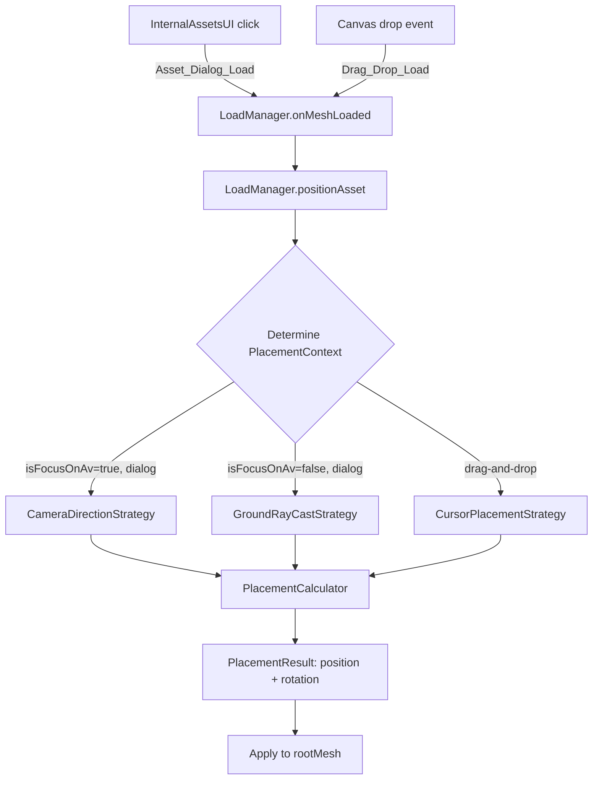

# Design Document: Smart Asset Placement

## Overview

The Smart Asset Placement system replaces the current `postionAsset` method in `LoadManager` with a context-aware placement strategy. The current implementation always places assets 2 metres in front of the avatar along the avatar's own forward direction. The new system uses camera orientation and user interaction context (dialog click vs. drag-and-drop) to determine where to place assets.

The system has three placement modes:
1. **Camera-direction placement** (avatar-focused, dialog load) — projects the camera forward vector onto the XZ plane and places assets in the direction the user is looking
2. **Ground ray-cast placement** (not avatar-focused, dialog load) — casts a ray from the camera toward the ground and places assets at the intersection
3. **Cursor placement** (drag-and-drop) — picks the ground at the cursor position and places assets exactly where the user dropped them

A fallback strategy handles cases where the ground is missing or not intersectable.

### Design Decisions

- **Extracted module**: Placement logic is extracted into a new `PlacementCalculator` class (pure computation, no side effects) separate from the placement orchestration in `LoadManager`. This enables property-based testing of the math without needing scene or DOM mocks.
- **No BabylonJS dependency in calculator**: The calculator operates on plain vector/ray data structures, accepting inputs and returning a computed position + rotation. `LoadManager` remains responsible for reading scene state and applying results.
- **Backward-compatible API**: `postionAsset` signature changes to accept an optional `PlacementContext` parameter. When absent (legacy code paths), behavior defaults to the current avatar-forward logic.

## Architecture



### Module Boundaries

| Module | Responsibility |
|--------|---------------|
| `PlacementCalculator` | Pure math: given inputs (vectors, ray hits, bounding boxes), compute final position and Y-rotation |
| `PlacementContext` | Data structure carrying the placement mode, camera state, pick point, and ground info |
| `LoadManager` | Orchestration: gathers scene state into `PlacementContext`, calls calculator, applies result to mesh |

## Components and Interfaces

### PlacementContext (Data Transfer Object)

```typescript
/** Describes how the asset load was triggered and the scene state at that moment */
interface PlacementContext {
    mode: 'camera-direction' | 'ground-raycast' | 'cursor';
    
    // Camera state
    cameraPosition: Vector3;
    cameraDirection: Vector3;  // normalized forward vector
    cameraTarget: Vector3;
    
    // Avatar state (used in camera-direction mode)
    avatarPosition?: Vector3;
    avatarForward?: Vector3;   // avatar's world-space forward direction
    isFocusOnAv: boolean;
    
    // Ground state
    groundMesh?: { exists: boolean };
    
    // Cursor pick (used in cursor mode)
    pickPoint?: Vector3 | null;
    
    // Asset bounding box (post-scaling)
    boundingBox: { min: Vector3; max: Vector3 };
}
```

### PlacementResult (Output)

```typescript
interface PlacementResult {
    position: Vector3;          // world-space position for rootMesh
    rotationY?: number;         // optional Y-axis rotation (radians) — used for fallback face-camera
    usedFallback: boolean;      // whether fallback was applied
}
```

### PlacementCalculator (Pure Logic)

```typescript
class PlacementCalculator {
    static readonly PLACEMENT_DISTANCE = 2;       // metres from avatar
    static readonly RAY_MAX_DISTANCE = 100;       // max ground-ray length
    static readonly FALLBACK_DISTANCE = 2;        // units in front of camera
    static readonly HORIZONTAL_EPSILON = 0.001;   // threshold for vertical camera check

    /**
     * Compute placement position for camera-direction mode.
     * Projects camera forward onto XZ plane, reverses if pointing at camera side of avatar.
     */
    computeCameraDirectionPlacement(ctx: PlacementContext): PlacementResult;

    /**
     * Compute placement for ground ray-cast mode.
     * Casts ray from camera in camera direction, returns hit point or fallback.
     */
    computeGroundRaycastPlacement(ctx: PlacementContext, groundHitPoint: Vector3 | null): PlacementResult;

    /**
     * Compute placement for cursor/drag-drop mode.
     * Uses pick point if available, otherwise fallback.
     */
    computeCursorPlacement(ctx: PlacementContext): PlacementResult;

    /**
     * Compute the fallback position: fixed offset along camera direction.
     * Also computes face-camera Y rotation.
     */
    computeFallbackPosition(cameraPosition: Vector3, cameraDirection: Vector3): PlacementResult;

    /**
     * Adjust position so bounding box min Y rests on ground surface.
     * Returns the vertical offset to apply.
     */
    computeGroundAlignment(boundingBox: { min: Vector3; max: Vector3 }, groundY: number): number;

    /**
     * Determine which bounding box corner is closest to the avatar based on
     * the horizontal quadrant of the placement direction.
     * Returns the corner vector (with min Y for ground alignment).
     */
    computeClosestCorner(boundingBox: { min: Vector3; max: Vector3 }, direction: Vector3): Vector3;
}
```

### LoadManager Changes

The existing `postionAsset` method is refactored:

```typescript
class LoadManager {
    // New: stores last pointer position over canvas (for dialog-initiated drag-drops)
    private _lastCanvasPointerPosition: { x: number; y: number } | null = null;

    // Refactored placement entry point
    private positionAsset(rootMesh: TransformNode, scaleNum: number, loadType: 'dialog' | 'drop', dropEvent?: DragEvent): void;
    
    // Builds a PlacementContext from current scene state
    private buildPlacementContext(rootMesh: TransformNode, loadType: 'dialog' | 'drop', dropEvent?: DragEvent): PlacementContext;
    
    // Performs scene picking (ray cast to ground)
    private pickGround(ray: Ray): Vector3 | null;
    
    // Performs scene picking at screen coordinates
    private pickGroundAtScreenPoint(x: number, y: number): Vector3 | null;
}
```

## Data Models

### PlacementMode Enum

```typescript
type PlacementMode = 'camera-direction' | 'ground-raycast' | 'cursor';
```

Selection logic:
- `'cursor'` — when `loadType === 'drop'`
- `'camera-direction'` — when `loadType === 'dialog'` AND `vishva.isFocusOnAv === true`
- `'ground-raycast'` — when `loadType === 'dialog'` AND `vishva.isFocusOnAv === false`

### Bounding Box

Reuses BabylonJS `getHierarchyBoundingVectors()` which returns `{ min: Vector3, max: Vector3 }`. The calculator accepts this shape directly.

### Ground Hit

A nullable `Vector3` representing where the ray intersects the ground mesh. `null` means no intersection (ground missing or not hit), triggering fallback.

## Correctness Properties

*A property is a characteristic or behavior that should hold true across all valid executions of a system—essentially, a formal statement about what the system should do. Properties serve as the bridge between human-readable specifications and machine-verifiable correctness guarantees.*

### Property 1: Camera-direction placement produces correct distance and direction

*For any* camera forward vector and avatar position, the computed placement point SHALL be exactly 2 units from the avatar position on the XZ plane, in the direction of the camera's forward vector projected onto the XZ plane (reversed if the projection points toward the camera side of the avatar), and SHALL use the avatar's forward direction when the camera forward vector is vertical (XZ magnitude < 0.001).

**Validates: Requirements 1.1, 1.3, 1.4**

### Property 2: Bounding-box corner selection matches placement quadrant

*For any* axis-aligned bounding box and any placement direction vector, the selected corner SHALL be the one whose XZ position is closest to the avatar (determined by the horizontal quadrant of the direction: Q1 → min/min, Q2 → max/min-z, Q3 → max/max, Q4 → min/max-z), and the placement SHALL position that corner at the computed placement point.

**Validates: Requirements 1.2**

### Property 3: Ground alignment places bounding-box minimum Y at ground surface

*For any* bounding box (including zero-height bounding boxes) and any ground surface Y coordinate, the computed vertical position adjustment SHALL result in the bounding box's minimum Y value aligning exactly with the ground surface Y coordinate at the placement point.

**Validates: Requirements 2.2, 3.1, 5.1, 5.4**

### Property 4: Ground ray-cast intersection lies on ground plane within range

*For any* camera position and direction where a ground plane exists, if the ray intersects the ground, the intersection point SHALL lie on the ground surface (Y equals ground Y) and the distance from camera to intersection SHALL be at most 100 units.

**Validates: Requirements 2.1**

### Property 5: Fallback position is exactly 2 units along camera direction with no ground adjustment

*For any* camera position and normalized camera direction, the fallback position SHALL equal cameraPosition + (cameraDirection × 2), and the asset's transform origin SHALL be placed directly at this position without vertical bounding-box adjustment.

**Validates: Requirements 2.3, 3.2, 3.5, 4.1, 4.2, 5.2**

### Property 6: Fallback rotation orients asset toward camera

*For any* fallback position and camera position, the computed Y-axis rotation SHALL orient the asset so that its local negative-Z axis (forward face) points from the asset position toward the camera position in the XZ plane.

**Validates: Requirements 4.3**

## Error Handling

| Scenario | Handling |
|----------|----------|
| Ground mesh not in scene | Fallback position used (2 units in front of camera) |
| Ground ray misses (too far, wrong angle) | Fallback position used |
| Camera direction is vertical (straight up/down) | Falls back to avatar forward direction for camera-direction mode |
| Bounding box has zero height | Asset origin placed at ground Y (no offset needed) |
| Drop event has no valid coordinates | Uses last tracked canvas pointer position; if that's also null, fallback position |
| rootMesh is null after load | No placement attempted (defensive guard, logged) |

## Testing Strategy

### Property-Based Tests (fast-check + Vitest)

Property-based testing is well-suited to this feature because the `PlacementCalculator` is a set of pure functions with clear mathematical properties that should hold across all valid inputs.

**Library**: fast-check 4.7.0
**Runner**: Vitest 4.1.5
**Config**: Minimum 100 iterations per property
**File**: `src/managers/PlacementCalculator.property.test.ts`

Each property test:
- Uses fast-check arbitraries to generate random Vector3 values, bounding boxes, and angles
- Tests the `PlacementCalculator` methods directly (no scene mocking needed)
- Tags with format: `Feature: smart-asset-placement, Property N: <description>`

Properties to implement:
1. Camera-direction distance and direction correctness
2. Bounding-box corner quadrant selection
3. Ground alignment (BB min Y = ground Y)
4. Ground ray intersection validity
5. Fallback position computation (distance = 2, no ground adjust)
6. Fallback face-camera rotation

### Unit Tests (Vitest)

**File**: `src/managers/PlacementCalculator.test.ts`

Example-based tests for:
- Specific camera angles (0°, 90°, 180°, 270°) confirming placement direction
- Known bounding box with known direction confirming exact corner
- Exact fallback position with specific camera state
- Edge case: camera perfectly vertical (XZ magnitude < 0.001)
- Edge case: bounding box with min Y = max Y (flat object)

### Integration Tests

**File**: `src/managers/LoadManager.placement.test.ts`

- Verify `buildPlacementContext` correctly reads `isFocusOnAv`, camera state, and ground mesh
- Verify drop event coordinates (`clientX`/`clientY`) are correctly extracted
- Verify last pointer position tracking over canvas
- Verify `positionAsset` selects the correct placement mode based on context

