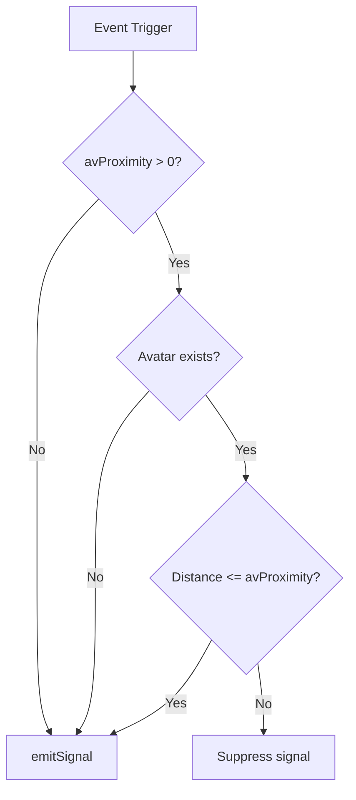

# Design Document: sensor-av-proximity

## Overview

This feature adds an `avProximity` numeric property to `SenClickProp` and `SenKeyboardProp` that gates signal emission based on the avatar's distance from the sensor's mesh. When `avProximity > 0`, the sensor computes the Euclidean distance between the avatar's `absolutePosition` and the mesh's `absolutePosition` — if the distance exceeds the threshold, signal emission is suppressed. When `avProximity` is 0 (or negative), proximity checking is disabled and the sensor emits normally.

The design is minimal: a single numeric property on each Props class, a shared helper function for the proximity check, and a guard call inserted before each sensor's `emitSignal()`. No new classes, no new files — the change fits naturally into the existing SNA architecture.

## Architecture



The proximity check is a pure guard that runs between event detection and signal emission. It does not alter sensor registration, action management, or any other behavior.

**Affected files:**
- `src/sna/SensorClick.ts` — Add `avProximity` to `SenClickProp`, add proximity guard in the click handler
- `src/sna/SensorKeyboard.ts` — Add `avProximity` to `SenKeyboardProp`, add proximity guard in `_handleKeyEvent()`
- `src/sna/SNA.ts` — No changes needed (serialization/deserialization handles plain numbers automatically)
- `src/gui/SnaUI.ts` — No changes needed (formCreate auto-generates inputs for number properties; formRead already uses parseFloat with NaN→0 fallback)

**No new files required.** The proximity check logic is simple enough to inline or extract as a private method on each sensor class. Since both sensors need the same logic, a shared utility function is preferred to avoid duplication.

## Components and Interfaces

### Proximity Check Utility

A standalone pure function (or shared module-level function) that encapsulates the proximity gating logic:

```typescript
/**
 * Returns true if the signal should be emitted (proximity check passes).
 * Returns false if the signal should be suppressed.
 * 
 * @param avProximity - The configured proximity threshold (0 = disabled)
 * @param meshPosition - The sensor mesh's absolute world position
 * @param getAvatar - Function returning the avatar mesh or null
 */
function shouldEmitByProximity(
    avProximity: number,
    meshPosition: Vector3,
    getAvatar: () => Mesh | null
): boolean {
    // Treat negative or zero as disabled
    if (avProximity <= 0) return true;
    
    const avatar = getAvatar();
    // No avatar = pass through
    if (avatar == null) return true;
    
    const distance = Vector3.Distance(avatar.absolutePosition, meshPosition);
    return distance <= avProximity;
}
```

This function will be placed in a shared location accessible to both sensors. Options:
1. **Module-level function in a new file** `src/sna/proximityCheck.ts` — cleanest separation
2. **Module-level function in `SNA.ts`** — keeps it in the framework file

**Decision:** Option 1 — a small dedicated file `src/sna/proximityCheck.ts`. This keeps the function isolated and easily testable without importing the full SNA framework.

### SenClickProp Changes

```typescript
export class SenClickProp extends SNAproperties {
    clickType: SelectType = new SelectType();
    avProximity: number = 0;  // NEW: max activation distance (0 = disabled)
    // ... constructor unchanged
}
```

### SensorClick.onPropertiesChange() Changes

The existing click handler lambda adds a proximity guard before `this.emitSignal(e)`:

```typescript
let action: Action = new ExecuteCodeAction(actType, (e) => {
    if (Vishva.vishva.key.alt ||
        Vishva.vishva.key.ctl ||
        Vishva.vishva.key.shift
    ) return;

    // NEW: proximity guard
    let clickProp = this.properties as SenClickProp;
    if (!shouldEmitByProximity(
        clickProp.avProximity,
        this.mesh.absolutePosition,
        () => SNAManager.getSNAManager().getAV()
    )) return;

    this.emitSignal(e);
});
```

### SenKeyboardProp Changes

```typescript
export class SenKeyboardProp extends SNAproperties {
    key: SelectType = new SelectType();
    ctrl: boolean = false;
    alt: boolean = false;
    shift: boolean = false;
    onKeyDown: boolean = true;
    onKeyUp: boolean = false;
    onlyOnPointerOver: boolean = false;
    avProximity: number = 0;  // NEW: max activation distance (0 = disabled)
    // ... constructor unchanged
}
```

### SensorKeyboard._handleKeyEvent() Changes

After all existing guards pass and before `this.emitSignal()`:

```typescript
// NEW: proximity guard
let kbProps = this.properties as SenKeyboardProp;
if (!shouldEmitByProximity(
    kbProps.avProximity,
    this.mesh.absolutePosition,
    () => SNAManager.getSNAManager().getAV()
)) return;

// All checks passed — emit signal
this.emitSignal();
```

### Negative Value Handling

Negative values for `avProximity` are handled at two levels:
1. **Runtime:** The `shouldEmitByProximity` function treats `avProximity <= 0` as disabled — this naturally handles negative values without extra clamping.
2. **UI save:** The existing `SnaUI.formRead()` uses `parseFloat` which preserves negative numbers. To satisfy Requirement 5.4 (negative → zero), we'll add a `Math.max(0, v)` clamp in the formRead path for number properties that are declared with a minimum of 0. However, since `formRead` is generic and doesn't know about per-property minimums, the simpler approach is to handle it in the `shouldEmitByProximity` function itself (which already does `<= 0`). The stored value might be negative, but behavior is identical to zero. For UI display fidelity, we can optionally clamp in the property setter or accept that negative values just behave as disabled.

**Decision:** Let negative values persist in the property (they serialize fine), but the runtime logic treats them as zero. This is the simplest approach — no changes to `SnaUI.formRead()` needed. The `shouldEmitByProximity(avProximity <= 0) → true` handles it.

## Data Models

### SenClickProp (updated)

| Property | Type | Default | Description |
|----------|------|---------|-------------|
| signalId | string | "0" | Signal identifier (inherited) |
| signalEnable | string | "" | Enable signal (inherited) |
| signalDisable | string | "" | Disable signal (inherited) |
| clickType | SelectType | "leftClick" | Click event type |
| **avProximity** | **number** | **0** | **Max activation distance (0 = disabled)** |

### SenKeyboardProp (updated)

| Property | Type | Default | Description |
|----------|------|---------|-------------|
| signalId | string | "0" | Signal identifier (inherited) |
| signalEnable | string | "" | Enable signal (inherited) |
| signalDisable | string | "" | Disable signal (inherited) |
| key | SelectType | " " | Key to listen for |
| ctrl | boolean | false | Require Ctrl modifier |
| alt | boolean | false | Require Alt modifier |
| shift | boolean | false | Require Shift modifier |
| onKeyDown | boolean | true | Listen for keydown |
| onKeyUp | boolean | false | Listen for keyup |
| onlyOnPointerOver | boolean | false | Require pointer over mesh |
| **avProximity** | **number** | **0** | **Max activation distance (0 = disabled)** |

### Serialization Format

Since `avProximity` is a plain `number` on a `SNAproperties` subclass:
- **Serialization:** `_serializeProps()` copies it as-is (not a `state_` prefix, not an object type)
- **Deserialization:** `unMarshalProps()` leaves plain numbers untouched — no special handling needed
- **Legacy saves:** Missing `avProximity` field → the default value from the class constructor (0) is used, since the sensor is constructed with `new SenClickProp()` and then properties are overlaid

## Correctness Properties

*A property is a characteristic or behavior that should hold true across all valid executions of a system — essentially, a formal statement about what the system should do. Properties serve as the bridge between human-readable specifications and machine-verifiable correctness guarantees.*

### Property 1: Proximity gating correctness

*For any* avProximity value (including zero and negative), any avatar state (present or null), and any pair of 3D world positions for avatar and mesh, the sensor SHALL emit a signal if and only if: `avProximity <= 0` OR `avatar is null` OR `Vector3.Distance(avatarPosition, meshPosition) <= avProximity`.

**Validates: Requirements 1.2, 1.3, 1.4, 1.5, 2.2, 2.3, 2.4, 2.5, 3.1, 3.2**

### Property 2: avProximity serialization round trip

*For any* valid non-negative numeric avProximity value, serializing a sensor's properties (stripping state_ keys) and then constructing a new sensor with the serialized data SHALL produce a sensor whose avProximity field equals the original value.

**Validates: Requirements 4.1, 4.2**

### Property 3: UI numeric input preserves valid values

*For any* non-negative finite number entered as a string in the avProximity input field, calling formRead SHALL set the sensor's avProximity property to that exact numeric value.

**Validates: Requirements 5.2**

### Property 4: UI invalid input normalizes to zero

*For any* string that `parseFloat` returns `NaN` for, OR any negative numeric string, the formRead logic SHALL set the sensor's avProximity property to zero.

**Validates: Requirements 5.3, 5.4**

## Error Handling

| Scenario | Handling |
|----------|----------|
| Avatar mesh is null | Proximity check passes (signal emits) |
| avProximity is negative | Treated as 0 (proximity check disabled) |
| avProximity is NaN (UI input) | formRead converts to 0 |
| Mesh has no absolutePosition | Not possible — all Mesh instances have absolutePosition via BabylonJS TransformNode |
| Avatar absolutePosition is (0,0,0) | Valid position, distance computed normally |

No exceptions are thrown by the proximity check — it's a simple numeric comparison that always returns a boolean.

## Testing Strategy

### Property-Based Tests (fast-check + Vitest)

File: `src/sna/proximityCheck.property.test.ts`

The `shouldEmitByProximity` function is a pure function with clear input/output behavior — ideal for property-based testing.

**Configuration:**
- Library: fast-check 4.7.0
- Runner: Vitest 4.1.5
- Minimum iterations: 100 per property
- Naming: `*.property.test.ts`

**Properties to implement:**
1. **Property 1** — Test `shouldEmitByProximity` with random positions, random thresholds, and random avatar presence. Verify result matches the formula: `avProximity <= 0 || avatar == null || distance <= avProximity`.
2. **Property 2** — Test serialization round trip: create properties with random avProximity, serialize (JSON stringify stripping state_ keys), verify avProximity field is present and correct.
3. **Property 3** — Test formRead with random valid numeric strings, verify correct float value.
4. **Property 4** — Test formRead with non-numeric strings and negative number strings, verify result is 0.

**Tag format:** `Feature: sensor-av-proximity, Property {N}: {title}`

### Unit Tests (Example-Based)

File: `src/sna/proximityCheck.test.ts`

- Default property value is 0 for both SenClickProp and SenKeyboardProp
- Boundary: distance exactly equals avProximity → emits
- Boundary: distance is avProximity + epsilon → suppresses
- Legacy deserialization without avProximity field → defaults to 0
- Integration: full SensorClick click handler with proximity guard (mock ActionManager + avatar)
- Integration: full SensorKeyboard _handleKeyEvent with proximity guard (mock window events + avatar)
